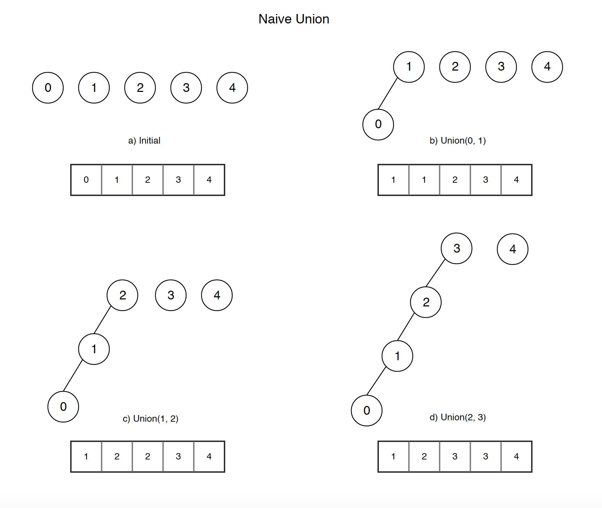
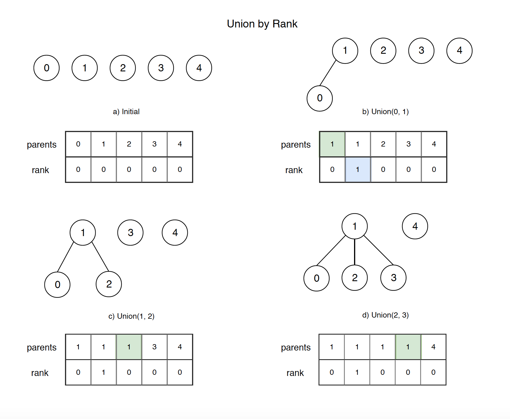

# Union find (Disjoint set)

## Disjoint set in math

In mathematics, two sets are said to be `disjoint sets` if they have no element in common. Equivalently, disjoint sets are sets whose intersection is the empty set. For example, {1, 2, 3} and {4, 5, 6} are disjoint sets, while {1, 2, 3} and {3, 4, 5} are not.

## Disjoint set data structure

Union find(Disjoint set) is a data structure that stores a collection of disjoint (non-overlapping) sets. Its has 2 primary operations:

- **Find**: Determine which subset a particular element is in. This can be used for determining if two elements are in the same subset.
- **Union**: Join two subsets into a single subset

Below is the sample code which implements union-find algorithms

```
class DisjointSet {
private:
  std::vector<int> parents;

public:
  DisjointSet(int n) {
    parents.resize(n);
    for (int i = 0; i < n; ++i) {
      parents[i] = i;
    }
  }

  int find(int x) {
    if (parents[x] == x) {
      return x;
    }

    return find(parents[x]);
  }

  void unionSet(int x, int y) {
    int parentX = find(x);
    int parentY = find(y);

    parents[parentY] = parentX;
  }
};
```


## Optimization

### Path compression

This optimization is designed for speeding up `find` method.

The naive find() method is **read-only**, when find() is called for an element i, root of the tree is returned, the find() operation traverses up from i to find root.

The idea of path compression is to make the found root as parent of i so that we don’t have to traverse all intermediate nodes again. If i is root of a subtree, then path (to root) from all nodes under i also compresses.


Below is the optimized find() method with Path Compression.

```cpp
int find(int x) {
  if (parents[x] != x) {
    parents[x] = find(parents[x]);
  }

  return parents[x];
}
```

We can also implement `find` without recursion.

```cpp
int find(int x) {
  while (parents[x] != x) {
    parents[x] = parents[parents[x]];
    x = parents[x];
  }

  return parents[x];
}
```

### Union by rank

In this optimization we will change the `unionSet` method.

In the naive implementation the second tree always got attached to the first one. In practice that can lead to trees containing chains of length O(n).



The solution is to always attach smaller depth tree under the root of the deeper tree.



Below is the optimized `unionSet()` method with Union by rank.

```cpp
void unionSet(int x, int y) {
  int parentX = find(x);
  int parentY = find(y);
  if (parentX == parentY) {
    return;
  }
  if (ranks[parentX] < ranks[parentY]) {
    parents[parentX] = parentY;
  }
  else if (ranks[parentX] > ranks[parentY]) {
    parents[parentY] = parentX;
  }
  else {
    // If ranks are the same
    parents[parentX] = parentY;
    ++ranks[parentY]; 
  }
}
```
