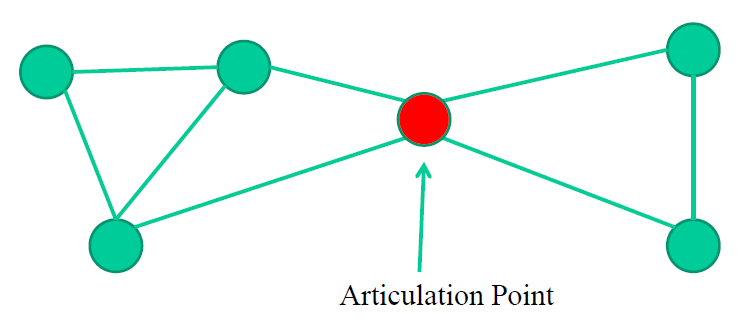
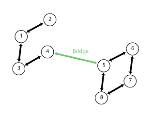

# Articulation Points and Bridges

## 1. Articulation Point

In a graph, a vertex is called an articulation point if removing it and all the edges associated with it results in the increase of the number of connected components in the graph



**Algorithm Steps:**

- Pick an arbitrary vertex of the graph root and run DFS from it.
- For each node maintain two time values:
+ `disc`: The time in which the node was first reached
+ `low`: The low time of a node is the lowest discovery time of all of its adjacent nodes
- A node is an articulation point if satisfy any of the following properties:
+ If node is root node and node has 2 children
+ If node's low time is lower than the low time of all other adjacent nodes (using `lows`)

```cpp
int n; // number of nodes
vector<vector<int>> adj; // adjacency list of graph

vector<bool> visited;
vector<int> disc, low;
int timer;

void dfs(int v, int p = -1) {
  visited[v] = true;
  disc[v] = low[v] = timer++;
  int children = 0;
  for (int to : adj[v]) {
    if (to == p) {
      continue;
    }

    if (visited[to]) {
      low[v] = min(low[v], disc[to]);
    } else {
      dfs(to, v);
      low[v] = min(low[v], low[to]);

      if (low[to] >= disc[v] && p != -1) {
        IS_CUTPOINT(v);
      }

      ++children;
    }
  }
  if (p == -1 && children > 1) {
    IS_CUTPOINT(v);
  }
}

void find_cutpoints() {
  timer = 0;
  visited.assign(n, false);
  disc.assign(n, -1);
  low.assign(n, -1);

  for (int i = 0; i < n; ++i) {
    if (!visited[i]) {
      dfs(i);
    }
  }
}
```

The time complexity of the algorithm is O(E + V).

## 2. Bridge 

An edge in a graph between vertices u and v is called a Bridge, if after removing it, there will be no path left between  u and v.



**Algorithm Steps:**

```cpp
int n; // number of nodes
vector<vector<int>> adj; // adjacency list of graph

vector<bool> visited;
vector<int> disc, low;
int timer;

void dfs(int v, int p = -1) {
  visited[v] = true;
  disc[v] = low[v] = timer++;
  for (int to : adj[v]) {
    if (to == p) {
      continue;
    }

    if (visited[to]) {
      low[v] = min(low[v], disc[to]);
    } else {
      dfs(to, v);
      low[v] = min(low[v], low[to]);

      if (low[to] > disc[v]) {
        IS_BRIDGE(v, to);
      }
    }
  }
}

void find_bridges() {
  timer = 0;
  visited.assign(n, false);
  disc.assign(n, -1);
  low.assign(n, -1);

  for (int i = 0; i < n; ++i) {
    if (!visited[i]) {
      dfs(i);
    }
  }
}
```
