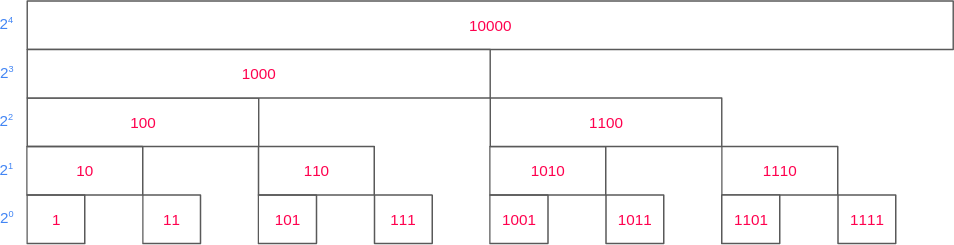

# Binary Indexed Tree (Fenwick Tree)

## Problem statement

Given an array v, we have to evaluate two operations:

- query(l, r): Find the sum of all elements in a given interval [l, r].
- update(i, val): Change the value of position i of the array to val.

The naive solution would take O(1) time complexity for an update operation and O(n) time complexity for a query operation.
Another naive solution is to use prefix sum would take O(1) time complexity for a query operation and O(n) time complexity for an update operation (rebuild prefix sum array).

The first solution has a good update but a terrible query. The second one has a good query but a terrible update.

## Binary Indexed Tree

A Fenwick tree or binary indexed tree is a data structure that can efficiently update elements and calculate prefix sums in a table of numbers.

### Isolating the last set bit

Before moving to the concept of the binary indexed tree, we need to find the solution to retrieve the last set bit which will help us in binary indexed tree implementation later.

For example a number x = (1110)₂ then the last set bit should be (0010)₂

How to isolate?

`x & (-x)` gives the last set bit in a number x, but how?

Let’s say x = (a1b)₂ is the number whose last set bit we want to isolate.

Here a is some binary sequence of any length of 1’s and 0’s and b is some sequence of any length but of 0’s only

-x = 2’s complement of x = (a1b)’ + 1 = a’0b’ + 1 = a’0(0….0)’ + 1 = a’0(1...1) + 1 = a’1(0…0) = a’1b

`x & (-x)` = (a1b) & (a'1b)

We have a & a' = 0 and b contains zero bits only then the result of `x & (-x)` will isolate the last bit of `x`

### The conception of the tree

In Fenwick tree the root node has the sum of the entire array. Its left child has the sum of the first half and the right child of the second half.


How can we use that new structure to sum the first n elements?


As you can see in the image above, the even indices is completely not used then we can ignore these indices.


### Query in the tree

For example, we want to calculate prefix sum from index 1 to index 13 (For sake of simplicity we will use 1-indexed array)

13 = (1101)₂ = 8 + 4 + 0 + 1. This structure divides the sum of first 13 elements into 3 blocks.


Generally, each set bit will be responsible for one part of the summation.

In our example, to sum up the first 13 = (1101)₂ elements, we sum the values on position 13 = (1101)₂, 12 = (1100)₂, and 8= (1000)₂.

A cleaner way to look at the construction we built



### Update in the tree

For the update operation, we need to change the value of the tree from the left node to all nodes above it.


To define those concepts better, we will need to understand how we can walk on the tree. Let represent the array as tree-shape structure.


By looking closely into the tree. We can notice that all nodes in the same level having the same suffix. The prefix merely indicates the order of that index in the level. In other words, the prefixes of the same level form the sequence 0, 1, 2, 3…

The Fenwick Tree arranges binary numbers in two dimensions. Assuming we always start at the root, it makes perfect sense to represent one digit as `go to the left` and the other as `go to the right`.


For now everything is clear, let move on to update operation in binary indexed tree.

Let `A` and `B` be two nodes in the tree, if len(prefix(A)) < len(prefix(B)) then `A` is an ancestor of `B`.

For example:

- 6=(001|10)₂ is an ancestor of 5=(0010|1)₂
- 7=(0011|1)₂, and 11=(0101|1)₂ is a decedent of 10=(010|10)₂, 12=(01|100)₂, 8=(0|1000)₂

To update a value of the array, we need to move from a given node B to node A immediately above it. Although not intuitive, this is precisely the sum of an index with its least significant bit.


## Implementation

```cpp
class FenwickTree {
private:
    std::vector<int> nodes;

public:
    FenwickTree(int size): nodes(size + 1, 0) {
    }

    void update(int i) {
        for (; i < nodes.size(); i += i & -i) {
            nodes[i] += 1;
        }
    }

    int query(int i) {
        int result = 0;
        for (; i > 0; i -= i & -i) {
            result += nodes[i];
        }
        return result;
    }
};
```
