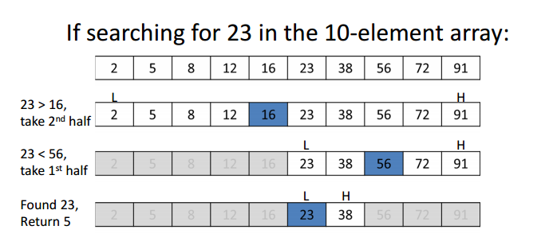

# Binary search

Binary Search is a searching algorithm for finding an element's position in a **sorted** array.

Binary search compares the target value to the middle element of the array. If they are not equal, the half in which the target cannot lie is eliminated and the search continues on the remaining half, again taking the middle element to compare to the target value, and repeating this until the target value is found. If the search ends with the remaining half being empty, the target is not in the array.



**Algorithm**

```cpp
int binarySearch(std::vector<int> array, int x) {
  int low = 0;
  int high = array.size() - 1;

  while (low <= high) {
    int mid = (low + high) / 2;

    if (array[mid] == x) {
      return mid;
    } else if (array[mid] < x) {
      low = mid + 1;
    } else {
      high = mid - 1;
    }
  }

  // Not found
  return -1;
}
```

## Examples

### Find First and Last Position of Element in Sorted Array

[Problem](https://leetcode.com/problems/find-first-and-last-position-of-element-in-sorted-array/)

**Approach**

In this problem, we'll search for x as we are searching normally. When we find the element, then there are 2 solutions:

- To find the first position, we keep searching for element in the left part of the array
- To find the last position, we keep searching for element in the right part of the array

```cpp
int findPosition(std::vector<int> &nums, int target, bool findFirst) {
  int leftIdx = 0;
  int rightIdx = nums.size() - 1;
  int position = NOT_FOUND;
  while (leftIdx <= rightIdx) {
    int midIdx = (leftIdx + rightIdx) / 2;
    if (nums[midIdx] == target) {
      position = midIdx;
      if (findFirst) {
        // Continue to find in the left part
        rightIdx = midIdx - 1;
      } else {
        // Continue to find in the right part
        leftIdx = midIdx + 1;
      }
    } else if (nums[midIdx] > target) {
      rightIdx = midIdx - 1;
    } else {
      leftIdx = midIdx + 1;
    }
  }

  return position;
}
```

### Find floor/ ceil in a sorted array

floor(arr, x): Return the largest integer in array `arr` that is smaller or equal to `x`

[Problem](https://practice.geeksforgeeks.org/problems/floor-in-a-sorted-array-1587115620/1/)

```cpp
int findFloor(vector<int> arr, int target) {
  int lowArrIdx = 0;
  int highArrIdx = arr.size() - 1;
  int floorIdx = -1;
  while (lowArrIdx <= highArrIdx) {
    int midArrIdx = (lowArrIdx + highArrIdx) / 2;
    if (arr[midArrIdx] <= target) {
      floorIdx = midArrIdx;
      lowArrIdx = midArrIdx + 1;
    } else {
      // arr[midArrIdx] > target
      highArrIdx = midArrIdx - 1;
    }
  }

  return floorIdx;
}
```

ceil(arr, x): Return the smallest integer in array `arr` that is greater or equal to `x`

```cpp
int findCeil(vector<int> arr, int target) {
  int lowArrIdx = 0;
  int highArrIdx = arr.size() - 1;
  int ceilIdx = -1;
  while (lowArrIdx <= highArrIdx) {
    int midArrIdx = (lowArrIdx + highArrIdx) / 2;
    if (arr[midArrIdx] >= target) {
      ceilIdx = midArrIdx;
      highArrIdx = midArrIdx - 1;
    } else {
      // arr[midArrIdx] < target
      lowArrIdx = midArrIdx + 1;
    }
  }

  return ceilIdx;
}
```

### Finding the peak of an array

[Problem](https://leetcode.com/problems/find-peak-element/)

```cpp
int findPeakElement(vector<int>& nums) {
  int leftNumsIdx = 0;
  int rightNumsIdx = nums.size() - 1;
  
  while (leftNumsIdx <= rightNumsIdx) {
    int midNumsIdx = (leftNumsIdx + rightNumsIdx) / 2;
    if (midNumsIdx == 0 || nums[midNumsIdx - 1] < nums[midNumsIdx]) {
      if (midNumsIdx == nums.size() - 1 || nums[midNumsIdx + 1] < nums[midNumsIdx]) {
          return midNumsIdx;
      }
      
      // We can find answer in the right part
      // We have a contrain nums[n] = -INF
      leftNumsIdx = midNumsIdx + 1;
    } else {
      // nums[midNumsIdx - 1] > nums[midNumsIdx]
      rightNumsIdx = midNumsIdx - 1;
    }
  }
  
  // Not reachable
  return -1;
}
```
