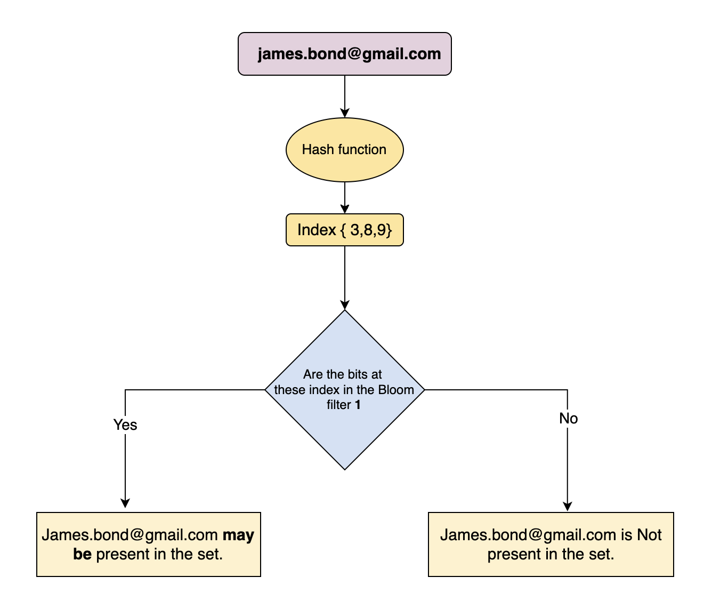

# Bloom filter

## What is Bloom filter

A Bloom filter is a data structure designed to tell you, rapidly and memory-efficiently, whether an element is present in a set.

The price paid for this efficiency is that a Bloom filter is a probabilistic data structure: it tells us that the element either definitely is not in the set or may be in the set.

For example is x in the list?

Yes (90% correct)
No (100% correct)

## How does a Bloom filter work?

An empty Bloom filter is a Bit Vector with all bits set to zero. In the image below, each cell represents a bit. The number below the bit is its index for a 10-bit vector.

In order to add an element, it must be hashed using multiple hash functions. Bits are set at the index of the hashes in the bit vector.

For example, let’s assume we need to add the james@gmail.com element using three efficient hash functions:

- H1(james@gmail.com) = 12021
- H2(james@gmail.com) = 23324
- H3(james@gmail.com) = 23237

We can take the mod of 10 for all these values to get an index within the bounds of the bit vector:

- 12021 % 10 = 1
- 23324 % 10 = 4
- 23237 % 10 = 7

For an item whose membership needs to be tested, it is also hashed via the same hash functions. If all the bits are already set for this, the element may exist in the set.

If any bit is not set, the element is definitely not in the set.

## Why Bloom filters give false positive results?

Let’s assume we have added the two members below to the bloom filter.

- Monkey with Hash Output H(“Monkey”) = {1,2,5}
- Lion with Hash Output H(“Lion”) = {7,4,3}

Now, if we want to check whether or not Tiger exists in the set, we can hash it via the same hash functions.

- H(“Tiger”) = {2,7,3}

We have not added “Tiger” to the bloom filter, but all the bits at index {2,7,3} have already been set by the previous two elements; thus, Bloom Filter claims that “Tiger” is present in the set. This is a false positive result.

## Bloom filter applications

- Medium uses Bloom filters in its Recommendation module to avoid showing those posts that have already been seen by the user.
- Cassandra uses bloom filters to optimize the search of data in an SSTable on the disk.
- CDNs use bloom filters to avoid caching items that are rarely searched.
