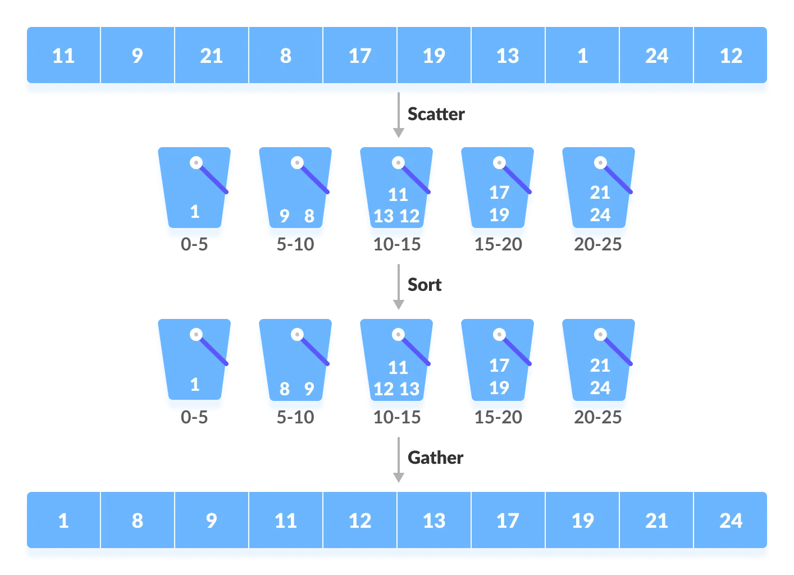

# Bucket sort

Bucket sort is a sorting algorithm that works by distributing the elements of an array into a number of buckets.
Each bucket is then sorted individually, either using different sorting algorithm.

Bucket sort is mainly useful when input is uniformly distributed over a range.

## 1. How does bucket sort work?



## 2. Pseudocode

Step 1: Create `n` empty buckets

Step 2: Place every element in their corresponding bucket

Step 3: Sort individual buckets (Using: quick sort or insertion sort)

Step 4: Merge all the bucket

## 3. Example

### Sort a large set of floating point numbers which are in range from 0.0 to 1.0 and are uniformly distributed across the range.

```
void bucketSort(std::vector<float>& arr, int n) {
    // Create n empty buckets
    std::vector<std::vector<float>> buckets;
    buckets.resize(n);

    // Put array elements in different buckets
    for (int i = 0; i < arr.size(); ++i) {
        int bucketIndex = arr[i] * n; // the value is in range from 0.0 to 1.0
        buckets[i].push_back(arr[i]);
    }

    // Sort individual buckets
    for (int i = 0; i < n; ++i) {
        std::sort(buckets[i].begin(), buckets[i].end());
    }

    // Concatenate all buckets into arr[]
    int index = 0;
    for (int i = 0; i < n; ++i) {
        for (int j = 0; j < buckets[i].size(); ++j) {
            arr[index++] = bucket[i][j];
        }
    }
}
```

### Bucket sort for numbers having integer part:

Step 1: Find maximum and minimum elements of the array

Step 2: Calculate the range of each bucket

```
auto range = (max - min) / n; // n is the number of buckets

```

Step 3: Create n buckets of calculated range

Step 4: Scatter the array elements to these buckets

```
auto bucketIndex = (arr[i] - min) / range;
```

Step 5: Sort each bucket individually

Step 6: Gather the sorted elements from buckets to original array

## 4. Time complexity

|                  | Time Complexity  |
| :--------------: | :--------------: |
|       Best       |     O(n + k)     |
|      Worst       | O(n<sup>2</sup>) |
|     Average      |       O(n)       |
| Space Complexity |     O(n + k)     |

Where k is the number of buckets
