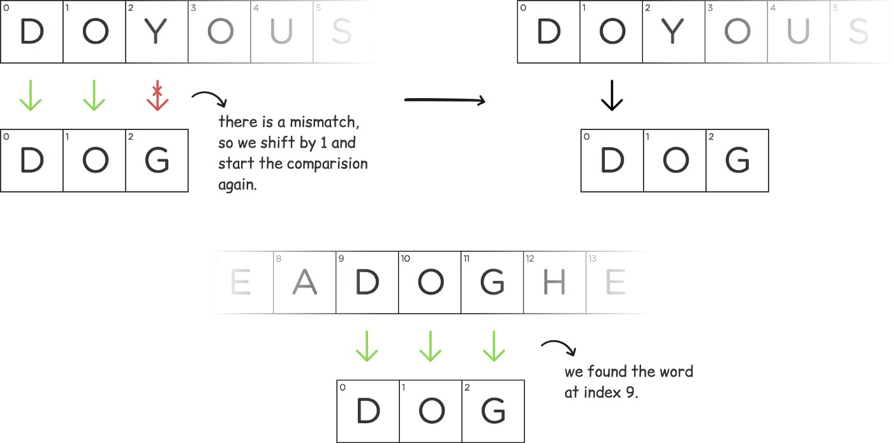
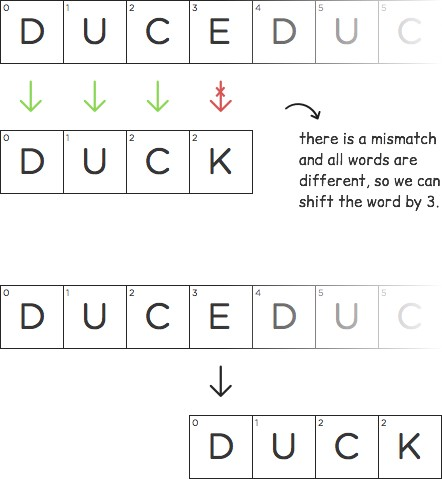
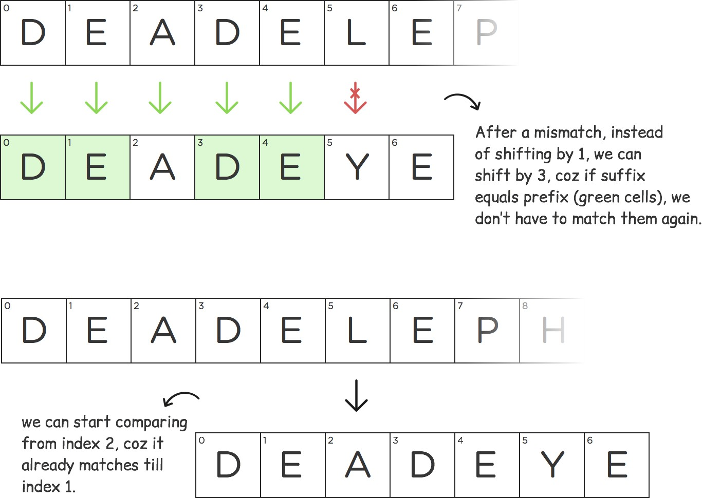
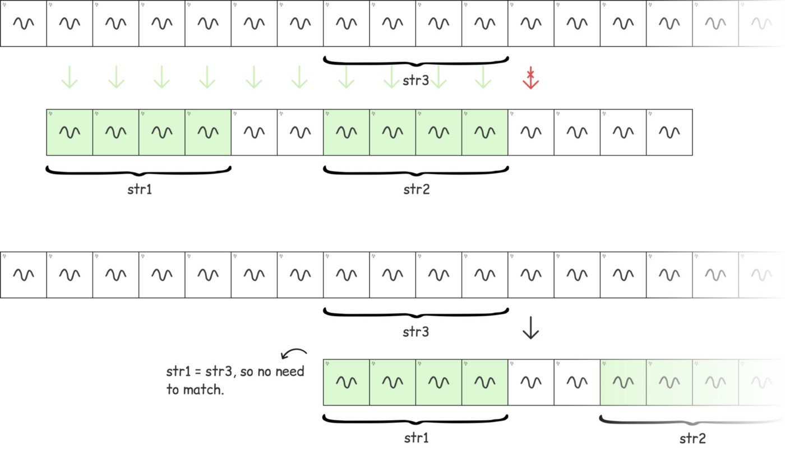
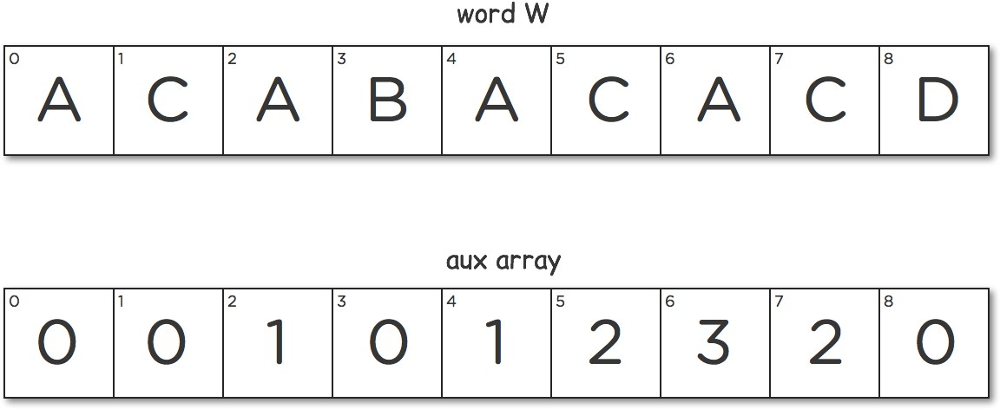
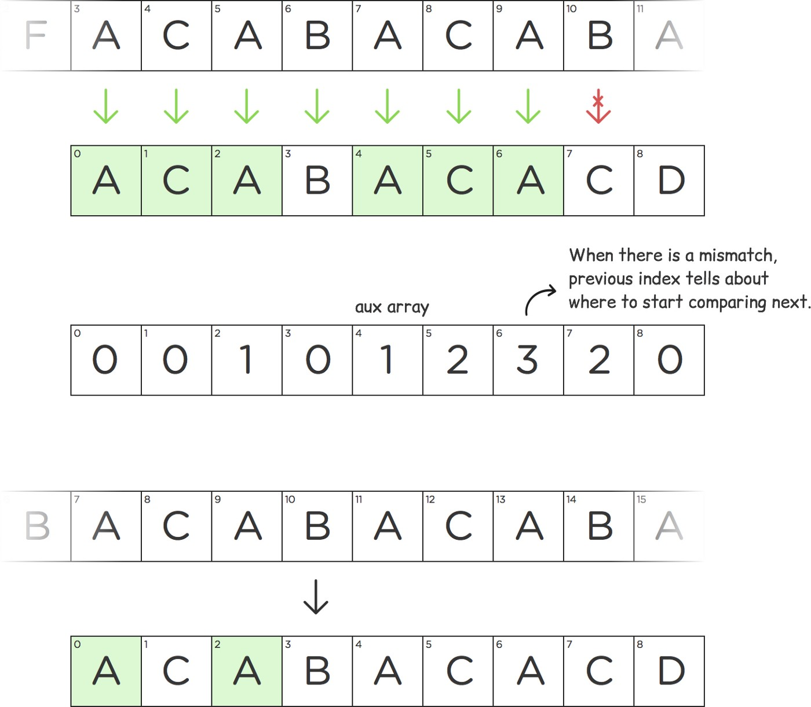

# Knuth–Morris–Pratt (KMP)

KMP (Knuth–Morris–Pratt algorithm) is a nice algorithm for solving some string matching
problems (match a pattern in a text).

## Naive solution

A naive way to solve this problem would be to compare each character of W with T. Every time there is a mismatch, we shift W to the right by 1, then we start comparing again.

Example:



One naive way to solve this problem would be to compare each character of W with T. Every time there is a mismatch, we shift W to the right by 1, then we start comparing again.

But we can do it better by using KMP algorithm.

## KMP



As you can see in the above image, there is a mismatch at index 3. According to naive approach next step would be to shift W by 1. Since all letters in W are different, we can actually shift W by the index where mismatch occurred (3 in this case). We can say for sure there won’t be any match in between.

Let take another example:



In the above image the green cells in the left substring is equal to the green cells in the right substring. It is actually the largest prefix which is also equal to the suffix of the substring till index 4 of the word “deadeye”

Now let’s see how it works by taking an abstract example:



str1 = str2 (green cells) and str2 = str3. When there is a mismatch after str2, we can directly shift the word till after str1 as you can see in the image. **Green cells actually tell us the index from where it should start comparing next, if there is a mismatch.**

### Calculate LPS (Longest Proper Prefix which is also Suffix) table

Prefix table (also known as LPS/ Longest Prefix Suffix) is an array data structure which captures the longest prefix which is also a suffix for every substring starting at index 0.





### Source code

Example code to compute LPS table

```cpp
std::vector<int> computeLPS(std::string pat) {
  int patSize = pat.size();
  std::vector<int> lsp(patSize, 0);
  int left = 0;
  int right = 1;
  lsp[0] = 0;
  while (right < patSize) {
    if (patt[left] == pat[right]) {
      lsp[right] = left + 1;
      ++left;
      ++right;
    } else {
      if (left != 0) {
        left = lsp[left - 1];
      } else {
        lsp[right] = 0;
        ++right;
      }
    }
  }
}
```

Example code to do KMS search

```cpp
int kmpSearch(std::string str, std::string pat) {
  auto strSize = str.size();
  auto patSize = pat.size();
  auto lsp = computeLPS(pat);

  int strIdx = 0;
  int patIdx = 0;

  while (strIdx < strSize) {
    if (str[strIdx] == pat[patIdx]) {
      ++strIdx;
      ++patIdx;
    } else {
      if (patIdx != 0) {
        patIdx = lsp[patIdx - 1];
      } else {
        ++strIdx;
      }
    }

    if (patIdx == patSize - 1) {
      return strIdx - patIdx;
    }
  }

  return -1;
}
```

### Time/space complexity

Time complexity: O(n + m)
Space complexity: O(m)

where:

- n is the size of the string
- m is the size of the pattern
