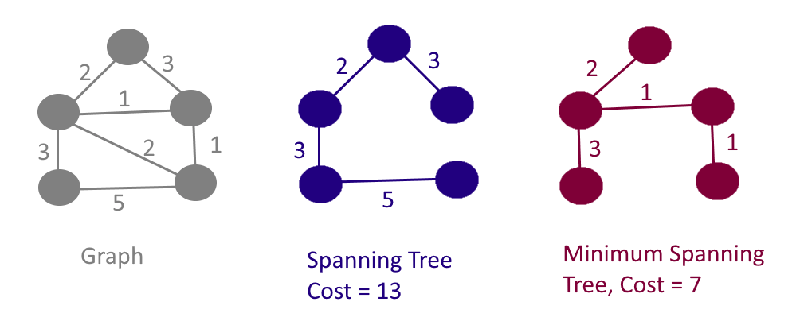

# Minimum Spanning Tree

## 1. What is a Spanning Tree?

In an undirected and connected graph G=(V,E), a spanning tree is a subgraph that is a tree which includes all of the vertices of G, with minimum possible number of edges. A graph may have several spanning trees. The cost of the spanning tree is the sum of the weights of all the edges in the tree

## 2. What is a Minimum Spanning Tree?

A minimum spanning tree (M- ST) is the spanning tree where the cost is minimum among all the spanning trees.



## 3. Prim’s Algorithm

- Prim’s algorithm is a greedy algorithm that works well on **dense graphs**.
- It finds a minimum spanning tree for a weighted **UNDIRECTED** graph.

**Algorithm Steps:**

1. Choose any arbitrary node s as root node
2. Enqueues all edges incident to s into a Priority Queue (PQ)
3. Repeatedly do the following greedy steps until PQ is empty: If the vertex v with edge e (w -> v) in the PQ has not been visited then add e to MST and enqueue all edges connected to v into the PQ.

[Visualising](https://visualgo.net/en/mst)

```cpp
#include <iostream>
#include <vector>
#include <queue>

std::vector<std::vector<std::pair<int, int>>> adj;
std::vector<bool> visited;
std::priority_queue<std::pair<int, int>, std::vector<std::pair<int, int>>, std::greater<std::pair<int, int>>> queue;

void addEdges(int s) {
	visited[s] = true;
	for (int i = 0; i < adj[s].size(); ++i) {
		if (visited[adj[s][i].second]) {
			continue;
		}

		queue.push(adj[s][i]);
	}
}

int main() {
	int n, m, a, b, w;
	std::cin >> n >> m;
	adj = std::vector<std::vector<std::pair<int, int>>>(n + 1, std::vector<std::pair<int, int>>{});
	visited = std::vector<bool>(n + 1, false);

	for (int i = 0; i < m; ++i) {
		std::cin >> a >> b >> w;
		adj[a].push_back(std::make_pair(w, b));
		adj[b].push_back(std::make_pair(w, a));
	}

	int edgeCount = 0;
	int mstCost = 0;
	addEdges(1);

	while(!queue.empty() && edgeCount != n - 1) {
		auto cost = queue.top().first;
		auto des = queue.top().second;
		queue.pop();

		if (visited[des]) {
			continue;
		}

		mstCost += cost;
		++edgeCount;

		addEdges(des);
	}

	if (edgeCount != n - 1) {
		// No MST found
		std::cout << "0";
	} else {
		std::cout << mstCost;
	}
}
```

The time complexity of Prim's algorithm is O(E log V).
