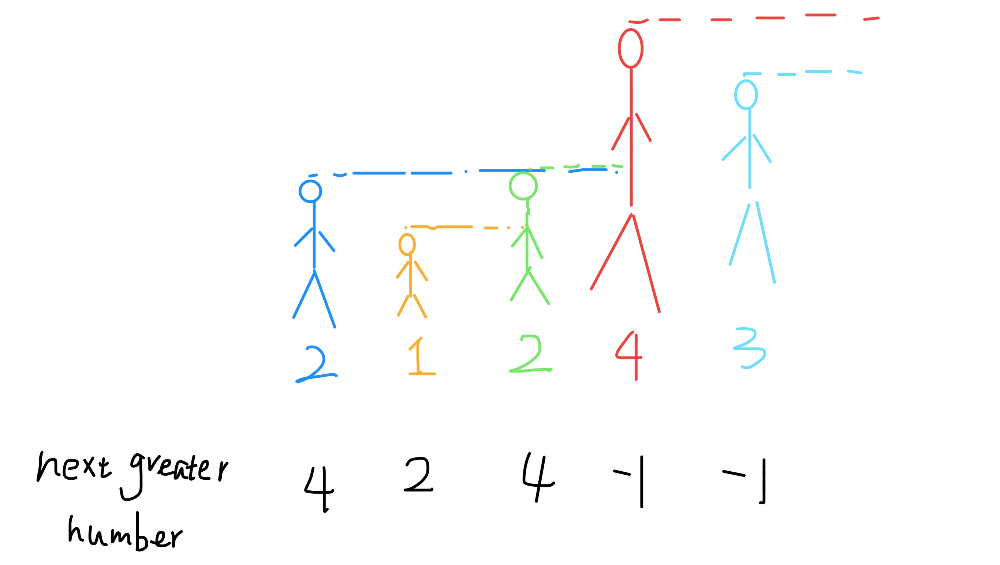

# Monotonic stack

Stack is a very simple data structure. The logical sequence of first in and last out conforms to the some characteristics of some problems, such as function call stack.

Monotonic stack is actually a stack. It just uses some ingenious logic to keep the elements in the stack orderly (monotone increasing or monotone decreasing) after each new element putting into the stack.

Well,sounds like a heap? No, monotonic stack is not widely used. It only deals with one typical problem, which is called `Next Greater Element`

If a problem is suitable to use monotonic stack, it must has at least three characters:

1. It is a `range queries in an array` problem.
2. The minima/maxima element or the monotonic order of elements in a range is useful to get answer of every range query.
3. When a element is popped from the monotonic stack, it will never be used again

## Example

### Next greater element

Give you an array,and return an array of equal length.The corresponding index stores the next larger element, if there is no larger element, store -1. It's not easy to explain clearly in words. Let's take a direct example:

Give you an array [2,1,2,4,3],and you return an array [4,2,4,-1,-1].

This problem can be thought abstractly: think of the elements in the array as people standing side by side, and the size of the elements as the height of an adult. These people stand in line before you. How to find the Next Greater Number of element "2"? Very simply, if you can see the element "2", then the first person you can see behind him is the Next Greater Number of "2". Because the element smaller than "2" is not tall enough and it is blocked by "2",the first one not being blocked is the answer.



This is a very understandable situation,huh? With this abstract scenario in mind, let's look at the code first.

```cpp
vector<int> nextGreaterElement(vector<int>& nums) {
    vector<int> ans(nums.size()); // array to store answer
    stack<int> s;
    for (int i = nums.size() - 1; i >= 0; i--) { // put it into the stack back to front
        while (!s.empty() && s.top() <= nums[i]) { // determine by height
            s.pop(); // short one go away while blocked
        }
        ans[i] = s.empty() ? -1 : s.top(); // the first tall behind this element
        s.push(nums[i]); // get into the queue and wait for later height determination
    }
    return ans;
}
```
