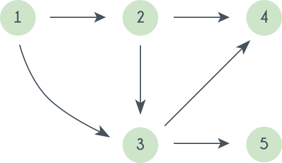

# Topological Sort

A topological ordering is an ordering of the nodes in a directed graph where for each directed edge from node A to node B, node A appears before node B in the ordering.

For example:



A topological sorting of this graph is: 1 2 3 4 5

Topological ordering are **NOT** unique. For the graph given above one another topological sorting is: 1 2 3 4 5

Note: Not every graph can have a topological ordering. A graph which contains a **cycle** can not have a valid ordering.

## 1. Kahn's algorithm

**Algorithm Steps:**

- Compute in-degree (number of incoming edges) for each of the vertex present in the DAG and initialize the count of visited nodes as 0.
- Pick all the vertices with in-degree as 0 and add them into a queue (Enqueue operation)
- Remove a vertex from the queue (Dequeue operation) and then.
  - Push node to topological array.
  - Decrease in-degree by 1 for all its neighbouring nodes.
  - If in-degree of a neighbouring nodes is reduced to zero, then add it to the queue.
- Repeat Step 3 until the queue is empty.
- If size of topological array is not equal to the number of nodes in the graph then the topological sort is not possible for the given graph.

```cpp
std::vector<int> inDegree(n, 0);
for (int i = 0; i < n; ++i) {
  for (int j = 0; j < adj[i].size(); ++j) {
    ++inDegree[adj[i][j]];
  }
}

std::queue<int> queue;
for (int i = 0; i < n; ++i) {
  if (inDegree[i] == 0) {
    queue.push(i);
  }
}

std::vector<int> topologicalOrdering;
while (!queue.empty()) {
  auto node = queue.front();
  queue.pop();
  topologicalOrdering.push_back(node);

  for (int i = 0; i < adj[node].size(); ++i) {
    --inDegree[adj[node][i]];
    if (inDegree[adj[node][i]] == 0) {
      queue.push(adj[node][i]);
    }
  }
}

if (topologicalOrdering.size() != n) {
  // Graph contains a cycle
} else {
  // The topological ordering is in this vector `topologicalOrdering`
}
```

## 2. DFS

**Algorithm Steps:**

- Pick an unvisited node
- Begin with the selected node, do a DFS exploring only unvisited nodes
- On the recursive callback of the DFS, add the current node to the topological ordering in the reverse order

```cpp
T = []
visited = []

topological_sort(cur_vert, N, adj[][]){
  visited[cur_vert] = true
  for i = 0 to N
      if adj[cur_vert][i] is true and visited[i] is false
        topological_sort(i)
  T.insert_in_beginning(cur_vert)
}
```
