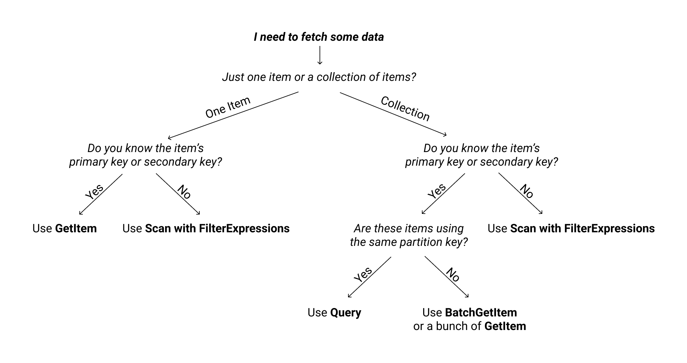

# Read and Write data to DynamoDB

## Write data

**PutItem**

```bash
aws dynamodb put-item \
    --table-name Blog \
    --item "{ \
        \"Author\" : { \"S\" : \"Seth Godin\"}, \
        \"Topic_Title\" : { \"S\" : \"Marketing, This is Marketing\" } }" \
    --return-consumed-capacity TOTAL
```

**--return-consumed-capacity** determines the level of detail about either provisioned or on-demand throughput consumption that is returned in the response:

- INDEXES - The response includes the aggregate ConsumedCapacity for the operation, together with ConsumedCapacity for each table and secondary index that was accessed.
Note that some operations, such as GetItem and BatchGetItem, do not access any indexes at all. In these cases, specifying INDEXES will only return ConsumedCapacity information for table(s).
- TOTAL - The response includes only the aggregate ConsumedCapacity for the operation.
- NONE - No ConsumedCapacity details are included in the response.

**Note**: If the primary key matches with a primary key of an item already present, the new item will **REPLACE** the old item.

**BatchWriteItem**

```
{
  "Blog" : [
    {
      "PutRequest": {
        "Item": {
          "Author" : {"S":"Huy"},
          "Topic_Title" : {"S":"DynamoDB, Hello world"}
        }
      }
    },
    ...
  ]
}
```

```bash
aws dynamodb batch-write-item \
    --request-items file://batch.json \
    --return-consumed-capacity INDEXES \
    --return-item-collection-metrics SIZE
```

## Read data

DynamoDB offers two ways to access information stored: Query and Scan.

**Query**

If our table doesn’t have a sort key, i.e the partition key that uniquely identifies every item in the table, we can only query one item at a time. We need to specify the partition key to query each item.

If the table also has a sort key, we can query multiple items by using a range-over-sort key. To query multiple items, we need to specify the partition key and a range-over-sort key. All items you want to query should be from the same partition. All the items from the given partition, that belong to the given range, are returned in a sorted order.

```bash
aws dynamodb query \
  --table-name Blog \
  --select SPECIFIC_ATTRIBUTES \
  --projection-expression "Author" \
  --key-condition-expression 'Author= :author AND Topic_Title = :topic_title' \
  --expression-attribute-values \
    "{
      \":author\" : {\"S\" : \"Huy\"},
      \":topic_title\" : {\"S\" : \"Hello world\"}
    }"
```

Amazon DynamoDB returns all the item attributes by default. To get only some, rather than all of the attributes, use a `projection expression`.

**Scan**

Scan reads every item in a table, which can be inefficient and costly for large datasets. You can fetch a maximum of 1 MB of data in one go and you can also apply filters to refine the items you get, all while scanning

```bash
aws dynamodb scan \
    --table-name Blog \
    --filter-expression 'Author = :author' \
    --expression-attribute-values \
    "{
        \":author\" : {\"S\" : \"Huy\"}
    }"
```

 
