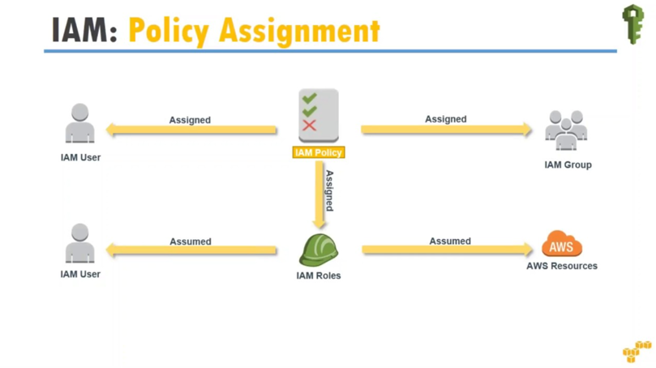

# IAM

IAM is a service that controls access to AWS resources

## IAM entities:

1. Users: mapped to a physical user, has a password for AWS console
2. Groups: Functions (admin, devops) Teams (engineering, design) which contain a group of users.
3. Roles: Internal usage within AWS resources
4. Policy is a JSON document that defines one or more permissions for users or groups.

You can apply policies to users, groups, and roles. Users, groups, and roles can all share the same policy documents.

Below is an example of a JSON policy document:

```json
{
    "Version": "2012-10-17",
    "Statement": [
        {
            "Effect": "Allow",
            "Action": [
                "aws-portal:ViewBilling",
                "aws-portal:ViewPaymentMethods",
                "aws-portal:ModifyPaymentMethods",
                "aws-portal:ViewAccount",
                "aws-portal:ModifyAccount",
                "aws-portal:ViewUsage"
            ],
            "Resource": [
                "*"
            ],
            "Condition": {
                "IpAddress": {
                    "aws:SourceIp": "203.0.113.0/24"
                }
            }
        },
        {
            "Effect": "Deny",
            "Action": [
                "s3:*"
            ],
            "Resource": [
                "arn:aws:s3:::customer",
                "arn:aws:s3:::customer/*"
            ]
        }
    ]
}
```

 

## Best practices

- One IAM User per person ONLY
- One IAM Role per Application
- Never use the ROOT account except for initial setup
- It's best to give users the minimal amount of permissions to perform their job
