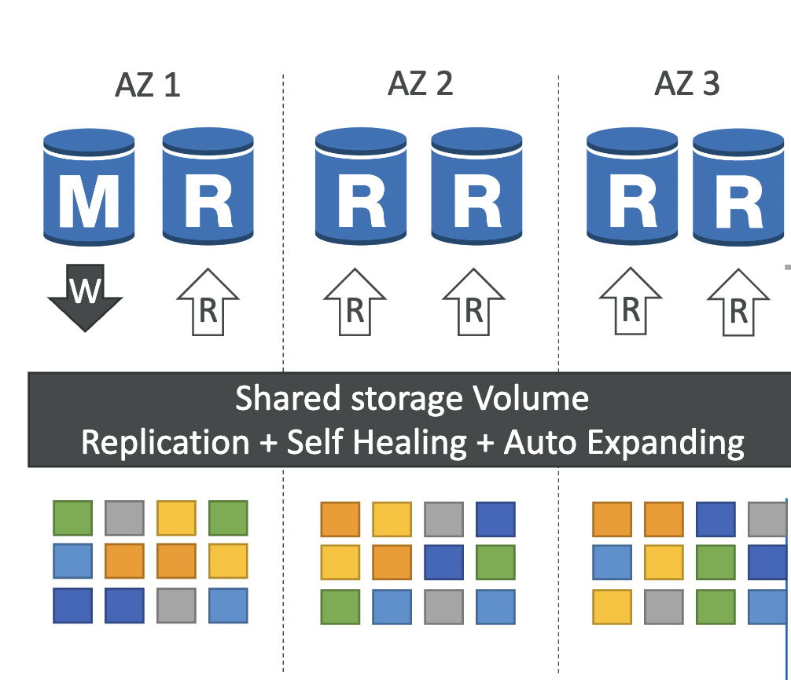
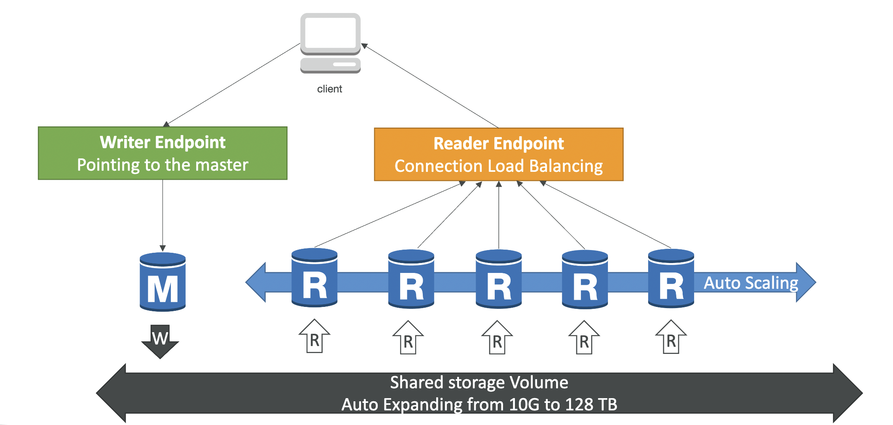

# RDS

RDS stands for Relational Database Service. It's allow you to create database in the cloud that are managed by AWS

- Postgres
- MySQL
- MariaDB
- Oracle
- Microsoft SQL Server
- Aurora (AWS proprietary database)

### RDS read replicas

- Up to 5 Read Replicates
- Within AZ, Cross AZ, Cross Region
- Replication is **ASYNC**, so read are eventual consistency
- Replicas can be promoted to their own DB
- Application must update to the connection string to leverage read replicas
- RDS replicas within the same region, you don't pay that fee.
- RDS replicas across region, you must pay that fee.

**Benefit**

- Improved reliability and disaster recovery
- Increased app performance

### RDS multi AZ

- **SYNC** replication
- One DNS name - automatic app failover to standby
- Increased the availability
- Not used for scaling 
- Multi-AZ replication is free

## Aurora

Amazon Aurora is a relational database service developed and offered by Amazon Web Service. Postgres and MySQL are both supported as Aurora DB (that means your drivers will work as if Aurora was Postgres or MySQL database).

Aurora claims 5x performance improvement over MySQL on RDS, over 3x the performance of Postgres on RDS

Aurora storage automatically grows in increments of 10Gb up to 128 Tb.

Aurora can have up to 15 replicas (MySQL has 5) and replication process is faster

Aurora costs more than RDS (20% more)

### Aurora High Availability and Read scaling

Aurora stores copies of the data in a DB cluster across multiple Availability Zones in a single AWS Region. When data is written to the primary DB instance, Aurora synchronously replicates the data across Availability Zones to six storage nodes associated with your cluster volume. 

 

 

## Best practice in RDS
- [https://docs.aws.amazon.com/AmazonRDS/latest/UserGuide/CHAP_BestPractices.html](https://docs.aws.amazon.com/AmazonRDS/latest/UserGuide/CHAP_BestPractices.html)
- [https://www.youtube.com/watch?v=9-7azhB27So](https://www.youtube.com/watch?v=9-7azhB27So)
