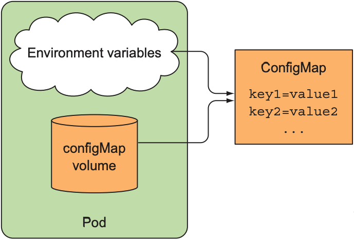
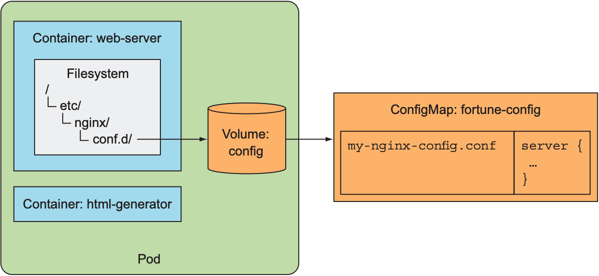
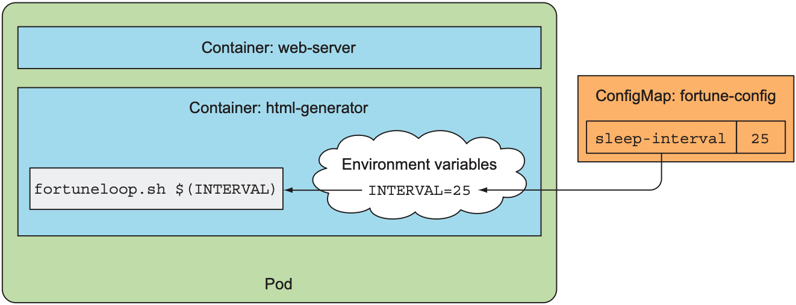

# ConfigMaps

## 1. Description

A ConfigMap is an API object used to store non-credential data in key-value pairs.

Kubernetes pods can use the created ConfigMaps as a:

- Configuration files
- Environment variable
- Command-line argument

A ConfigMap allows you to decouple environment-specific configuration from your container images, so that your applications are easily portable.

Importantly, ConfigMaps are not suitalbe for storing a confidental data. They don't provide any kind of encryption, and all the data in them are visible to anyone who has access to the file.

## 2. Define a ConfigMap

```
apiVersion: v1
kind: ConfigMap
metadata:
  name: game-demo
data:
  # property-like keys; each key maps to a simple value
  player_initial_lives: "3"
  ui_properties_file_name: "user-interface.properties"

  # file-like keys
  game.properties: |
    enemy.types=aliens,monsters
    player.maximum-lives=5

  user-interface.properties: |
    color.good=purple
    color.bad=yellow
    allow.textmode=true

  prometheus.yaml: |
    global:
      scrape_interval: 15s
    scrape_configs:
      - job_name: prometheus
        metrics_path: /prometheus/metrics
        static_configs:
          - targets:
            - localhost:9090
```

In a ConfigMap, the required information can store in the `data` field. We can store values as two ways:

- As individual key-value pair properties
- In a granular format where they are fragments of a configuration format. (File Like Keys)

## 3. Utilizing ConfigMaps in Pod

There are four ways that you can use a ConfigMap to configure a container inside a Pod:

1. Inside a container command and args
2. Environment variables for a containers
3. Add a file in read-only volumne, for application to read
4. Write code inside the Pod that uses the K8s API to read a ConfigMap

Here's an example Pod that that uses values from the above ConfigMap:

```
apiVersion: v1
kind: Pod
metadata:
  name: configmap-demo-pod
spec:
  containers:
    - name: demo
      image: alpine
      command: ["sleep", "3600"]
      env:
        # Define the environment variable
        - name: PLAYER_INITIAL_LIVES # Notice that the case is different here
                                     # from the key name in the ConfigMap.
          valueFrom:
            configMapKeyRef:
              name: game-demo           # The ConfigMap this value comes from.
              key: player_initial_lives # The key to fetch.
        - name: UI_PROPERTIES_FILE_NAME
          valueFrom:
            configMapKeyRef:
              name: game-demo
              key: ui_properties_file_name
      volumeMounts:
      - name: config
        mountPath: "/config"
        readOnly: true
  volumes:
    # You set volumes at the Pod level, then mount them into containers inside that Pod
    - name: config
      configMap:
        # Provide the name of the ConfigMap you want to mount.
        name: game-demo
        # An array of keys from the ConfigMap to create as files
        items:
        - key: "game.properties"
          path: "game.properties"
        - key: "user-interface.properties"
          path: "user-interface.properties"
        - key: "prometheus.yaml"
          path: "prometheus.yaml"
```

For this example, defining a volume and mounting it inside the demo container as `/config` creates three files, `/config/game.properties`, `/config/user-interface.properties` and `prometheus.yaml`, even though there are four keys in the ConfigMap.
This is because the Pod definition specifies an `items` array in the `volumes` section.
If you omit the `items` array entirely, every key in the ConfigMap becomes a file with the same name as the key, and you get 5 files

### Pods use ConfigMaps through environment variables and configMap volumes



### Pass ConfigMap entries to a pod as files in a volume



### Pass a ConfigMap entry as a command-line argument

```
apiVersion: v1
kind: Pod
metadata:
  name: fortune-args-from-configmap
spec:
  containers:
  - image: luksa/fortune:args
    env:
    - name: INTERVAL
      valueFrom:
        configMapKeyRef:
          name: fortune-config
          key: sleep-interval
    args: ["$(INTERVAL)"]
```


