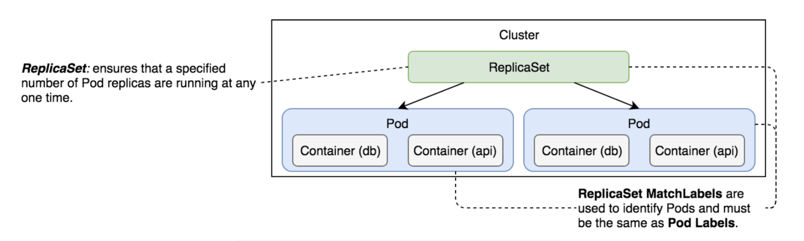
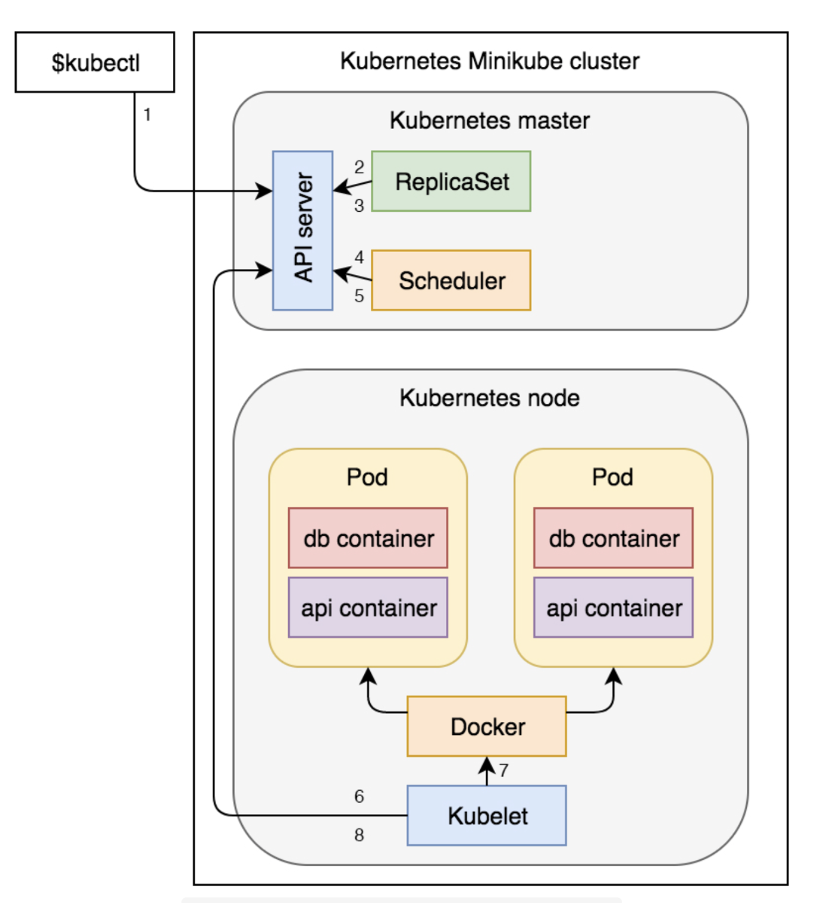

# Controllers

## 1. ReplicaSet

A ReplicaSet ensures that a specified number of pod replicas are running at any given time.

Example:

```
apiVersion: apps/v1
kind: ReplicaSet
metadata:
  name: frontend
spec:
  replicas: 2
  selector:
    matchLabels:
      tier: frontend
  template:
    metadata:
      labels:
        tier: frontend
    spec:
      containers:
      - name: php-redis
        image: gcr.io/google_samples/gb-frontend:v3
```

The `apiVersion`, `kind`, `metadata` fields are mandatory with all k8s objects.

- Line 1: We specified that the `apiVersion` is `apps.v1`
- Line 2-3: The `kind` is `ReplicaSet` and `metadata` has the `name` key set to `frontend`
- Line 5-6: The first field we defined in the `spec` section is `replicas`. It sets the desired number of replicas of the pod. In this case the ReplicaSet should ensure that 2 pods should run concurrently.
- Line 7: The next `spec` section is the `selector`. We use it to select which pods should be included in the ReplicaSet. If pods that match the `selector` exist, ReplicaSet will do nothing. If they don't, it will create as many as pods that match the value of the `replicas` field. Not only that ReplicaSet creates the pods that are missing, but also monitors the cluster and ensures that the desired number of `replicas` is always running.
- Line 8-9: We used `spec.selector.matchLabels` to specify labels. They must match the labels defined in `spec.tempalte`. In our case, ReplicaSet will look for Pods with `tier` set to `frontend`. If pods with this label does not exist, it will create them using the `spec.template` section.
- Line 10-13: The last section of the `spec` field is the `template` and it has the same schema as a Pod specification. At a minimum, the labels of the `spec.template.metadata.labels` section must match those specified in the `spec.selector.matchLabels`.
- Line 14-17: Finally the `spec.template.spec` section the `containers` definition.



### The process of creating ReplicaSet

1. K8s client (kubectl) sent a request to the API server requesting the creation of ReplicaSet
2. The controller is watching the API server for new events and it detected that there is a new ReplicaSet objecto
3. The controller creates 2 new pod definitions because we have configured replica value as 2 in the above example
4. The scheduler is watching the API server for new events and it detected that there are 2 unasigned pods
5. The scheduler decided which node to assign the Pod and sent that information to the API server
6. Kublet is also watching the API server. It detected that the 2 pods were assigned to the node it is running on
7. Kublet sent request to Docker requesting the creation of the containers that form the Pod.
8. Finally, Kublet sent a request to the API server notifying it that the pods were created successfully



A ReplicaSet ensures that a specified number of pod replicas are running at any given time. However, a Deployment is a higher-level concept that manages ReplicaSets and provides declarative updates to Pods along with a lot of other useful features. Therefore, k8s recommend using Deployments instead of directly using ReplicaSets, unless you require custom update orchestration or don't require updates at all.

This actually means that you may never need to manipulate ReplicaSet objects: use a Deployment instead, and define your application in the spec section.

## 2. Deployments

Kubernetes Deployment is the process of providing declarative updates to Pods and ReplicaSets.

### Define a zero-downtime deployment

```
apiVersion: apps/v1
kind: Deployment
metadata:
  name: go-demo-2-api
spec:
  replicas: 3
  selector:
    matchLabels:
      type: api
      service: go-demo-2
  minReadySeconds: 1
  progressDeadlineSeconds: 60
  revisionHistoryLimit: 5
  strategy:
    type: RollingUpdate
    rollingUpdate:
      maxSurge: 1
      maxUnavailable: 1
  template:
    metadata:
      labels:
        type: api
        service: go-demo-2
        language: go
    spec:
      containers:
      - name: api
        image: vfarcic/go-demo-2
        env:
        - name: DB
          value: go-demo-2-db
        readinessProbe:
          httpGet:
            path: /demo/hello
            port: 8080
          periodSeconds: 1
        livenessProbe:
          httpGet:
            path: /demo/hello
            port: 8080
```

- `spec.minReadySeconds`: defines the number of seconds before k8s starts considering the Pod healthy. The default value is `0`, meaning that the Pods will be considered available as soon as they are ready and, when specified `livenessProbe` returns OK.
- `spec.revisionHistoryLimit`: defines the number of old `ReplicaSet` we can rollback (default value is `10`)
- `spec.strategy.type`: can be either `RollingUpdate` or `Recreate` type.

### Deployment strategies

#### Recreate

The recreate strategy is a dummy deployment which consists of shutting down version A then deploying version B after version A is turned off. This technique implies downtime of the service that depends on both shutdown and boot duration of the application.


Pros:

- Easy to setup
- Application state entirely renewed.

Cons:

- High impact on the user, expect downtime that depends on both shutdown and boot duration of the application.

#### Rolling update

The rolling update deployment strategy consists of slowly rolling out a version of an application by replacing instances one after the other until all the instances are rolled out.


Pros:

- Easy to setup
- Version is slowly released across instances
- Convenient for stateful applications that can handle rebalancing of the data.

Cons:

- Rollout/rollback can take time.
- Supporting multiple APIs is hard.
- No control over traffic.
