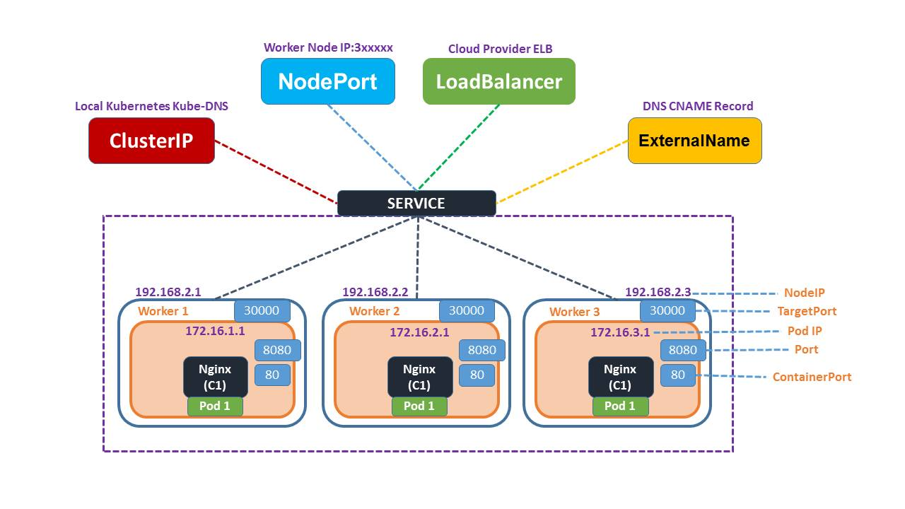
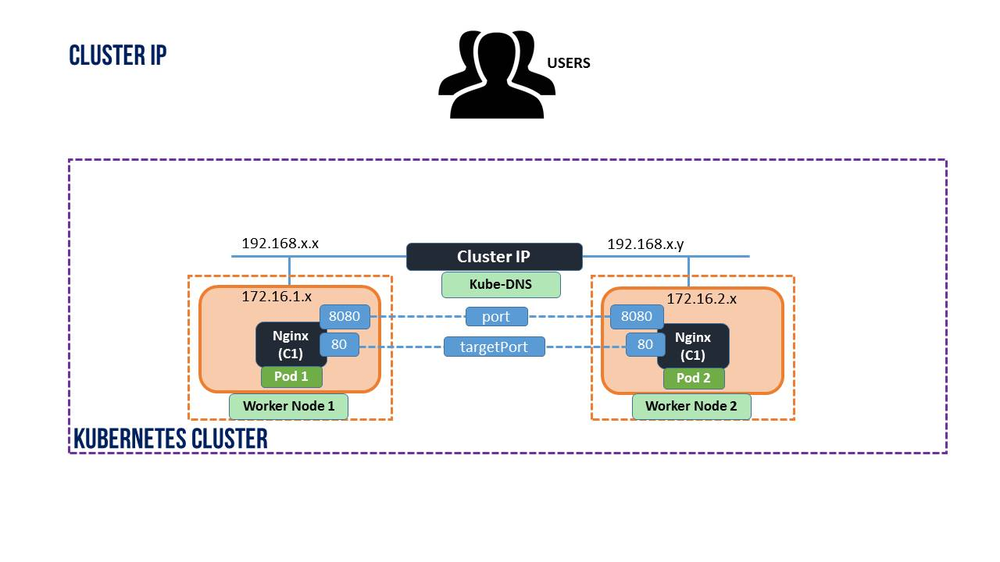
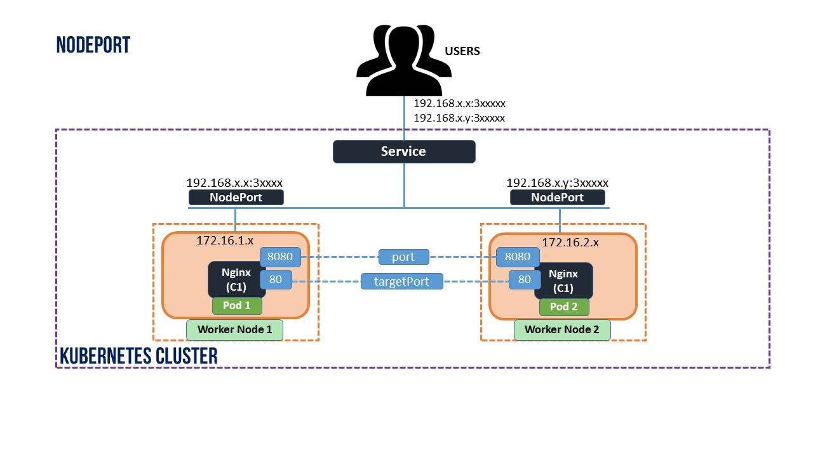
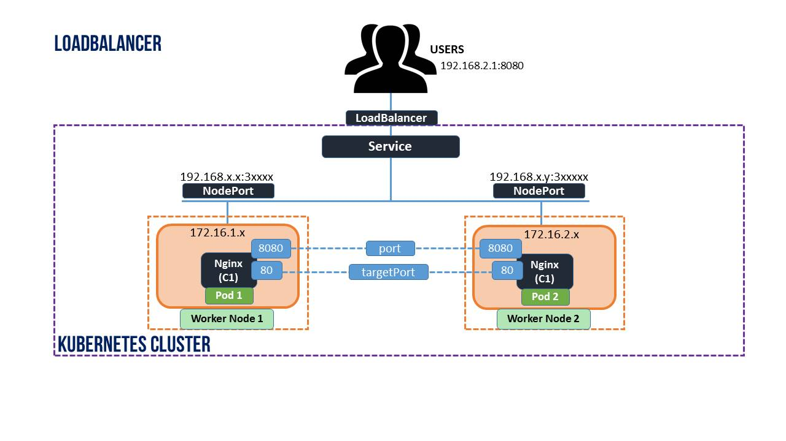
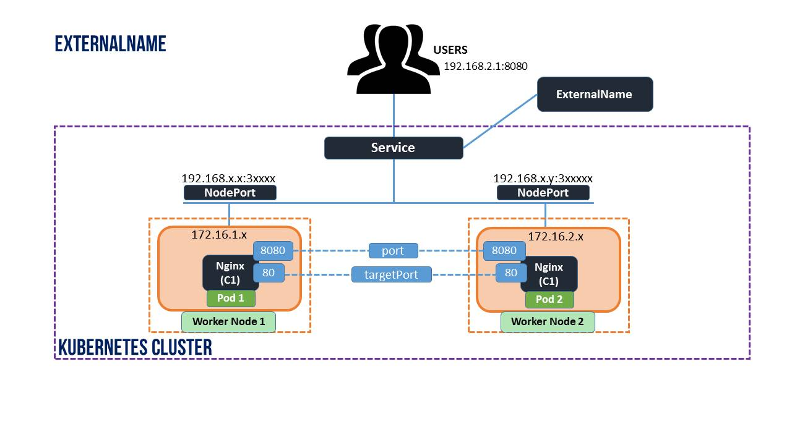

# Service

Kubernetes pods are created and destroyed to match the state of your cluster. If you use Deployment to run your app, it can create and destroy pods dynamically.

Each pods get it own IP address, however in Deployment, the set of pods running in one moment in time could be different from the set of pods running that application a moment later.

It leads to a problem that if set of pods (backend) provides functionality for other pods (frontend) inside your cluster, how do the frontend can find out and keep track which ip address to connect to?

Kubernetes Services provides addresses through which associated pods can be accessed.



## 1. Define a service

For example, suppose you have a set of pods where each listens on TCP port `9376` and contains a label `app=MyApp`

```yaml
apiVersion: v1
kind: Service
metadata:
  name: my-service
spec:
  selector:
    app: MyApp
  ports:
    - protocol: TCP
      port: 80
      targetPort: 9376
```

This specification creates a new Service object named `my-service` which targets TCP port `9376` on any Pod with the `app=MyApp` label.

Kubernetes assigns this Service an IP address (sometimes called the "cluster IP"), which is used by the Service proxies.

The controller for the Service selector continuously scans for Pods that match its selector, and then POSTs any updates to an Endpoint object also named `my-service`.

## 2. Services without selectors

Services most commonly abstract access to Kubernetes Pods, but they can also abstract other kinds of backends. For example:

- You want to have an external database cluster in production, but in your test environment you use your own databases.
- You want to point your Service to a Service in a different Namespace or on another cluster.

Eg:

```yaml
apiVersion: v1
kind: Service
metadata:
  name: my-service
spec:
  ports:
    - protocol: TCP
      port: 80
      targetPort: 9376
```

Because this Service has no selector, the corresponding Endpoints object is not created automatically. You can manually map the Service to the network address and port where it's running, by adding an Endpoints object manually:

```yaml
apiVersion: v1
kind: Endpoints
metadata:
  name: my-service
subsets:
  - addresses:
      - ip: 192.0.2.42
    ports:
      - port: 9376
```

## 3. Type of service

Kubernetes Services allow you to specify what kind of Service you want. The default is `ClusterIP`.

`Type` values and their behavior are:

- `ClusterIP`: Exposes the service on cluster internal IP. Choosing this makes the Service only reachable from within the cluster.



- `NodePort`: Exposes the service on each Node'IP at a static port. A `ClusterIP` is automatically created. You will be able to reach the NodePort service from outside the cluster, by requesting <NodeIP>:<NodePort>



- `LoadBalancer`: Exposes the Service externally using a cloud provider's load balancer. `NodePort` and `ClusterIP` Services, to which the external load balancer routes, are automatically created.



- `ExternalName`: Maps the Service to the content of the `externalName` field.


