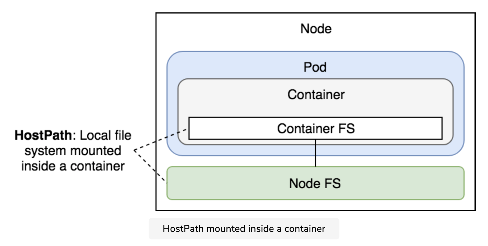

# Volumes

On-disk file in a container are ephemeral, which presents some problems for non-trivial applications when running in containers. One problem is the loss of files when a container crashes. The kubelet restarts the container but with a clean state. A second problem occurs when sharing files between containers running together in a `Pod`. The k8s `Volumes` solves both of these problems.

## 1. Types of Volumes

K8s supportes several types of volumes. We can categorize the Kubernetes Volumes based on their lifecycle.

Considering the lifecycle of the volumes, we can have:

- **Ephemeral Volumes**, which are tightly coupled with the lifetime of the Node (for example emptyDir, or hostPath) and they are deleted if the Node goes down.
- **Persistent Volumes**, which are meant for long-term storage and are independent of the Pods or Nodes lifecycle. These can be cloud volumes (like gcePersistentDisk, awsElasticBlockStore, azureFile or azureDisk), NFS (Network File Systems) or Persistent Volume Claims (a series of abstraction to connect to the underlying cloud provided storage volumes).

### emptyDir

An emptyDir volume is first created when a Pod is assigned to a node and exists as long as that Pod is running on that node and the volume is initially empty.
All containers in the Pod can read and write the same files in the emptyDir volume, When a Pod is removed from a node for any reason, the data in the emptyDir is deleted permanently.

Depending on your environment, `emptyDir` volumes are stored on whatever medium that backs the node, such as disk or SSD or RAM.

Some use cases for an emptyDir are:

- Scratch space, for a sort algorithm for example
- Checkpointing a long computation for recovery from crashes
- As a cache
- Holding files that a content-manager container fetches while a webserver Container serves the data

**Note:** emptyDir volume should NOT be used for persisting data (database, application data, etc)


Example:

```
apiVersion: v1
kind: Pod
metadata:
  name: test-nginx
spec:
  containers:
  - image: nginx
    name: test-nginx
    volumeMounts:
    - mountPath: /cache
      name: cache-volume
  volumes:
  - name: cache-volume
    emptyDir: {}
```

Let’s try applying the YAML file and get into the Pod.

```
kubectl apply -f emptydir.yml
pod/test-nginx created

kubectl get pods
NAME         READY   STATUS    RESTARTS   AGE
test-nginx   1/1     Running   0          7s

kubectl exec -it test-nginx -- /bin/bash
root@test-nginx:/# mount | grep -i cache
/dev/vda1 on /cache type ext4 (rw,relatime)
```

If we see the storage medium used for the `emptyDir` mounted on the container we just created, it shows up as `/dev/vda1` a paravirtualization disk driver.

If you set the `emptyDir.medium` field to `Memory`. Kubernetes mounts a tmpfs (RAM-backed filesystem) for you instead.

```
apiVersion: v1
kind: Pod
metadata:
  name: test-nginx
spec:
  containers:
  - image: nginx
    name: test-nginx
    volumeMounts:
    - mountPath: /cache
      name: cache-volume
  volumes:
  - name: cache-volume
    emptyDir:
       medium: Memory
```

### hostPath

A hostPath volume mounts a file or directory from the host node's filesystem into your Pod.

Some use cases for an hostPath are:

- Running a container that needs access to Docker internals; use a hostPath of /var/lib/docker
- Persist database data, application data



Example:

```
apiVersion: v1
kind: Pod
metadata:
  name: test-pd
spec:
  containers:
  - image: k8s.gcr.io/test-webserver
    name: test-container
    volumeMounts:
    - mountPath: /test-pd
      name: test-volume
  volumes:
  - name: test-volume
    hostPath:
      # directory location on host
      path: /data
      # this field is optional
      type: Directory
```

The supported values for field `type` are:

- `DirectoryOrCreate`: If nothing exists at the given path, an empty directory will be created there as needed with permission set to `0755`, having the same group and ownership with Kubelet.
- `Directory`: A directory must exist at the given path
- `FileOrCreate`: If nothing exists at the given path, an empty file will be created there as needed with permission set to `0644`, having the same group and ownership with Kubelet.
- `File`: A file must exist at the given path
- `Socket`: A UNIX socket must exist at the given path
- `CharDevice`: A character device must exist at the given path
- `BlockDevice`: A block device must exist at the given path
