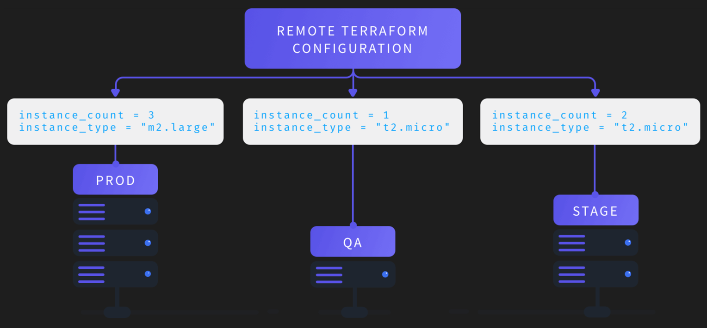

# Terragrunt



## How to set up Terragrunt configurations

Terragrunt configuration is defined in a `terragrunt.hcl` file.

```hcl
include {
  path = "../../env/${get_aws_account_id()}-terragrunt.hcl"
}
```

## Terragrunt use cases

### Keep your Terraform code DRY

Consider the following file structure, which defines two environments (prod, stage) with the same infrastructure in each one (an app, a MySQL database):

```
└── live
    ├── prod
    │   ├── app
    │   │   └── main.tf
    │   └── mysql
    │       └── main.tf
    └── stage
        ├── app
        │   └── main.tf
        └── mysql
            └── main.tf
```

The contents of each environment will be more or less identical, except perhaps for a few settings (e.g. the prod environment may run bigger or more servers)

**Remote Terraform configurations**

Terragrunt has the ability to download remote Terraform configurations. The idea is that you define the Terraform code for your infrastructure just once, in a single repo, called, for example, modules:

```
└── modules
    ├── app
    │   └── main.tf
    └── mysql
        └── main.tf
```

This repo contains typical Terraform code, with one difference: anything in your code that should be different between environments should be exposed as an input variable. For example, the app module might expose the following variables:

```terraform
variable "instance_count" {
  description = "How many servers to run"
}

variable "instance_type" {
  description = "What kind of servers to run (e.g. t2.large)"
}
```

In a separate repo, called, for example, live, you define the code for all of your environments, which now consists of just one terragrunt.hcl file per component (e.g. app/terragrunt.hcl, mysql/terragrunt.hcl, etc). This gives you the following file layout:

```
└── live
    ├── prod
    │   ├── app
    │   │   └── terragrunt.hcl
    │   └── mysql
    │       └── terragrunt.hcl
    └── stage
        ├── app
        │   └── terragrunt.hcl
        └── mysql
            └── terragrunt.hcl
```

For example, stage/app/terragrunt.hcl may look like this:

```terraform
terraform {
  # Deploy version v0.0.3 in stage
  source = "git::git@github.com:foo/modules.git//app?ref=v0.0.3"
}

inputs = {
  instance_count = 3
  instance_type  = "t2.micro"
}
```

**DRY common Terraform code with Terragrunt generate blocks**

Terragrunt has the ability to generate code in to the downloaded remote Terraform modules before calling out to terraform using the generate block. This can be used to inject common terraform configurations into all the modules that you use.

```terraform
generate "providers" {
  path      = "providers.tf"
  if_exists = "overwrite"
  contents  = <<EOF
terraform {

  required_providers {
    aws = {
      source  = "hashicorp/aws"
      version = "~> ${local.aws_provider_version}"
    }
  }

  backend "s3" {}
}
EOF
}
```

This instructs Terragrunt to create the file `provider.tf` in the working directory (where Terragrunt calls terraform) before it calls any of the Terraform commands (e.g `plan`, `apply`, `validate`, etc). This allows you to inject this provider configuration in all the modules that includes the root file.

To include this in the child configurations (e.g mysql/terragrunt.hcl), you would update all the child modules to include this configuration using the include block:

```terraform
include "root" {
  path = find_in_parent_folders()
}
```

**Create remote state and locking resources automatically**

The generate block is useful for allowing you to setup the remote state backend configuration in a DRY manner, but this introduces a bootstrapping problem: how do you create and manage the underlying storage resources for the remote state? For example, when using the s3 backend, Terraform expects the S3 bucket to already exist for it to upload the state objects.

Ideally you can manage the S3 bucket using Terraform, but what about the state object for the module managing the S3 bucket? How do you create the S3 bucket, before you run terraform, if you need to run terraform to create the bucket?

To handle this, Terragrunt supports a different block for managing the backend configuration: the remote_state block.

```terraform
remote_state {
  backend = "s3"
  generate = {
    path      = "backend.tf"
    if_exists = "overwrite"
  }
  config = {
    bucket         = "my-terraform-state"
    key            = "${path_relative_to_include()}/terraform.tfstate"
    region         = "us-east-1"
    encrypt        = true
    dynamodb_table = "my-lock-table"
  }
}
```

Like the approach with `generate` blocks, this will generate a `backend.tf` file that contains the remote state configuration. However, in addition to that, terragrunt will also now manage the S3 bucket and DynamoDB table for you. This means that if the S3 bucket `my-terraform-state` and DynamoDB table `my-lock-table` does not exist in your account, Terragrunt will automatically create these resources before calling terraform and configure them based on the specified configuration parameters.
