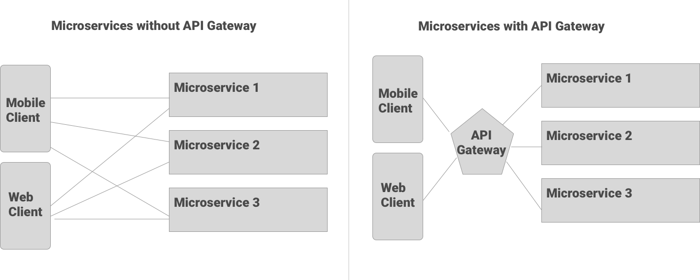
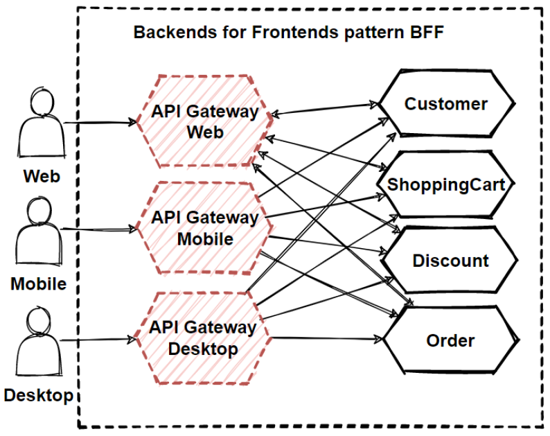

# API Gateway

An API gateway is a service which is the entry point into the application from the outside world and acts as a single point of entry for a defined group of microservices.

In high level It’s responsible for request routing, API composition, and other functions, such as authentication.

Functionalities of API Gateway:

- Authentication and authorization
- Load balancing
- Service discovery integration
- Protocol translation
- Response caching
- Retry policies, circuit breaker, and QoS
- Rate limiting and throttling
- Logging, tracing, correlation
- Headers, query strings, and claims transformation
- IP whitelisting
- IAM
- Centralized Logging (transaction ID across the servers, error logging)
- Identity Provider, Authentication and Authorization

List of notable API Gateways:

- [Zuul](https://github.com/Netflix/zuul)
- Amazon API Gateway
- Kong Gateway

## Benefits of API gateways

- **Decoupling**: If your clients which you have no control over communicated directly with many separate services, renaming or moving those services can be challenging as the client is coupled to the underlying architecture and organization. API gateways enables you to route based on path, hostname, headers, and other key information enabling you to decouple the publicly facing API endpoints from the underlying microservice architecture.
- **Reduce Round Trips**: Certain API endpoints may need to join data across multiple services. API gateways can perform this **aggregation** so that the client doesn’t not need complicated call chaining and reduce number of round trips.
- **Security**: API gateways provide a centralized proxy server to manage rate limiting, bot detection, authentication, CORS, among other things. Many API gateways allow setting up a datastore such as Redis to store session information.
- **Cross Cutting Concerns**: Logging, Caching, and other cross cutting concerns can be handled in a centralized appliances rather than deployed to every microservice.

## Backend for Frontend (BFF) pattern

It is a variation of the API Gateway pattern. Rather than a single point of entry for the clients, it provides multiple gateways based upon the client. The purpose is to provide tailored APIs according to the needs of the client, removing a lot of bloats caused by making generic APIs for all the clients.

Why BFF:

- Decoupling of Backend and Frontend for sure gives us faster time to market as frontend teams can have dedicated backend teams serving their unique needs.
  The release of new features of one frontend does not affect the other.
- We can much easier maintain and modify APIs and even provide API versioning dedicated for specific frontend, which is a big plus from a mobile app perspective as many users do not update the app immediately.
- The BFF can benefit from hiding unnecessary or sensitive data before transferring it to the frontend application interface, so keys and tokens for 3rd party services can be stored and used from BFF.
- Allows to send formatted data to frontend and because of that can minimalize logic on it.
- Additionally, give us possibilities for performance improvements and good optimization for mobile.
