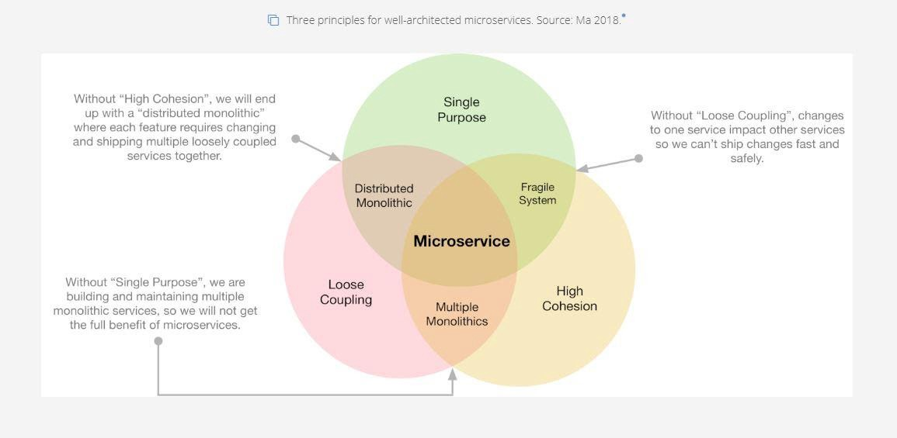
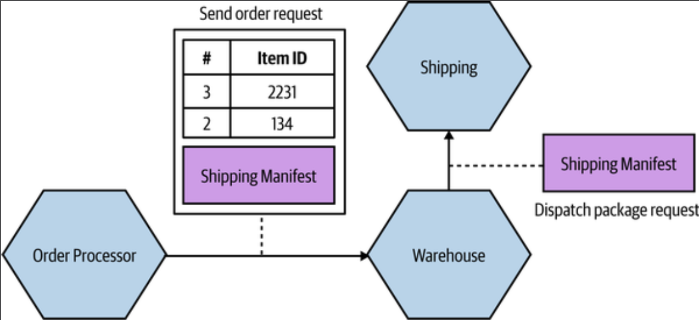
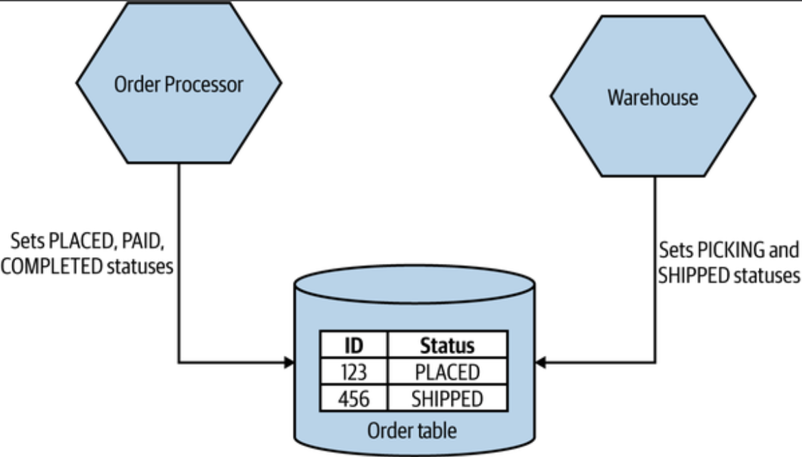
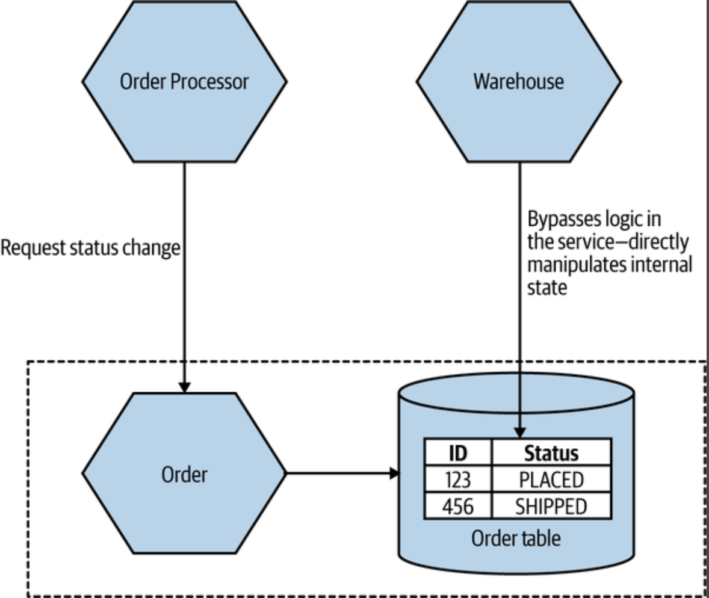

# Cohesion and coupling

## Cohesion

Cohesion is the degree to which the elements inside a microservice belong together.

A microservice with high cohesion contains elements that are tightly related to each other and united in their purpose.

## Coupling

Coupling is the degree of interdependence between microservices. When services are loosely coupled, a change to one service should not require a change to another.

### Type of coupling

### Domain coupling

Domain coupling describes a situation in which one microservice needs to interact with another microservice, because the first microservice needs to make use of the functionality that the other microservice provides.

In microservice, this type of interaction is largely unavoidable. A microservice-based system relies on multiple microservices collaborating in order for it to do its work. We still want to keep this to a minimum, though; whnever you see a single micorservice depending on multiple downstream services in this way, it can be a cause for concern.

### Pass through coupling

Pass through coupling describes a situation in which one micorservice passes data to another microservice purely because the data is needed by some other micorservice further downstream.

The major issue with pass-through coupling is that a change to the required data downstream can cause a more significant upstream change.

### Common coupling

Common coupling occurs when 2 or more microservices make use of a common database.

### Content coupling

Content coupling describes a situation in which an upstream service reaches into the internals of a downstream service and changes its internal state.

The most common manifestation of this is an external service accessing another microservice's database and changing it directly.
The differences between content coupling and common coupling are subtle.
In both cases, 2 or more microservices are reading and writing to the same database.

- With common coupling, you understand that you are making use of a shared database. You know it's not under your control.
- With content coupling, t he lines of wonership become less clear, and it becomes more difficult for developers to change a system.

