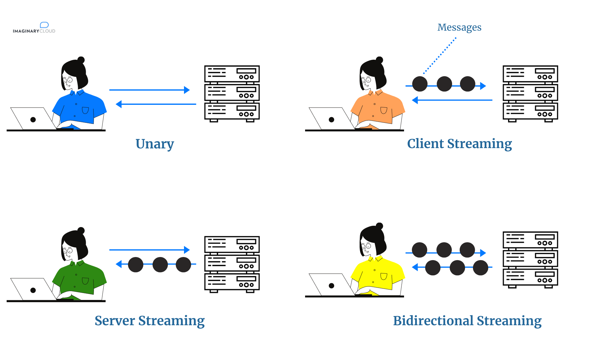
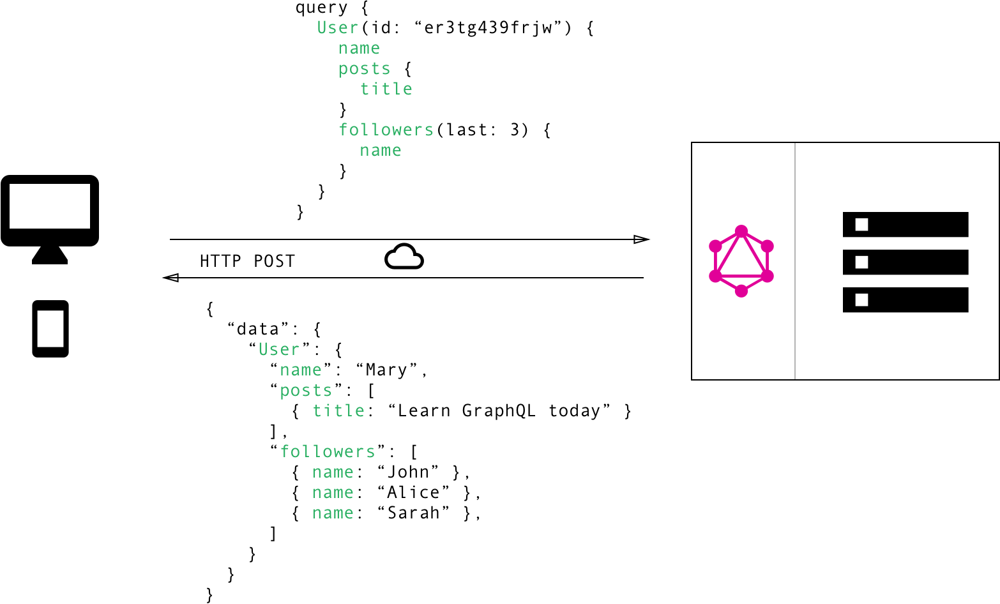

# Micro-service communication

## Communication types

### Synchronous

A microservice makes a call to another microservice and blocks operation waiting for the response.

#### Advantages

- Simple

#### Disadvantages

- Temporal coupling may occur
- Vulnerable to cascading issues caused by downstream outages

### Asynchronous

The act of sending a call out over the network doesn’t block the microservice issuing the call. It is able to carry on with any other processing without having to wait for a response.

#### Advantages

- Good when dealing with time-consuming tasks
- Avoid temporal coupling
- Loosely coupling

#### Disadvantages

- Complexity

## Communication styles

### Request/response communication

A microservice sends a request to another microservice asking for something to be done. It expects to receive a response informing it of the result.

### Event driven

Microservices emit events, which other microservices consume and react to accordingly. The microservice emitting the event is unaware of which microservices, if any, consume the events it emits.

### Common data

Not often seen as a communication style, microservices collaborate via some shared data source.

## Technology choices

### REST

REST (Representational State Transfer) is an architectural style that provides guidelines for designing web APIs.

REST itself doesn’t really talk about underlying protocols, although it is most commonly used over HTTP.
We can implement REST using different protocols, although this can require a lot of work. Some of the features that HTTP gives us as part of the specification, such as verbs, make implementing REST over HTTP easier, whereas with other protocols you’ll have to handle these features yourself.

**Where to use:**

REST-over-HTTP-based API is an obvious choice for a synchronous request-response interface if you are looking to allow access from as wide a variety of clients as possible

### Remote procedure call

Remote procedure call (RPC) refers to the technique of making a local call and having it execute on a remote service somewhere. There are a number of different RPC implementations in use. Most of the technology in this space requires an explicit schema, such as **SOAP** or **gRPC**. In this note, we only focus on **gRPC**

gRPC stands for Google Remote Procedure Call and is a variant based on the RPC architecture. This technology follows an RPC API's implementation that uses HTTP 2.0 protocol

gRPC uses Protocol Buffer by default to serialize payload data.

#### REST vs gRPC

**Guidelines vs. Rules**

REST is a set of guidelines for designing web APIs without enforcing anything.

gRPC enforces rules by defining a .proto file that must be adhered to by both client and server for data exchange.

**Underlying HTTP Protocol**

REST provides a request-response communication model built on the HTTP 1.1 protocol. Therefore, when multiple requests reach the server, it is bound to handle each of them, one at a time which consequently slows the entire system.

gRPC follows a client-response model of communication for designing web APIs that rely on HTTP/2. Hence, gRPC allows streaming communication and serves multiple requests simultaneously. In addition to that, gRPC also supports unary communication similar to REST.

**Data Exchange Format**

REST typically uses JSON and XML formats for data transfer

gRPC relies on Protobuf for an exchange of data over the HTTP/2 protocol.

The gRPC is based on binary protocol-buffer format which is very lightweight compared to text-based formats such as JSON.
For example, for below payload JSON encoding takes 81 bytes and the same payload in protocol-buffers takes 33 bytes

**Serialization vs. Strong Typing**

REST, in most cases, uses JSON or XML that requires serialization and conversion into the target programming language for both client and server, thereby increasing response time and the possibility of errors while parsing the request/response.

gRPC provides strongly typed messages automatically converted using the Protobuf exchange format to the chosen programming language.

**Latency**

REST utilizing HTTP 1.1 requires a TCP handshake for each request. Hence, REST APIs with HTTP 1.1 can suffer from latency issues.

gRPC relies on HTTP/2 protocol, which uses multiplexed streams. Therefore, several clients can send multiple requests simultaneously without establishing a new TCP connection for each one. Also, the server can send push notifications to clients via the established connection.

**Browser Support**

REST APIs on HTTP 1.1 have universal browser support.

gRPC has limited browser support because numerous browsers

**Code Generation Features**

REST provides no built-in code generation features. However, we can use third-party tools like Swagger or Postman to produce code for API requests.

gRPC, using its protoc compiler, comes with native code generation features, compatible with several programming languages.

**Where to use:**

- Great choice for inter-process communication in microservices applications (Not only the gRPC services are faster compared to RESTful services but also they are strongly typed)
- IoT systems that require light-weight message transmission
- Mobile applications with no browser support
- Applications that need multiplexed streams.

### GraphQL

GraphQL is a query language and server-side runtime for application programming interfaces (APIs) that prioritizes giving clients exactly the data they request and no more.

With a REST API, you would typically gather the data by accessing multiple endpoints.

In the example, these could be `/users/<id>` endpoint to fetch the initial user data.
Secondly, there’s likely to be a `/users/<id>/posts` endpoint that returns all the posts for a user.
The third endpoint will then be the `/users/<id>/followers` that returns a list of followers per user.

In GraphQL on the other hand, you’d simply send a single query to the GraphQL server that includes the concrete data requirements. The server then responds with a JSON object where these requirements are fulfilled.

**Where to use:**

- Apps for devices such as mobile phones, smartwatches, and IoT devices, where bandwidth usage matters.
- Applications where nested data needs to be fetched in a single call. (For example, a blog or social networking platform where posts need to be fetched along with nested comments and commenters details.)
- Composite pattern, where application retrieves data from multiple, different storage APIs (For example, a dashboard that fetches data from multiple sources such as logging services, backends for consumption stats, third-party analytics tools to capture end-user interactions.)

### Message brokers

Message brokers are programs that enables services to communicate with each other and exchange information.

#### Point-to-Point (Queues)

#### Publish and Subscribe (Topics)

**Where to use:**

- Long-running tasks
- Data post-processing

