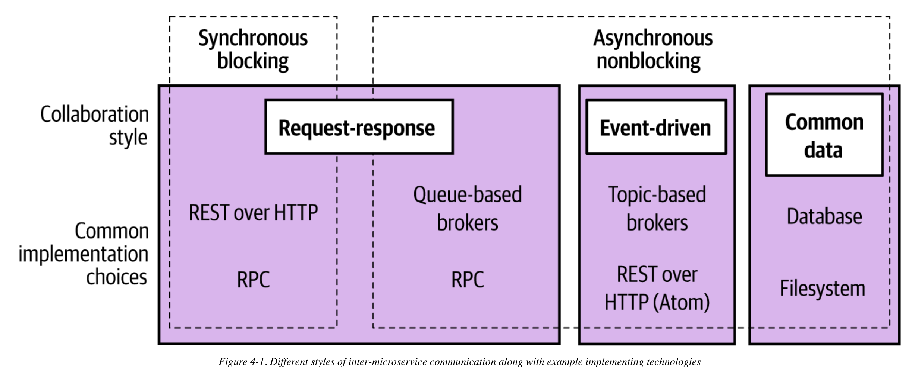

# Micro-service communication

## Communication types

### Synchronous

A microservice makes a call to another microservice and blocks operation waiting for the response.

#### Advantages

- Simple

#### Disadvantages

- Temporal coupling may occur
- Vulnerable to cascading issues caused by downstream outages

### Asynchronous

The act of sending a call out over the network doesn’t block the microservice issuing the call. It is able to carry on with any other processing without having to wait for a response.

#### Advantages

- Good when dealing with time-consuming tasks
- Avoid temporal coupling
- Loosely coupling

#### Disadvantages

- Complexity

## Communication styles

### Request/response communication

A microservice sends a request to another microservice asking for something to be done. It expects to receive a response informing it of the result.

### Event driven

Microservices emit events, which other microservices consume and react to accordingly. The microservice emitting the event is unaware of which microservices, if any, consume the events it emits.

### Common data

Not often seen as a communication style, microservices collaborate via some shared data source.
