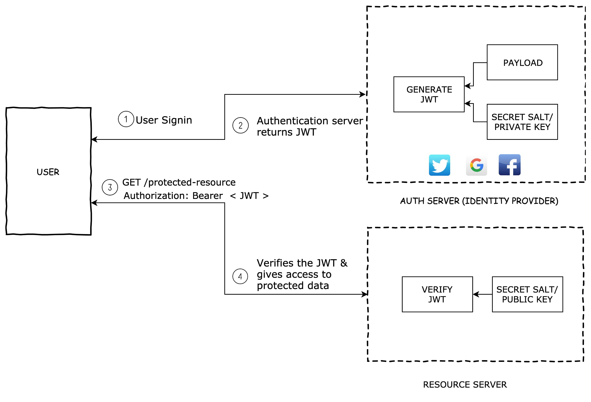

# JWT

## 1. What is JWT?

JWT, or JSON Web Token, is an open standard used to share security information between two parties — a client and a server. Each JWT contains encoded JSON objects, including a set of claims. JWTs are signed using a cryptographic algorithm to ensure that the claims cannot be altered after the token is issued.

## 2. What is the JSON Web Token structure?

A JSON Web Token consists of 3 parts separated by a period.

`header.payload.signature`


### 2.1 Header

JWT header consists of token type and algorithm used for signing and encoding. Algorithms can be HMAC, SHA256, RSA, HS256 or RS256.

Eg:

```json
{
  "typ": "JWT",
  "alg": "HS256"
}
```

Then, this JSON is **Base64Url** encoded to form the first part of the JWT.

### 2.2 Payload

Payload consists of the session data called as claims. Below are some of the the standard claims that we can use,

- Issuer(iss)
- Subject (sub)
- Audience (aud)
- Expiration time (exp)
- Issued at (iat)

Eg:

```json
{
  "sub": "user10001",
  "iat": 1569302116
}
```

Custom claims can also be included in the claim set. When using custom claim sets,

- Do not put large data in claim sets. Claim sets meant to be compact.
- Do not put sensitive informations since, JWT can be decoded easily.

```json
{
  "sub": "user10001",
  "iat": 1569302116,
  "role": "admin",
  "user_id": "user10001"
}
```

The payload is then Base64Url encoded to form the second part of the JSON Web Token.

### 2.3 Signature

To create the signature part you have to take the encoded header, the encoded payload, a secret, the algorithm specified in the header, and sign that.

For example if you want to use the HMAC SHA256 algorithm, the signature will be created in the following way:

```
HMACSHA256(
  base64UrlEncode(header) + "." +
  base64UrlEncode(payload),
  secret)
```

The signature is used to verify the message wasn't changed along the way, and, in the case of tokens signed with a private key, it can also verify that the sender of the JWT is who it says it is.

## 3. JWT Validation

Here is the basic flow of JWT authentication:



### 3.1 How tokens are signed

**Symmetric Signatures**

When a JWT is signed using a secret key, then it is called a symmetric signature. This type of signature is done when there is only one server that signs and validates the token. The same secret key is used to generate and validate the token. The token is signed using HMAC.

**HMAC** stands for **Hashing for Message Authentication Code**. It’s a message authentication code obtained by running a cryptographic hash function (like MD5, SHA1, and SHA256) over the data (to be authenticated) and a shared secret key

**Asymmetric Signatures**

This signature is suitable for distributed scenarios. Suppose there are multiple applications that can validate a given JWT. If we use a secret key to sign a JWT, then these applications will need that key to validate the token.

It is not possible to share the secret key amongst all the applications, as it may get leaked. To solve this issue, asymmetric signing is done.

### 3.2 How is token validated

When a server receives a token, it fetches the header and payload from that token. It then uses the secret key or the public key (in the case of asymmetric signing) to generate the signature from the header and payload.

If the generated signature matches the signature provided in the JWT, then it is considered to be valid.

### 3.3 Claims validations

It is not sufficient to just validate the signature of the token. There are a few other security properties that need to be validated as discussed below:

1. Check if the token is still valid. This can be validated through `exp` claim.
2. Validate that the token is actually meant for you through the `aud` claim.
3. Check if the token can be used at this time using the `nbf` claim. NBF stands for not before which means that this token should not be used before a particular time.

## 4. Where to store your JWTs

**Web Storage (local storage or session storage)**

If tokens are stored inside local storage, they are accessible by any script inside your page and thus vulnerable to cross-site scripting (XSS) attacks. Therefore, it is advisable to not store any sensitive information in the web storage.

**Cookies**

When cookies are used with the HttpOnly flag, they are good candidates for storing JWTs as they are immune to XSS attacks. Additionally, we can use the Secure cookie flag to guarantee that the cookie is only sent over HTTPS.

## 5. How to invalidate a JWT

If our JWT is somehow compromised, then we need some mechanism to invalidate our token. In session-based authentication, we can just close the browser and the session is destroyed. Unfortunately, it is not that easy in case of token-based authentication.

One option that we have is that the server should change its secret key. However, this will invalidate the tokens for all the users. This approach should be used if the application owner thinks that the JWTs of a large number of users are stolen.

Another option is maintaining a blacklist of all the invalid tokens. If a client suspects that the token is stolen, then they can logout from the browser. On doing this, the token for that user will be deleted from the browser storage and will be added to the blacklist present on the server. When the hacker sends a request with the stolen JWT, the server will find it in the blacklist and throw an unauthorized error.
