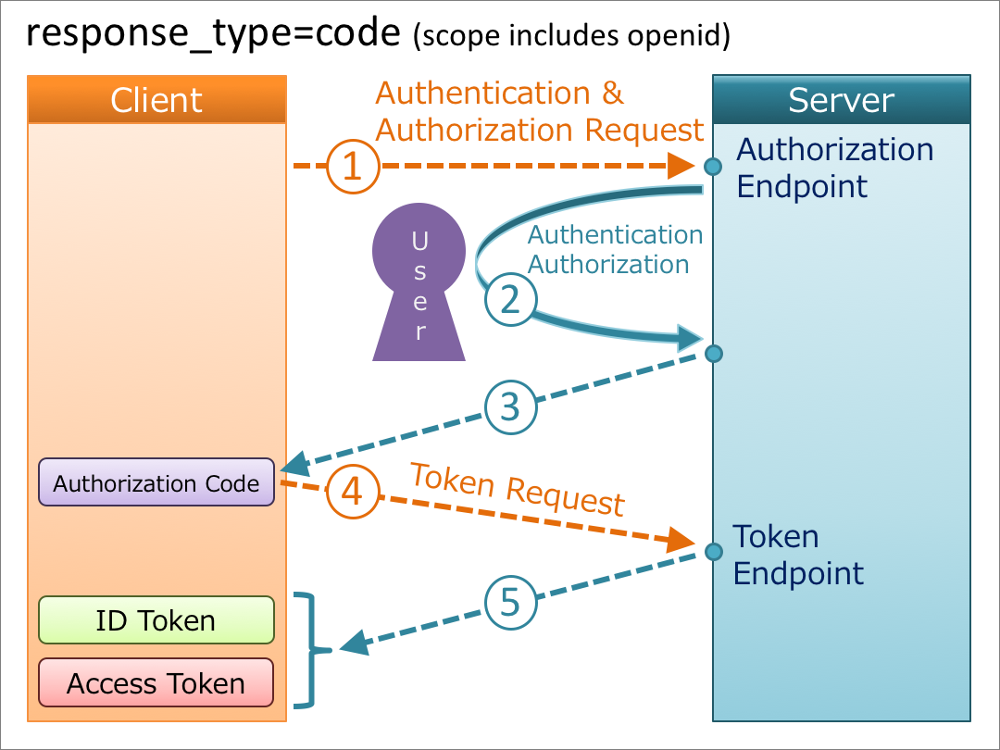

# OpenId Connect

OAuth 2.0 is designed only for authorization. It is used for granting access to data and features from one application to another. In OAuth, the client is given a token which it uses to access the data on the resource server, but it doesn’t get to know anything about the user. OAuth was used for authentication as well, but since it was not designed for authentication it was extended further to support authentication.

OpenID Connect is an identity layer on top of the OAuth 2.0 protocol. It extends OAuth 2.0 to standardize a way for authentication.

- OpenID is about verifying a person's identity (authentication).
- OAuth is about accessing a person's stuff (authorization).
- OpenID Connect does both.

## Identity token

While discussing OAuth, we discussed the **authorization code and access token**. In the case of OpenId Connect, there is one more token that we can request. This token is called the identity token, which encodes the user’s authentication information.

In contrast to access tokens, which are only intended to be understood by the resource server, ID tokens are intended to be understood by the client application. The ID token contains the user information in JSON format. The JSON is wrapped into a JWT.

An ID token is an artifact that proves that **the user has been authenticated**

An ID token is encoded as a JSON Web Token (JWT)

When a client receives the identity token, it should validate it first. The client must validate the following fields:

1. `iss` - Client must validate that the issuer of this token is the Authorization Server
2. `aud` - Client must validate that the token is meant for the client itself.
3. `exp` - Client must validate that the token is not expired.

Here is some sample user information in the form of JSON present in an identity token.

```json
{
  "iss": "https://server.example.com",
  "sub": "24400320",
  "aud": "s6BhdRkqt3",
  "nonce": "n-0S6_WzA2Mj",
  "exp": 1311281970,
  "iat": 1311280970,
  "auth_time": 1311280969,
  "acr": "urn:mace:incommon:iap:silver"
}
```

- `iat`: The iat claim identifies the time at which the JWT was issued.
- `auth_time`: Time when the End-User authentication occurred.
- `nonce`: ID token requests may come with a nonce request parameter to protect from replay attacks.

The ID token may have additional information about the user, such as their email address, picture, birthday, and so on.

**ID token vs Access token**


## Authorization Code Flow for Authentication

The Authorization code flow for OpenID Connect is similar to the **Authorization Code Flow**. The only difference is the change in the value of the scope field. It must contain **openid** as one of the values, followed by other scope values based on what type of user data the client wants.



## OpenId Connect vs OAuth2

- OpenID Connect are authentication protocols while OAuth2 is an authorization protocol.
- The most significant difference between OpenID Connect and OAuth2 is the id_token. OIDC contains an id_token while OAuth2 does not.
- In OpenID Connect it contains user info endpoint while OAuth2 does not.
- OpenID Connect defines how to send a signed and encrypted request object where OAuth2 does not.
