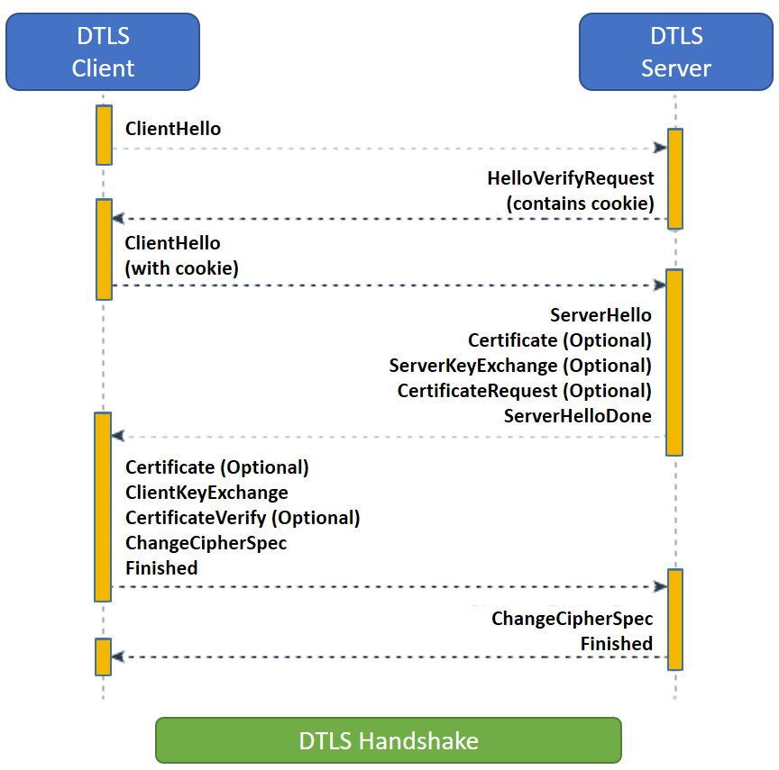

# Securing

## 1. DTLS

DTLS(Datagram Transport Layer Security) is a variant of the TLS protocol that runs over UDP instead of TCP. In WebRTC it is used as a way to generate symmetric encryption keys for use in SRTP as well as encyption of the datachannel. The DTLS handshake takes place after ICE has found a path through the NAT maze.

### DTLS handshake

**ClientHello**

ClientHello is the initial message sent by the client. It contains a list of attributes that tell the server the ciphers and features the client supports.

**HelloVerifyRequest**

HelloVerifyRequest is sent by the server to the client. It is to make sure that the client intended to send the request. The Client then re-sends the ClientHello, but with a token provided in the HelloVerifyRequest.

**ServerHello**

ServerHello is the response by the server for the configuration of this session. It contains what cipher will be used when this session is over. It also contains the server random data.

**Certificate**

Certificate contains the certificate for the Client or Server. After the handshake is over we will make sure this certificate when hashed matches the fingerprint in the `SessionDescription`.

**ServerKeyExchange/ClientKeyExchange**

These messages are used to transmit the public key. On startup, the client and server both generate a keypair. After the handshake these values will be used to generate the Pre-Master Secret.

**CertificateRequest**

A CertificateRequest is sent by the server notifying the client that it wants a certificate.

**ServerHelloDone**

ServerHelloDone notifies the client that the server is done with the handshake.

**CertificateVerify**

CertificateVerify is how the sender proves that it has the private key sent in the Certificate message.

**ChangeCipherSpec**

ChangeCipherSpec informs the receiver that everything sent after this message will be encrypted.

**Finished**

Finished is encrypted and contains a hash of all messages. This is to assert that the handshake was not tampered with.

## 2. SRTP

SRTP is a protocol designed specifically for encrypting RTP packets. To start an SRTP session you specify your keys and cipher. Unlike DTLS it has no handshake mechanism. All the configuration and keys were generated during the DTLS handshake.

