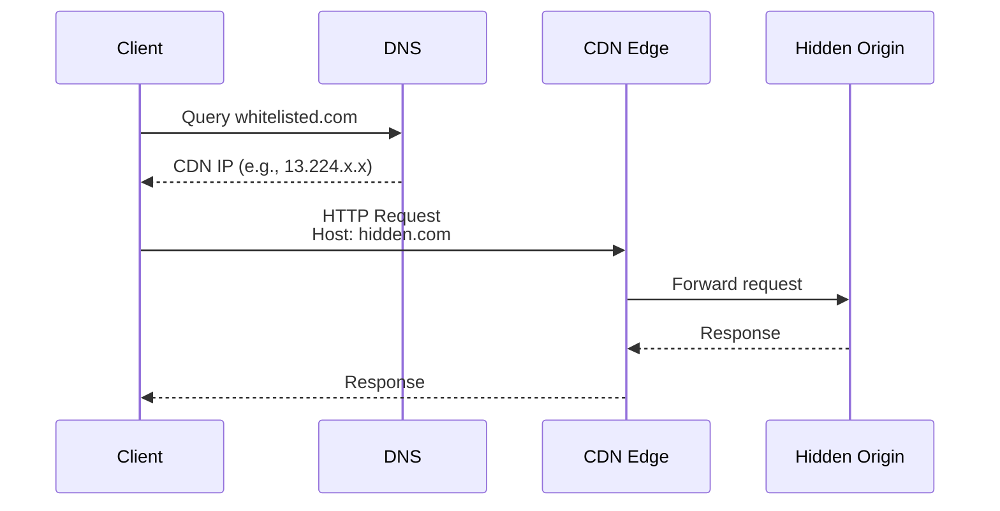
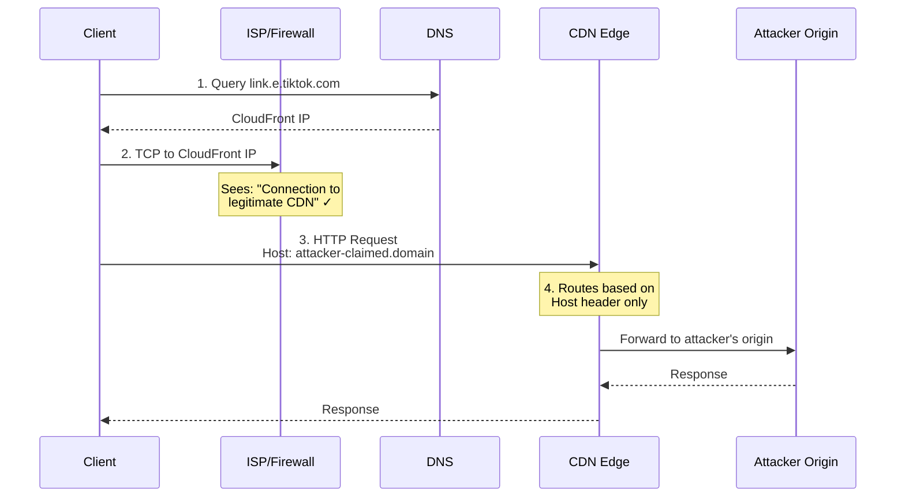

# Domain Fronting

Domain fronting is a censorship circumvention and obfuscation technique that hides the true destination of HTTPS traffic by using a trusted domain (e.g., a popular site) in the TLS SNI field, while directing the encrypted request to a hidden, malicious, or blocked site in the HTTP **Host** header. It abuses CDNs, which serve both domains, making traffic appear legitimate to firewalls.

## How CDN Routing Works

CDNs route traffic based on the **Host header**, not the DNS domain used for resolution:

- Multiple domains can resolve to the same CDN IP addresses
- CDN edge servers examine the Host header to determine routing
- The origin server lookup is based entirely on the Host header value

## CloudFront Alternate Domain Names

CloudFront allows distributions to claim "alternate domain names" (CNAMEs) that determine which distribution handles requests for a given Host header.

### CNAME Uniqueness

- Each alternate domain name can only be associated with **ONE distribution globally**
- First-come-first-served across ALL AWS accounts
- Attempting to claim an already-used domain results in `CNAMEAlreadyExists` error

## Domain Fronting Attack Flow

