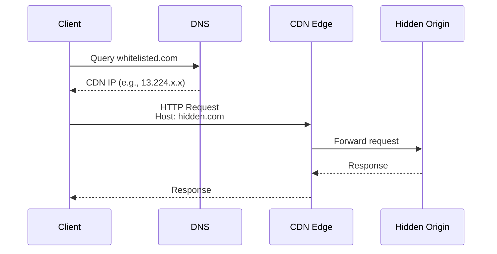
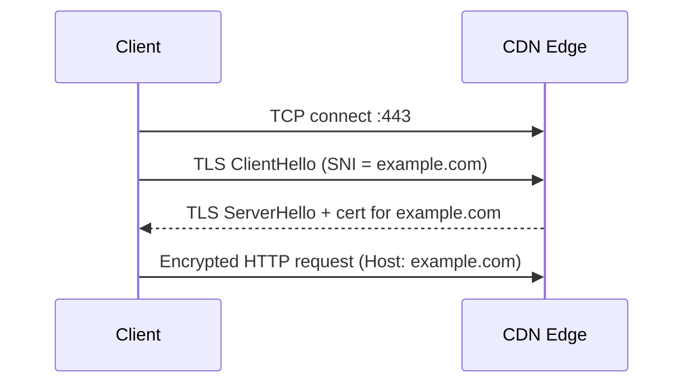
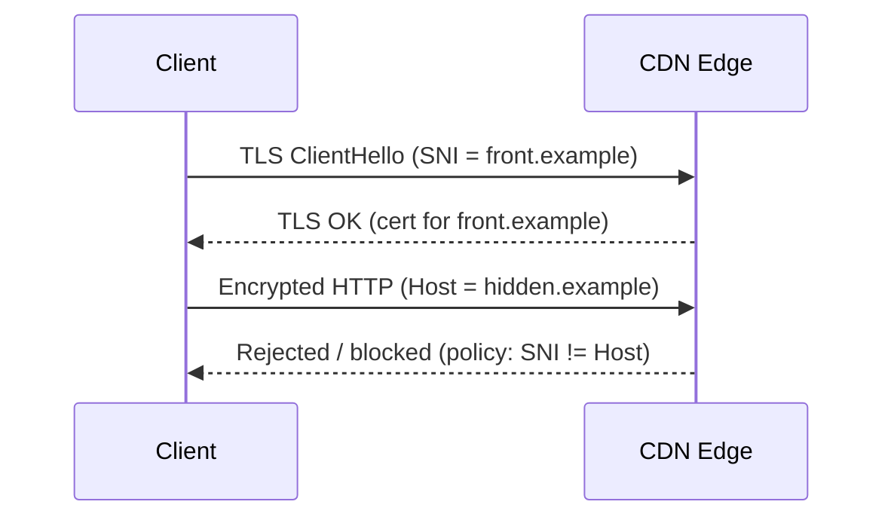
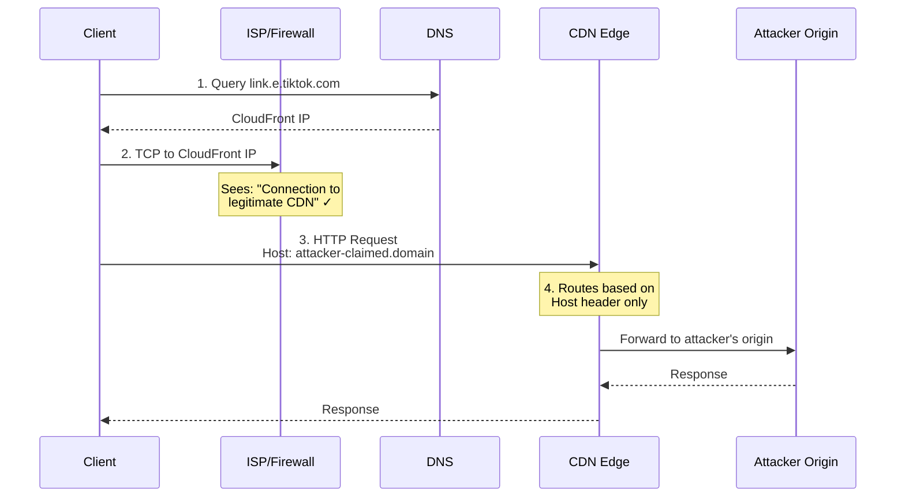
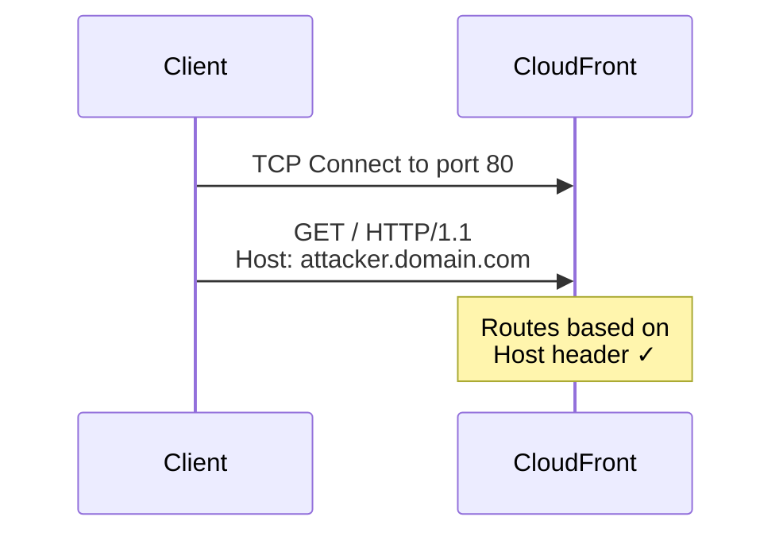
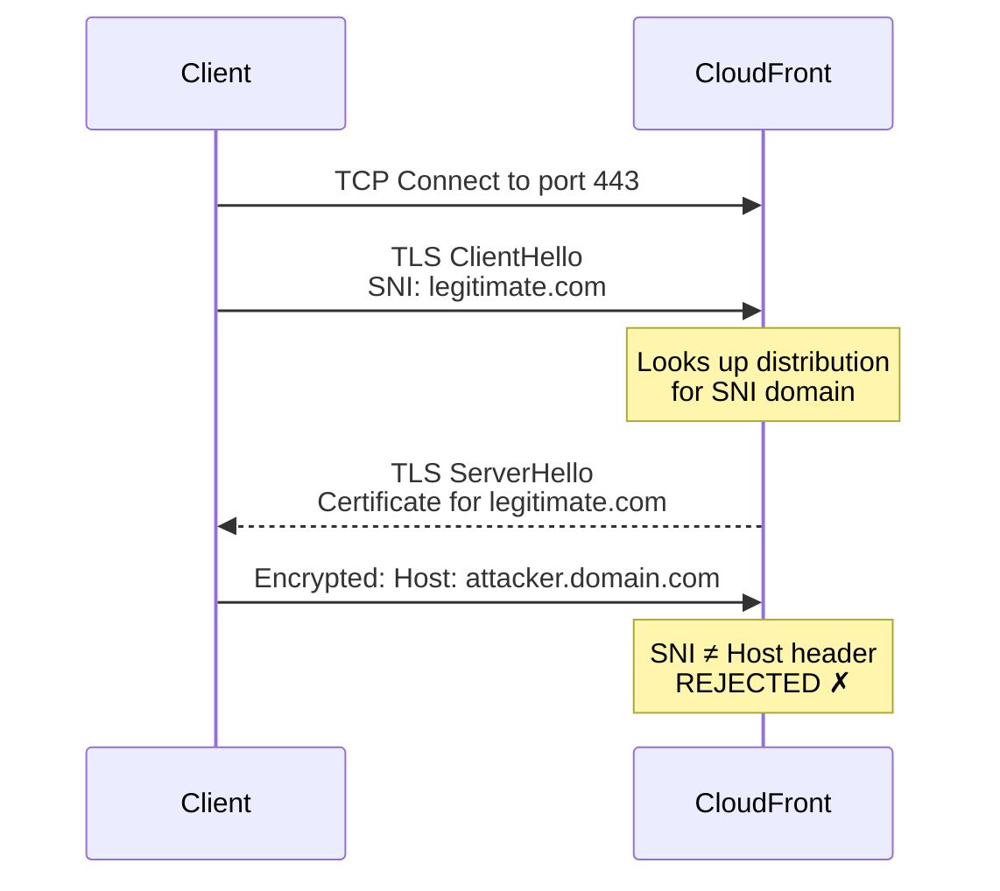
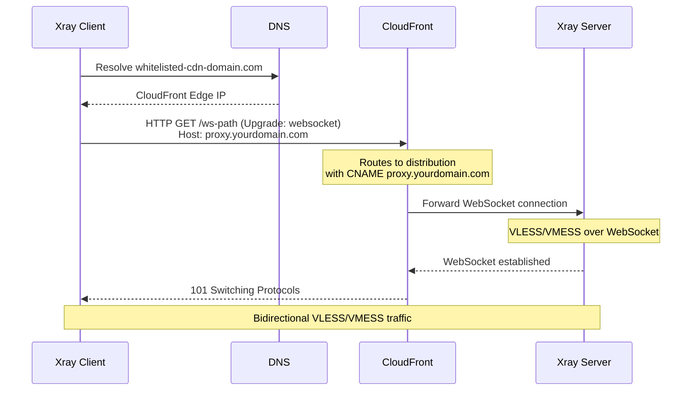

# Domain Fronting

Domain Fronting is a networking technique used to bypass censorship by hiding the true destination of a connection. It works by using a Trusted Domain (the "Front") to establish a connection with a CDN, while internally directing the request to a Hidden Domain (the "Origin") via the HTTP Host header.

To a firewall, the traffic looks like a legitimate connection to a popular, whitelisted service (e.g., TikTok, Amazon, or Google).

## How CDN Routing Works

CDNs use shared infrastructure to host thousands of websites on the same set of IP addresses. To distinguish which website a user wants, the CDN relies on specific identifiers.

### HTTP (Port 80)

In plain HTTP, there is no encryption or handshake. The CDN relies solely on the `Host` Header inside the HTTP request.

- **Flow**: The client connects to a CDN IP and sends: `GET / HTTP/1.1, Host: hidden.com`.
- **Routing**: The CDN reads `hidden.com` and routes the traffic there.



### HTTPS (Port 443)

In HTTPS, a TLS handshake occurs before the HTTP request is sent. This introduces a second identifier: SNI (Server Name Indication).

- The SNI: Tells the CDN which SSL certificate to provide.
- The Host Header: Tells the CDN which website to route to.



**Why classic domain fronting fails on modern HTTPS CDNs**

Most CDNs now check if `SNI == Host` Header. If they don't match, the CDN terminates the connection (403 Forbidden).



## Domain Fronting Attack Flow



### HTTP (Port 80) - Works



- No encryption, no SNI
- CloudFront only sees the **Host header**
- Routes purely based on Host header value
- Attacker can claim any unclaimed domain without ownership proof

### HTTPS (Port 443) - Doesn't Work



**The SNI Problem:**

1. **TLS Handshake happens BEFORE HTTP**: CloudFront must select a certificate during the TLS handshake
2. **SNI is plaintext**: The Server Name Indication (SNI) in ClientHello is unencrypted
3. **CloudFront validates SNI vs Host**: After TLS, CloudFront checks that the Host header matches the SNI
4. **Mismatch = Connection Rejected**: If `SNI: legitimate.com` but `Host: attacker.com`, CloudFront returns 403 Forbidden

## Domain Fronting with CloudFront + Xray

### Prerequisites

1. **AWS Account** with CloudFront access
2. **Origin Server** (VPS) running Xray with VLESS/VMESS
3. **A domain you control** (for the CloudFront alternate domain name)

### Configuration Strategy:

- Protocol: `VMESS` is mandatory here. Since Port `80` is unencrypted, `VMESS` provides its own internal encryption for the payload and `UUID`. VLESS is unsafe because it would leak your `UUID` (payload still safe for HTTPS encryption).
- CloudFront Setting: You must set your Origin Request Policy to `AllViewer` to ensure the Host header is preserved.

### Step 1: Set Up Xray Server

Configure Xray on your origin server with WebSocket transport:

```json
{
  "inbounds": [
    {
      "port": 80,
      "protocol": "vmess",
      "settings": {
        "clients": [
          {
            "id": "your-uuid-here",
            "alterId": 0
          }
        ]
      },
      "streamSettings": {
        "network": "ws",
        "wsSettings": {
          "path": "/ws-path"
        }
      }
    }
  ],
  "outbounds": [
    {
      "protocol": "freedom"
    }
  ]
}
```

### Step 2: Create CloudFront Distribution

1. **Create Distribution** in AWS CloudFront console

2. **Origin Settings:**
   - Origin Domain: Your VPS IP or domain
   - Protocol: **HTTP only** (port 80)
   - HTTP Port: 80

3. **Behavior Settings:**
   - Viewer Protocol Policy: **HTTP only**
   - Allowed HTTP Methods: GET, HEAD, OPTIONS, PUT, POST, PATCH, DELETE
   - Cache Policy: **CachingDisabled** (important for WebSocket)
   - Origin Request Policy: **AllViewer** (forwards Host header)

4. **Alternate Domain Name (CNAME):**
   - Add your domain: `proxy.yourdomain.com`
   - No SSL certificate needed for HTTP-only

### Step 3: Configure Xray Client

| Field         | Value                        | Purpose                                |
| ------------- | ---------------------------- | -------------------------------------- |
| `address`     | `whitelisted-cdn-domain.com` | DNS resolution target (fronted domain) |
| `port`        | `80`                         | Must be HTTP to bypass SNI check       |
| `Host` header | `proxy.yourdomain.com`       | Your CloudFront CNAME (actual routing) |
| `path`        | `/ws-path`                   | WebSocket endpoint on Xray server      |

```json
{
  "outbounds": [
    {
      "protocol": "vmess",
      "settings": {
        "vnext": [
          {
            "address": "whitelisted-cdn-domain.com",
            "port": 80,
            "users": [
              {
                "id": "your-uuid-here",
                "alterId": 0,
                "security": "none"
              }
            ]
          }
        ]
      },
      "streamSettings": {
        "network": "ws",
        "wsSettings": {
          "path": "/ws-path",
          "headers": {
            "Host": "proxy.yourdomain.com"
          }
        }
      }
    }
  ]
}
```

### Traffic Flow



## Note

- Tiktok Cloudflare CDN: `link.e.tiktok.com`
- Tiktok Cloudfront CDN: `api24-normal-alisg.tiktokv.com`
