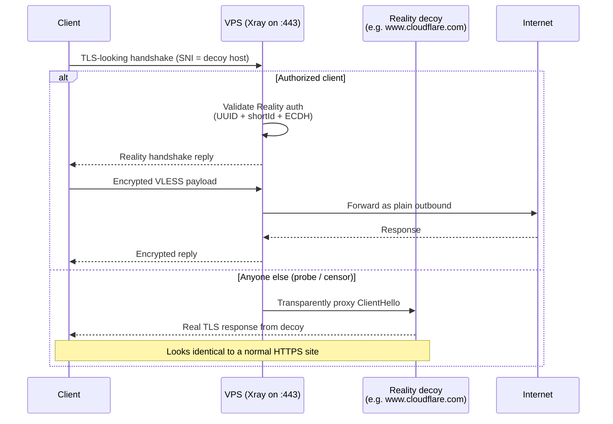

# Setup Xray VPN with VLESS + Reality

In this document, we will set up an [Xray-core](https://github.com/XTLS/Xray-core) VPN server using the VLESS protocol with Reality as the transport security layer, then connect to it from a client.

For background on how each piece works, see [vless.md](./vless.md) and [xtls_reality.md](./xtls_reality.md).

## Requirements

- A VPS with a public IPv4 address.
- 1 vCPU and 512 MB – 2 GB of RAM is enough for personal use (Xray idles around 20–50 MB).
- 50 GB disk is more than enough; the binary itself is < 30 MB.
- A modern Linux distro with a recent kernel (Debian 12, Ubuntu 22.04/24.04, …). A kernel ≥ 4.9 is required for BBR.
- Root or sudo access.

## Architecture



## Server setup

### 1. Open the listening port

Most VPS providers ship a default firewall that drops everything except SSH. Open the port Xray will listen on (we use `tcp/443` because it blends in with normal HTTPS traffic):

```bash
sudo iptables -I INPUT 5 -p tcp --dport 443 -j ACCEPT

# Persist iptables rules across reboots
echo 'iptables-persistent iptables-persistent/autosave_v4 boolean true' | sudo debconf-set-selections
echo 'iptables-persistent iptables-persistent/autosave_v6 boolean true' | sudo debconf-set-selections
sudo DEBIAN_FRONTEND=noninteractive apt -y install iptables-persistent
sudo netfilter-persistent save
```

> [!NOTE]  
> Cloud providers usually have a **second firewall layer** at the network level (Security Groups / Security Lists / Cloud Firewall). Allowing the port inside the VM is not enough — make sure ingress for `TCP/443` is also opened in the provider's console.

### 2. Enable BBR

[BBR](https://en.wikipedia.org/wiki/TCP_congestion_control#TCP_BBR) is a Google-developed TCP congestion control algorithm that drastically improves throughput on lossy or long-distance links. Xray rides on the kernel TCP stack, so this benefits every connection automatically.

```bash
echo 'net.core.default_qdisc=fq' | sudo tee -a /etc/sysctl.conf
echo 'net.ipv4.tcp_congestion_control=bbr' | sudo tee -a /etc/sysctl.conf
sudo sysctl -p

# Verify
sysctl net.ipv4.tcp_congestion_control   # → bbr
lsmod | grep bbr                         # → tcp_bbr loaded
```

### 3. Install Xray-core

Use the official install script. It places the binary in `/usr/local/bin/xray`, ships a hardened systemd unit, and sets up log directories.

```bash
curl -L -o /tmp/xray-install.sh https://github.com/XTLS/Xray-install/raw/main/install-release.sh
sudo bash /tmp/xray-install.sh install
```

Files installed:

| Path | Purpose |
|---|---|
| `/usr/local/bin/xray` | Binary |
| `/usr/local/etc/xray/config.json` | Server config |
| `/usr/local/share/xray/{geoip,geosite}.dat` | Routing data files |
| `/etc/systemd/system/xray.service` | Systemd unit |
| `/var/log/xray/{access,error}.log` | Logs |

To upgrade later, rerun the same script. To remove: `sudo bash /tmp/xray-install.sh remove --purge`.

### 4. Generate Reality credentials

Three values are needed: an X25519 keypair for Reality, a UUID for the VLESS user, and a short ID.

```bash
# X25519 keypair — privateKey stays on the server, the public key (shown as
# "Password" or "PublicKey" depending on the version) is what clients use.
/usr/local/bin/xray x25519

# UUID for the VLESS user
/usr/local/bin/xray uuid

# Short ID — any 1 to 16 hex chars (always an even count)
openssl rand -hex 8
```

Save the output. The values used below are placeholders:

| Field | Placeholder | Notes |
|---|---|---|
| `privateKey` | `<server_private_key>` | Keep secret, server only |
| `publicKey` / `pbk` | `<server_public_key>` | Goes into client config |
| `UUID` | `<uuid>` | Per-user identifier |
| `shortId` / `sid` | `<short_id>` | 1–16 hex chars |

### 5. Choose a Reality decoy host (`dest` / `serverName`)

Reality forwards probes from anyone who isn't an authorized client to a real public site, so the connection looks like a perfectly normal HTTPS request to that site. The decoy must:

1. Speak TLS 1.3 + HTTP/2.
2. Be a popular site you do **not** own (so the traffic blends in).
3. Be geographically close to the VPS so the upstream latency stays low.

Good defaults: `www.cloudflare.com`, `www.apple.com`, `www.bing.com`, `www.icloud.com`. Verify:

```bash
curl -I --tls-max 1.3 --http2 https://www.cloudflare.com/
# Expect: HTTP/2 200 (or a 301/302) with TLS 1.3 in the handshake.
```

### 6. Write the server config

Replace the placeholders, then write to `/usr/local/etc/xray/config.json`:

```json
{
  "log": {
    "loglevel": "warning",
    "access": "/var/log/xray/access.log",
    "error": "/var/log/xray/error.log"
  },
  "inbounds": [
    {
      "listen": "0.0.0.0",
      "port": 443,
      "protocol": "vless",
      "settings": {
        "clients": [
          { "id": "<uuid>", "flow": "xtls-rprx-vision" }
        ],
        "decryption": "none"
      },
      "streamSettings": {
        "network": "tcp",
        "security": "reality",
        "realitySettings": {
          "show": false,
          "dest": "www.cloudflare.com:443",
          "xver": 0,
          "serverNames": ["www.cloudflare.com"],
          "privateKey": "<server_private_key>",
          "shortIds": ["<short_id>"]
        }
      },
      "sniffing": {
        "enabled": true,
        "destOverride": ["http", "tls", "quic"],
        "routeOnly": true
      }
    }
  ],
  "outbounds": [
    { "protocol": "freedom", "tag": "direct" },
    { "protocol": "blackhole", "tag": "block" }
  ],
  "routing": {
    "rules": [
      { "type": "field", "ip": ["geoip:private"], "outboundTag": "block" },
      { "type": "field", "protocol": ["bittorrent"], "outboundTag": "block" }
    ]
  }
}
```

A few things to know about the structure:

- `flow: xtls-rprx-vision` enables XTLS Vision flow control on top of Reality — splices large data streams without per-packet TLS overhead, big throughput win.
- `dest` and `serverNames[0]` should match — this is the decoy that probes get forwarded to.
- The blackhole outbound combined with the routing rules drops BitTorrent and traffic to private/internal ranges (avoids your VPS being abused as a P2P relay or LAN scanner).

Validate before restarting:

```bash
sudo /usr/local/bin/xray -test -config /usr/local/etc/xray/config.json
# → Configuration OK.
```

### 7. Start the service

```bash
sudo systemctl enable --now xray
sudo systemctl status xray
sudo ss -tlnp | grep :443     # confirms xray is listening
sudo journalctl -u xray -n 30 # confirms a clean start
```

## Client setup

Any Xray/V2Ray client supporting VLESS + Reality + Vision will do: **v2rayN** (Windows), **NekoBox** / **NekoRay**, **Hiddify**, **Streisand** (iOS), **FairVPN**, **Shadowrocket**, **V2RayNG** (Android), **Furious** (macOS).

### Share link format

```
vless://<uuid>@<server_ip>:443?encryption=none&flow=xtls-rprx-vision&security=reality&sni=www.cloudflare.com&fp=chrome&pbk=<server_public_key>&sid=<short_id>&type=tcp&headerType=none#<label>
```

### Manual fields

| Field | Value |
|---|---|
| Address / Host | `<server_ip>` |
| Port | `443` |
| Protocol | VLESS |
| UUID | `<uuid>` |
| Encryption | `none` |
| Flow | `xtls-rprx-vision` |
| Network / Transport | `tcp` |
| Security | `reality` |
| SNI / ServerName | `www.cloudflare.com` |
| Fingerprint (uTLS) | `chrome` |
| Public Key (`pbk`) | `<server_public_key>` |
| Short ID (`sid`) | `<short_id>` |
| SpiderX | *(empty)* |

> [!NOTE]  
> The client **does not** need any TLS certificate. That is the whole point of Reality — the certificate the client appears to validate during the fake handshake is the decoy site's real certificate.

## Testing

### Server-side checks

```bash
sudo systemctl status xray                                         # active (running)
sudo ss -tlnp | grep :443                                          # xray listening on :443
sudo /usr/local/bin/xray -test -config /usr/local/etc/xray/config.json
sudo journalctl -u xray -f                                         # live logs

sysctl net.ipv4.tcp_congestion_control                             # bbr
sudo iptables -L INPUT -n --line-numbers | grep 443                # ACCEPT rule present

curl -I --tls-max 1.3 --http2 https://www.cloudflare.com/          # decoy reachable + TLS 1.3 + H2
```

### Reachability from the public internet

From any other machine:

```bash
nc -zv <server_ip> 443
# Expected: Connection ... succeeded!
```

If this fails, the cloud-level firewall is almost always the cause — the host firewall (iptables/ufw) being open is not enough.

### Client-side verification

1. Import the share link, activate the connection.
2. Confirm the egress IP changed:
   ```bash
   curl https://ifconfig.me
   # → <server_ip>
   ```
3. DNS leak / WebRTC: <https://browserleaks.com/ip>, <https://www.dnsleaktest.com>.
4. Speed: <https://fast.com> or <https://www.speedtest.net>. Expect roughly your line speed minus 10–20 % overhead.

### Common failures

| Symptom | Likely cause | Fix |
|---|---|---|
| `nc -zv` from outside fails | Cloud firewall blocking 443 | Open ingress in provider console |
| Connects but client times out | Wrong UUID / `pbk` / `sid` | Re-import the share link |
| `Configuration OK.` but service fails to start | Port 443 already used (web server, etc.) | `sudo ss -tlnp \| grep :443` and stop the conflict |
| Throughput poor on lossy network | BBR not active | `sysctl net.ipv4.tcp_congestion_control` should print `bbr` |
| Client connects but no internet | Egress blocked / routing rule | `journalctl -u xray -f` while reproducing |

## Day-2 operations

```bash
# Service control
sudo systemctl restart xray
sudo systemctl stop xray
sudo systemctl disable xray

# Edit config and apply
sudo $EDITOR /usr/local/etc/xray/config.json
sudo /usr/local/bin/xray -test -config /usr/local/etc/xray/config.json
sudo systemctl restart xray

# Add another user — append a client to inbounds[0].settings.clients:
#   { "id": "<new-uuid>", "flow": "xtls-rprx-vision" }
/usr/local/bin/xray uuid

# Rotate Reality keypair (e.g. if leaked) — replace privateKey, redistribute pbk
/usr/local/bin/xray x25519

# Upgrade Xray
curl -L -o /tmp/xray-install.sh https://github.com/XTLS/Xray-install/raw/main/install-release.sh
sudo bash /tmp/xray-install.sh install

# Uninstall
sudo bash /tmp/xray-install.sh remove --purge
```

## References

- <https://github.com/XTLS/Xray-core>
- <https://github.com/XTLS/Xray-install>
- <https://xtls.github.io/en/document/level-0/ch07-xray-server.html>
- <https://github.com/XTLS/REALITY>
