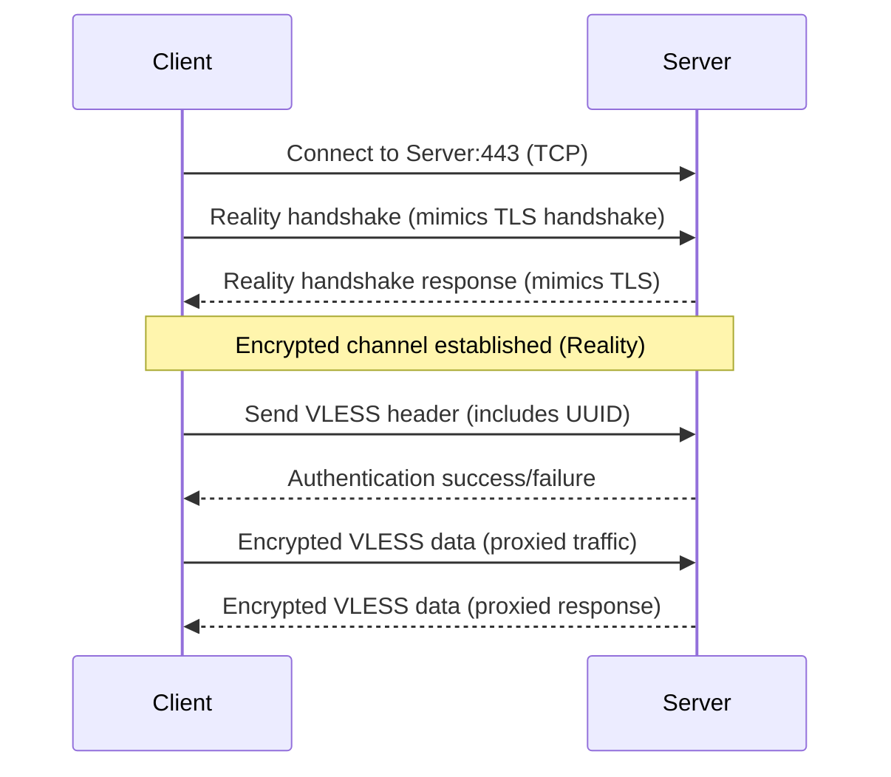
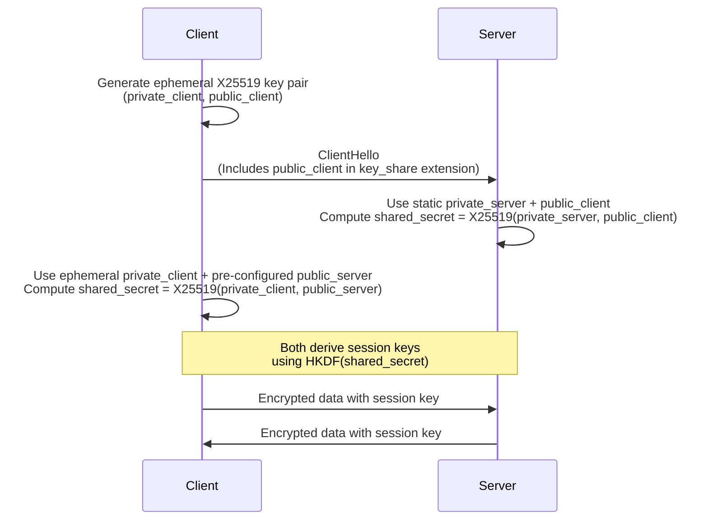

# VLESS

VLESS (short for "VMess Less") is a modern, lightweight transport protocol designed for secure communication between clients and servers.
It is widely used in VPN and proxy solutions, especially within the Xray and V2Ray frameworks, to bypass censorship and enhance privacy

## How VLESS Works

1. Client-Server Model

VLESS operates on a client-server model:

- The client connects to a VLESS server using a unique user ID.
- The server verifies the ID and establishes a session.

2. No Native Encryption

Unlike VMess, VLESS does not encrypt traffic by itself. Instead, it relies on TLS or XTLS for encryption and obfuscation, ensuring data confidentiality and making traffic harder to detect

3. Stateless Operation

VLESS is stateless, meaning the server does not store session data, which improves scalability and reduces resource usage.

4. Simple Configuration

A typical VLESS configuration requires:

- Server address and port
- User ID (UUID or custom string)
- Transport protocol (e.g., TCP, WebSocket)
- TLS/XTLS settings for encryption

## How VLESS Works with Reality

1. Roles of Each Component

VLESS and Reality are combined to create a secure, stealthy, and censorship-resistant proxy/VPN tunnel. Here’s a detailed breakdown of how they work together:

- VLESS: A lightweight, stateless proxy protocol that handles authentication (via UUID) and data framing between client and server. It does not provide encryption itself and is designed to be efficient and flexible
- Reality: An advanced transport security layer that encrypts and obfuscates the traffic. Reality mimics real TLS handshakes to make proxy traffic indistinguishable from normal HTTPS traffic, providing strong privacy and making detection and blocking extremely difficult

2. How the Combination Works

**Connection Establishment**

- The client initiates a connection to the server using VLESS protocol over TCP.
- The transport layer is set to "reality" instead of traditional TLS.

**Authentication**

- The client sends a UUID (or mapped string) in the VLESS header to authenticate itself to the server.

**Reality Handshake**

- Reality performs a cryptographic handshake using X25519 (modern elliptic-curve Diffie-Hellman) for key exchange, establishing a secure encrypted channel.
- The handshake is crafted to look exactly like a legitimate TLS handshake to a real website (using a "server name" and destination IP), so to any observer, it appears as if the user is simply visiting a popular website.

**Data Transfer**

- Once the secure Reality tunnel is established, all VLESS-framed traffic is sent through this encrypted channel.
- The server decrypts the traffic, checks the UUID, and then processes or forwards the data as configured.

**Communication flow**

**How `masterKey` is created**

