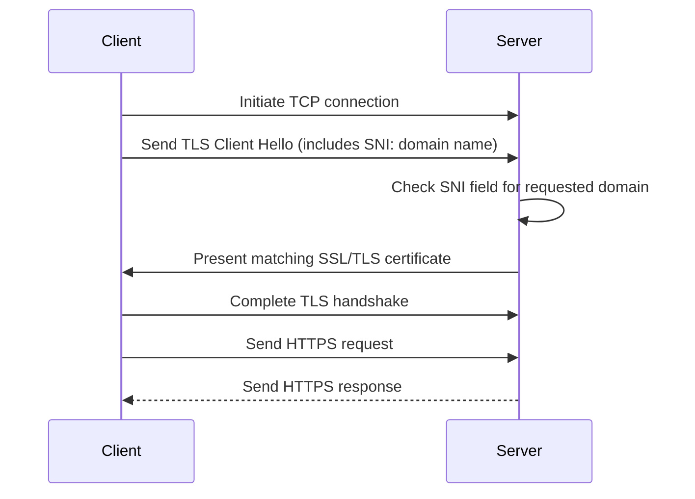
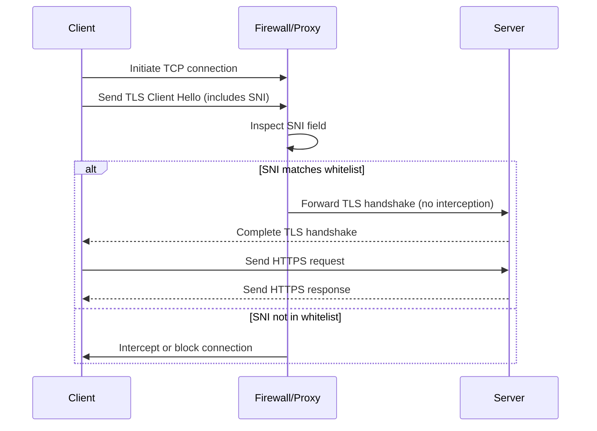

# How Does XTLS REALITY Work?

## What is SNI?

Server Name Indication (SNI) is an extension to the TLS (Transport Layer Security) protocol that allows a client (such as a web browser) to specify the hostname (domain name) it wants to connect to during the initial TLS handshake. This enables a server to present the correct SSL/TLS certificate for the requested domain, even when **multiple domains are hosted on the same IP address and port**

Before SNI, each HTTPS website with its own SSL certificate required a unique IP address. This was inefficient and contributed to the exhaustion of IPv4 addresses. SNI solves this problem by allowing multiple domains, each with their own certificate, to share a single IP address. This makes web hosting more efficient, cost-effective, and scalable, and helps conserve valuable IP resources.

Without SNI, a server wouldn't know which certificate to present during the handshake, potentially causing errors or security warnings for users

**How SNI Works**

## SNI Whitelist

SNI whitelist refers to a security or network policy mechanism that uses the Server Name Indication (SNI) field in the TLS handshake to determine which HTTPS connections are allowed or bypassed by a firewall, proxy, or other security device.

> [!NOTE]  
> The SNI whitelist functions only with unencrypted SNI; if a user employs TLS 1.3 and ESNI, it will no longer work. In China, newer HTTPS technologies such as TLS 1.3 and ESNI are blocked, as noted [here](https://hide.me/en/blog/china-now-blocking-https-traffic-using-tls-1-3-and-esni/).
