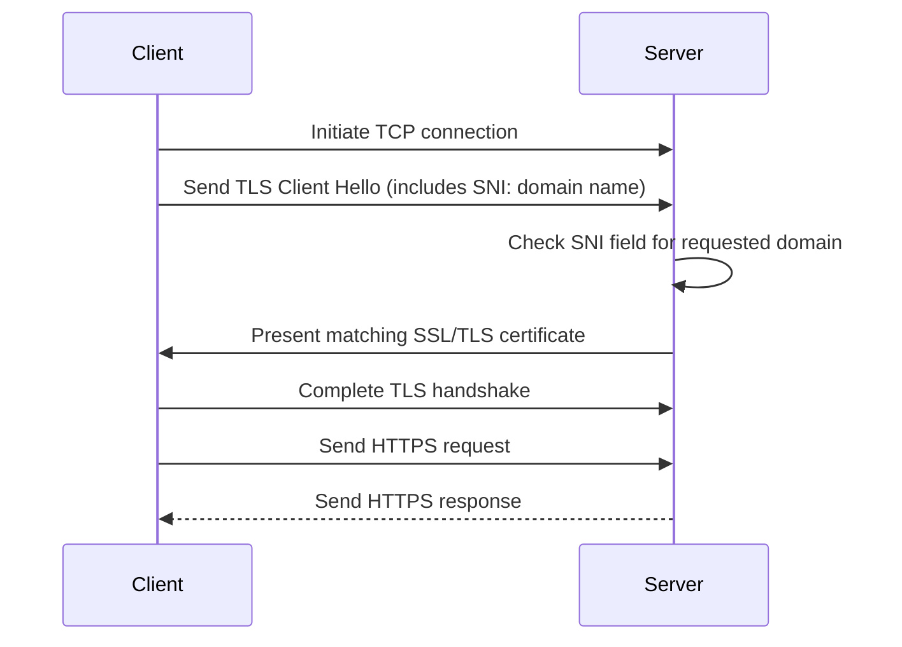
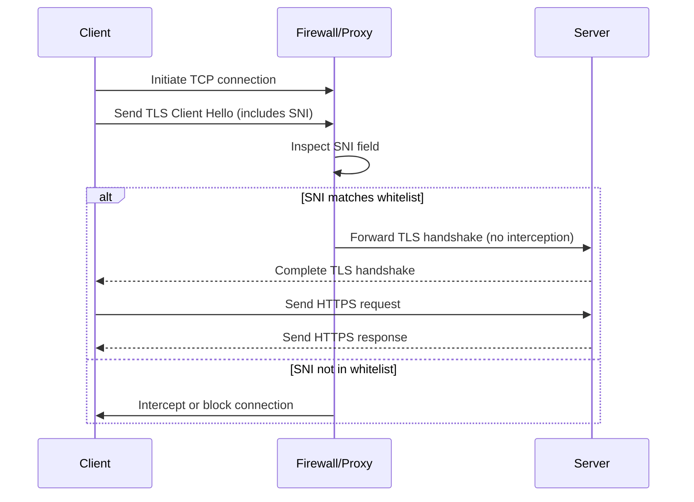

# How Does XTLS REALITY Work?

## What is SNI?

Server Name Indication (SNI) is an extension to the TLS (Transport Layer Security) protocol that allows a client (such as a web browser) to specify the hostname (domain name) it wants to connect to during the initial TLS handshake. This enables a server to present the correct SSL/TLS certificate for the requested domain, even when **multiple domains are hosted on the same IP address and port**

Before SNI, each HTTPS website with its own SSL certificate required a unique IP address. This was inefficient and contributed to the exhaustion of IPv4 addresses. SNI solves this problem by allowing multiple domains, each with their own certificate, to share a single IP address. This makes web hosting more efficient, cost-effective, and scalable, and helps conserve valuable IP resources.

Without SNI, a server wouldn't know which certificate to present during the handshake, potentially causing errors or security warnings for users

**How SNI Works**



## SNI Whitelist

SNI whitelist refers to a security or network policy mechanism that uses the Server Name Indication (SNI) field in the TLS handshake to determine which HTTPS connections are allowed or bypassed by a firewall, proxy, or other security device.



> [!NOTE]  
> SNI whitelisting only works when the SNI is transmitted in plaintext. If a client uses TLS 1.3 with ESNI (Encrypted SNI) or ECH (Encrypted Client Hello), the SNI field is encrypted and cannot be inspected by intermediaries, rendering SNI whitelisting ineffective. In response, some censorship systems (such as the Great Firewall of China) block all connections using ESNI or ECH to maintain control over accessible domains

## TLS Handshake


1. Client sends ClientHello (plaintext)

- Includes the client's key share for key exchange (e.g., ECDHE public value) and SNI.

2. Server sends ServerHello (plaintext)

- Includes the server's key share for key exchange (e.g., ECDHE public value).

3. Both client and server compute the shared secret (pre-master secret)

- Using their own private key and the other party's public key, both sides compute the same pre-master secret via ECDHE

4. Both sides create the master key and session keys

- The client and server use the shared secret from the key exchange, combined with random numbers sent earlier, to generate the main encryption keys using a secure algorithm (HKDF).
- This step happens before any encrypted handshake messages are sent.

5. Server sends encrypted handshake messages

- Server sends EncryptedExtensions, Certificate, CertificateVerify, and Finished messages, all encrypted with the handshake keys.

6. Client verifies server and sends its own encrypted messages

- Client verifies server certificate and Finished message, and (if requested) sends its own Certificate and CertificateVerify, then sends its Finished message—all encrypted.

7. Subsequent handshake messages are encrypted

- Both sides use the derived session keys to encrypt all further application data.

> [!NOTE]  
> The preMasterKey is only used for internal calculation of the master key and session keys; it is not used to encrypt, authenticate, or exchange any data directly over the network.

## Xray-core Implementation

### Client

In Xray-core, all packages responsible for encapsulating and transmitting proxy traffic are placed in the transport/internet directory, and the reality package is no exception:

```
Xray-core/
|-- transport/
| |-- internet/
| | |-- reality/
| | | |-- config.go
| | | |-- config.pb.go
| | | |-- config.proto
| | | |-- reality.go
```

The key to initiating a REALITY connection is in reality.go, where func6 UClient is called when other packages initiate a REALITY connection, and is the most important functional entry point for the client part of the package:

```go
func UClient(c net.Conn, config *Config, ctx context.Context, dest net.Destination) (net.Conn, error)
```

The `UClient` function is a complex implementation that creates a REALITY client connection. This function establishes a TLS connection using the uTLS library with REALITY protocol enhancements, which includes custom handshake modifications and anti-detection mechanisms.

**Initial Setup**

```go
localAddr := c.LocalAddr().String()
uConn := &UConn{}
utlsConfig := &utls.Config{
    VerifyPeerCertificate:  uConn.VerifyPeerCertificate,
    ServerName:             config.ServerName,
    InsecureSkipVerify:     true,
    SessionTicketsDisabled: true,
    KeyLogWriter:           KeyLogWriterFromConfig(config),
}
```

- Creates a uTLS configuration with custom certificate verification (`VerifyPeerCertificate` verify the validity of the server certificate and the server identity.)

**Fingerprint Setup**

```go
fingerprint := tls.GetFingerprint(config.Fingerprint)
uConn.UConn = utls.UClient(c, utlsConfig, *fingerprint)
```

- Gets a TLS fingerprint to mimic specific browsers/clients
- Golang's ClientHello has a very **unique fingerprint** that stands out particularly on mobile clients where Go isn't popular. This makes circumvention tools built with standard Go TLS libraries easily identifiable and blockable with minimal collateral damage. We need to randomized fingerprint to avoid ClientHello request getting blocked.

**Custom Handshake**

REALITY clients use the Session ID field space in TLS Client Hello to covertly mark the client so that the server can distinguish between **censors** and **legitimate REALITY clients**. The Session ID field was originally used for the 0-RTT session resumption mechanism of TLS1.2. Although TLS1.3 switched to the session resumption mechanism based on PSK (Pre-shared Key), in order to maintain compatibility with TLS1.2 as much as possible, the Session ID field was retained while TLS1.3 was deprecated. Therefore, the Session ID used for each TLS1.3 connection should be randomly generated.

```go
// Generate the default ClientHello and provide it to uConn
// In this step, the client's TLS key pair is also generated
uConn.BuildHandshakeState()
// Assign the pointer of the generated default ClientHello to hello
hello := uConn.HandshakeState.Hello
// Assign a 32-byte empty slice (dynamic array) to SessionId
// And fill it to the 40th-71th bytes of ClientHello, occupying the unit position
hello.SessionId = make([]byte, 32)
copy(hello.Raw[39:], hello.SessionId) // the fixed location of `Session ID`
// And fill it to the 40th-71th bytes of ClientHello, occupying the unit position
hello.SessionId[0] = core.Version_x
hello.SessionId[1] = core.Version_y
hello.SessionId[2] = core.Version_z
hello.SessionId[3] = 0 // reserved
// Fill the current Unix timestamp into the 5th-8th bytes of SessionId
binary.BigEndian.PutUint32(hello.SessionId[4:], uint32(time.Now().Unix()))
// Fill shortId from the 9th byte of SessionId
copy(hello.SessionId[8:], config.ShortId)

// Convert the REALITY public key to a usable public key object
publicKey, err := ecdh.X25519().NewPublicKey(config.PublicKey)

// ...

// Use the X25519 private key and REALITY public key in the client TLS key pair generated by BuildHandshakeState() to enter the ECDH algorithm to calculate the shared key.
uConn.AuthKey, _ = uConn.HandshakeState.State13.KeyShareKeys.Ecdhe.ECDH(publicKey)

// ...

// Input the key into HKDF (key derivation function based on HMAC) to calculate preMasterKey.
if _, err := hkdf.New(sha256.New, uConn.AuthKey, hello.Random[:20], []byte("REALITY")).Read(uConn.AuthKey); err != nil {
    return nil, err
}

// Uses AES-GCM to encrypt the session ID
block, _ := aes.NewCipher(uConn.AuthKey)
aead, _ := cipher.NewGCM(block)
aead.Seal(hello.SessionId[:0], hello.Random[20:], hello.SessionId[:16], hello.Raw)
// Copy the final SessionId to bytes 40-72 of ClientHello
copy(hello.Raw[39:], hello.SessionId)

// ...

// Performs the actual TLS handshake with the modified ClientHello.
if err := uConn.HandshakeContext(ctx); err != nil {
    return nil, err
}
```

**Anti-Detection Spider Mechanism**

If the connection isn't verified (meaning it's likely being inspected), the function launches a sophisticated anti-detection mechanism:

1. **HTTP/2 Client Setup**

```go
client := &http.Client{
    Transport: &http2.Transport{
        DialTLSContext: func(ctx context.Context, network, addr string, cfg *gotls.Config) (net.Conn, error) {
            errors.LogInfo(ctx, fmt.Sprintf("REALITY localAddr: %v\tDialTLSContext\n", localAddr))
            return uConn, nil
        },
    },
}
```

   - Creates an HTTP/2 client that reuses the TLS connection
   - This simulates normal browser behavior

2. **Web Crawling Simulation**

```go
prefix := []byte("https://" + uConn.ServerName)
maps.Lock()
if maps.maps == nil {
    maps.maps = make(map[string]map[string]struct{})
}
paths := maps.maps[uConn.ServerName]
if paths == nil {
    paths = make(map[string]struct{})
    paths[config.SpiderX] = struct{}{}
    maps.maps[uConn.ServerName] = paths
}
firstURL := string(prefix) + getPathLocked(paths)
maps.Unlock()
get := func(first bool) {
    var (
        req  *http.Request
        resp *http.Response
        err  error
        body []byte
    )
    if first {
        req, _ = http.NewRequest("GET", firstURL, nil)
    } else {
        maps.Lock()
        req, _ = http.NewRequest("GET", string(prefix)+getPathLocked(paths), nil)
        maps.Unlock()
    }
    if req == nil {
        return
    }
    req.Header.Set("User-Agent", fingerprint.Client) // TODO: User-Agent map
    if first && config.Show {
        errors.LogInfo(ctx, fmt.Sprintf("REALITY localAddr: %v\treq.UserAgent(): %v\n", localAddr, req.UserAgent()))
    }
    times := 1
    if !first {
        times = int(crypto.RandBetween(config.SpiderY[4], config.SpiderY[5]))
    }
    for j := 0; j < times; j++ {
        if !first && j == 0 {
            req.Header.Set("Referer", firstURL)
        }
        req.AddCookie(&http.Cookie{Name: "padding", Value: strings.Repeat("0", int(crypto.RandBetween(config.SpiderY[0], config.SpiderY[1])))})
        if resp, err = client.Do(req); err != nil {
            break
        }
        defer resp.Body.Close()
        req.Header.Set("Referer", req.URL.String())
        if body, err = io.ReadAll(resp.Body); err != nil {
            break
        }
        maps.Lock()
        for _, m := range href.FindAllSubmatch(body, -1) {
            m[1] = bytes.TrimPrefix(m[1], prefix)
            if !bytes.Contains(m[1], dot) {
                paths[string(m[1])] = struct{}{}
            }
        }
        req.URL.Path = getPathLocked(paths)
        if config.Show {
            errors.LogInfo(ctx, fmt.Sprintf("REALITY localAddr: %v\treq.Referer(): %v\n", localAddr, req.Referer()))
            errors.LogInfo(ctx, fmt.Sprintf("REALITY localAddr: %v\tlen(body): %v\n", localAddr, len(body)))
            errors.LogInfo(ctx, fmt.Sprintf("REALITY localAddr: %v\tlen(paths): %v\n", localAddr, len(paths)))
        }
        maps.Unlock()
        if !first {
            time.Sleep(time.Duration(crypto.RandBetween(config.SpiderY[6], config.SpiderY[7])) * time.Millisecond) // interval
        }
    }
}
get(true)
concurrency := int(crypto.RandBetween(config.SpiderY[2], config.SpiderY[3]))
for i := 0; i < concurrency; i++ {
    go get(false)
}
```

   - Maintains a map of discovered URLs for each server
   - Performs GET requests to simulate real browsing
   - Extracts links from responses to build a realistic browsing pattern
   - Uses random delays and multiple concurrent requests
   - Sets realistic headers including User-Agent and Referer

3. **Realistic Browsing Behavior**:

   - Random cookie padding
   - Multiple concurrent requests
   - Link following with proper referer headers
   - Random timing intervals

## References

- https://blog.cloudflare.com/handshake-encryption-endgame-an-ech-update/
- https://objshadow.pages.dev/en/posts/how-reality-works/
