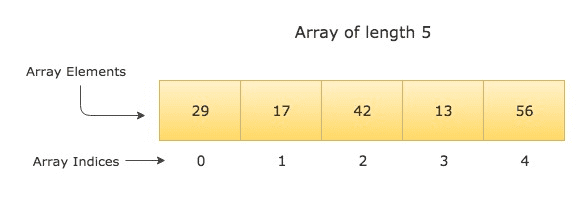
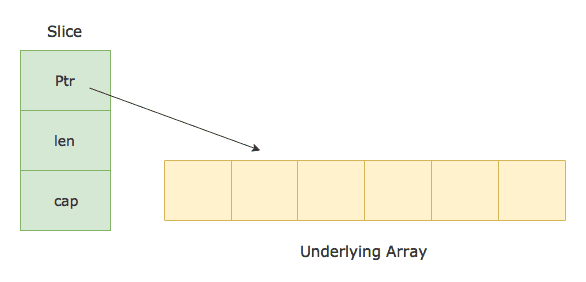
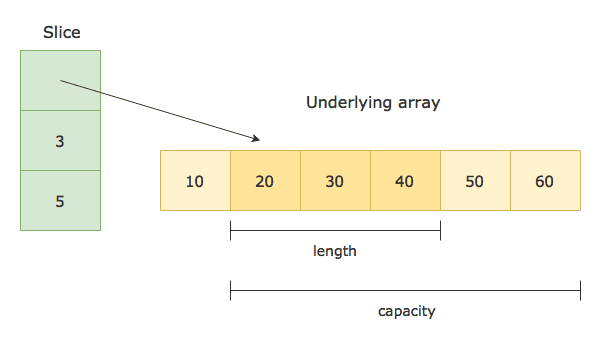

# Array and slice

## 1. Array

Arrays are fixed-length sequences of items of the same type. Arrays in Go can be created using the following syntaxes:

```go
[N]Type
[N]Type{value1, value2, ..., valueN}
[...]Type{value1, value2, ..., valueN}
```

For example, the type `[4]int` represents an array of four integers.



## 2. Slice

### What is slice

A Slice is a segment of an array. Slices build on arrays and provide more power, flexibility, and convenience compared to arrays. Just like arrays, Slices are indexable and have a length. But unlike arrays, they can be resized.

Slices can be created using the following syntaxes:

```go
make([]Type, length, capacity)
make([]Type, length)
[]Type{}
[]Type{value1, value2, ..., valueN}
```

A slice of type T is declared using `[]T`. The slice is declared just like an array except that we do not specify any size in the brackets `[]`.

Since a slice is a segment of an array, we can create a slice from an array.

To create a slice from an array a, we specify two indices `low` (lower bound) and `high` (upper bound) separated by a colon -

```go
a[low:high]
```

The above expression selects a slice from the array `a`. The resulting slice includes all the elements starting from index `low` to `high`, but excluding the element at index `high`.

The `low` and `high` indices in the slice expression are optional. The default value for low is `0`, and high is the length of the slice.

A slice can also be created by slicing an existing slice.

### Modifying the slice

Slices are reference types. They refer to an underlying array. Modifying the elements of a slice will modify the corresponding elements in the referenced array. Other slices that refer the same array will also see those modifications.

### Length and Capacity of a Slice

A slice consists of three things -

- A pointer (reference) to an underlying array.
- The length of the segment of the array that the slice contains.
- The capacity (the maximum size up to which the segment can grow).

```go
type SliceHeader struct {
	Data uintptr
	Len  int
	Cap  int
}
```



Let’s consider the following array and the slice obtained from it as an example -

```go
var a = [6]int{10, 20, 30, 40, 50, 60}
var s = [1:4]
```

Here is how the slice s in the above example is represented -



The length of the slice is the number of elements in the slice, which is 3 in the above example.

The capacity is the number of elements in the underlying array starting from the first element in the slice. It is 5 in the above example.

You can find the length and capacity of a slice using the built-in functions `len()` and `cap()`

### Zero value of slices

The zero value of a slice is nil. A nil slice doesn’t have any underlying array, and has a length and capacity of 0

```go
package main
import "fmt"

func main() {
	var s []int
	fmt.Printf("s = %v, len = %d, cap = %d\n", s, len(s), cap(s))

	if s == nil {
		fmt.Println("s is nil")
	}
}
```

Output:

```sh
s = [], len = 0, cap = 0
s is nil
```

### Slice functions

#### copy

The copy() function copies elements from one slice to another. Its signature looks like this -

```go
func copy(dst, src []T) int
```

It takes two slices - a destination slice, and a source slice. It then copies elements from the source to the destination and returns the number of elements that are copied.

The number of elements copied will be the minimum of len(src) and len(dst).

#### append

The append() function appends new elements at the end of a given slice. Following is the signature of append function.

```go
func append(s []T, x ...T) []T
```

It takes a slice and a variable number of arguments x …T. It then returns a new slice containing all the elements from the given slice as well as the new elements.

If the given slice doesn’t have sufficient capacity to accommodate new elements then a new underlying array is allocated with bigger capacity. All the elements from the underlying array of the existing slice are copied to this new array, and then the new elements are appended.

However, if the slice has enough capacity to accommodate new elements, then the append() function re-uses its underlying array and appends new elements to the same array.

### Iterating over a slice

#### Using for loop

```go
package main
import "fmt"

func main() {
	countries := []string{"India", "America", "Russia", "England"}

	for i := 0; i < len(countries); i++ {
		fmt.Println(countries[i])
	}
}
```

#### Using range

```go
package main
import "fmt"

func main() {
	primeNumbers := []int{2, 3, 5, 7, 11, 13, 17, 19, 23, 29}

	for index, number := range primeNumbers {
		fmt.Printf("PrimeNumber(%d) = %d\n", index+1, number)
	}
}
```
