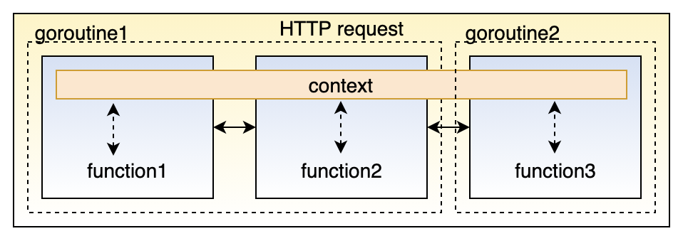
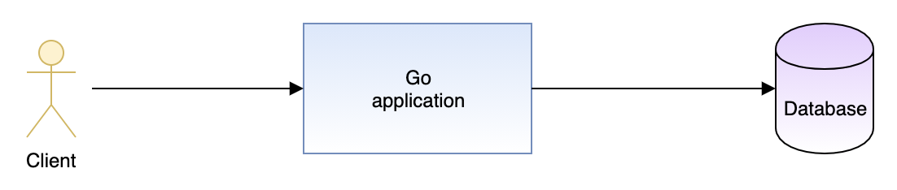
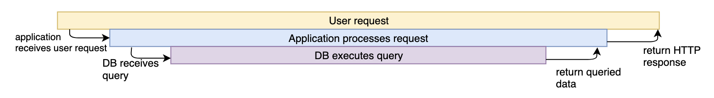
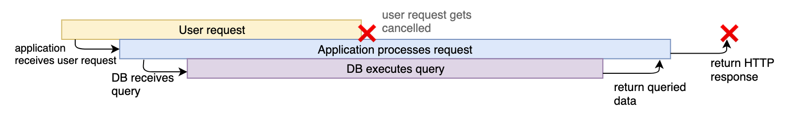
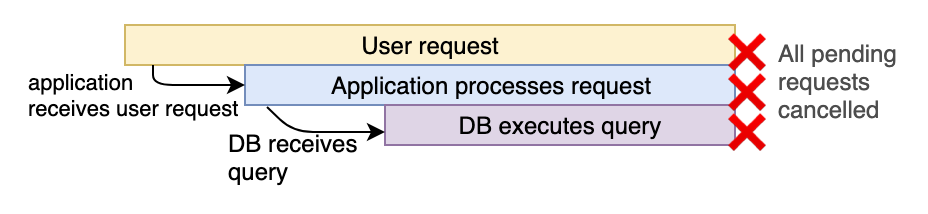

# Context

## 1. Introduction

In Go servers, each incoming request is handled in its own goroutine. Request handlers often start additional goroutines to access backends such as databases and RPC services. The set of goroutines working on a request typically needs access to request-specific values such as the identity of the end user, authorization tokens, and the request's deadline. When a request is canceled or times out, all the goroutines working on that request should exit quickly so the system can reclaim any resources they are using.

A context package makes it easy to pass request-scoped values, cancelation signals, and deadlines across API boundaries to all the goroutines involved in handling a request.



A context package will help you in following problems:

- Let’s say that you started a function and you need to pass some common parameters to the downstream functions. You cannot pass these common parameters each as an argument to all the downstream functions.
- You started a goroutine which in turn start more goroutines and so on. Suppose the task that you were doing is no longer needed. Then how to inform all child goroutines to gracefully exit so that resources can be freed up.
- A task should be finished within a specified timeout of say 2 seconds. If not it should gracefully exit or return.
- A task should be finished within a deadline eg it should end before 5 pm. If not finished then it should gracefully exit and return.

Use cases:

- To pass data to the downstream. Eg. a HTTP request creates a `request_id`, `request_user` which needs to be passed around to all downstream functions for distributed tracing.
- When you want to halt the operation in the midway – A HTTP request should be stopped because the client disconnected.
- When you want to halt the operation within a specified time from start i.e with timeout – Eg- a HTTP request should be completed in 2 sec or else should be aborted.
- When you want to halt an operation before a certain time – Eg. A cron is running that needs to be aborted in 5 mins if not completed.

## 2. Context

The core of the context package is the Context type:

```go
// A Context carries a deadline, cancelation signal, and request-scoped values
// across API boundaries. Its methods are safe for simultaneous use by multiple
// goroutines.
type Context interface {
    // Done returns a channel that is closed when this Context is canceled
    // or times out.
    Done() <-chan struct{}

    // Err indicates why this context was canceled, after the Done channel
    // is closed.
    Err() error

    // Deadline returns the time when this Context will be canceled, if any.
    Deadline() (deadline time.Time, ok bool)

    // Value returns the value associated with key or nil if none.
    Value(key interface{}) interface{}
}
```

## 3. Derived contexts

The context package provides functions to derive new Context values from existing ones. These values form a tree: when a Context is canceled, all Contexts derived from it are also canceled.

`Background` is the root of any Context tree; it is never canceled:

```go
// Background returns an empty Context. It is never canceled, has no deadline,
// and has no values. Background is typically used in main, init, and tests,
// and as the top-level Context for incoming requests.
func Background() Context
```

`TODO` is a non-nil, empty Context. Code should use context.TODO when it's unclear which Context to use or it is not yet available

```go
// TODO returns a non-nil, empty Context. Code should use context.TODO when
// it's unclear which Context to use or it is not yet available (because the
// surrounding function has not yet been extended to accept a Context
// parameter).
func TODO() Context
```

A derived context is can be created in 4 ways:

```go
// A CancelFunc cancels a Context.
type CancelFunc func()

// WithCancel returns a copy of parent whose Done channel is closed as soon as
// parent.Done is closed or cancel is called.
func WithCancel(parent Context) (ctx Context, cancel CancelFunc)

// WithTimeout returns a copy of parent whose Done channel is closed as soon as
// parent.Done is closed, cancel is called, or timeout elapses. The new
// Context's Deadline is the sooner of now+timeout and the parent's deadline, if
// any. If the timer is still running, the cancel function releases its
// resources.
func WithTimeout(parent Context, timeout time.Duration) (Context, CancelFunc)

// WithValue returns a copy of parent whose Value method returns val for key.
func WithValue(parent Context, key interface{}, val interface{}) Context

// WithDeadline returns a copy of the parent context with the deadline adjusted to be no later than d
func WithDeadline(parent Context, d time.Time) (Context, CancelFunc)
```

## 4. Context examples

We need cancellation to prevent our system from doing unnecessary work.

Consider the common situation of an HTTP server making a call to a database, and returning the queried data to the client:



The timing diagram, if everything worked perfectly, would look like this:



But, what would happen if the client cancelled the request in the middle? This could happen if, for example, the client closed their browser mid-request.

Without cancellation, the application server and database would continue to do their work, even though the result of that work would be wasted:



Ideally, we would want all downstream components of a process to halt, if we know that the process (in this example, the HTTP request) halted:



Example:

```go
package main

import (
	"context"
	"fmt"
	"time"
)

func task(ctx context.Context) {
	i := 1
	for {
		select {
		case <-ctx.Done():
			fmt.Println("Gracefully exit")
			fmt.Println(ctx.Err())
			return
		default:
			fmt.Println(i)
			time.Sleep(time.Second * 1)
			i++
		}
	}
}

func main() {
	ctx := context.Background()
	cancelCtx, cancelFunc := context.WithCancel(ctx)
	go task(cancelCtx)
	time.Sleep(time.Second * 3)
	cancelFunc()
	time.Sleep(time.Second * 1)
}
```

An example using `withValue` context

```go
package main

import (
	"context"
	"github.com/google/uuid"
	"net/http"
)

//HelloWorld hellow world handler
func HelloWorld(w http.ResponseWriter, r *http.Request) {
	msgID := ""
	if m := r.Context().Value("msgId"); m != nil {
		if value, ok := m.(string); ok {
			msgID = value
		}
	}
	w.Header().Add("msgId", msgID)
	w.Write([]byte("Hello, world"))
}

func inejctMsgID(next http.Handler) http.Handler {
	return http.HandlerFunc(func(w http.ResponseWriter, r *http.Request) {
		msgID := uuid.New().String()
		ctx := context.WithValue(r.Context(), "msgId", msgID)
		req := r.WithContext(ctx)
		next.ServeHTTP(w, req)

	})
}

func main() {
	helloWorldHandler := http.HandlerFunc(HelloWorld)
	http.Handle("/welcome", inejctMsgID(helloWorldHandler))
	http.ListenAndServe(":8080", nil)
}
```

## 5. BestPractices and Caveats

- Do not store a context within a struct type
- Context should flow through your program. For example, in case of an HTTP request, a new context can be created for each incoming request which can be used to hold a request_id or put some common information in the context like currently logged in user which might be useful for that particular request.
- Always pass context as the first argument to a function.
- Whenever you are not sure whether to use the context or not, it is better to use the context.ToDo() as a placeholder.
- Only the parent goroutine or function should the cancel context. Therefore do not pass the cancelFunc to downstream goroutines or functions. Golang will allow you to pass the cancelFunc around to child goroutines but it is not a recommended practice
