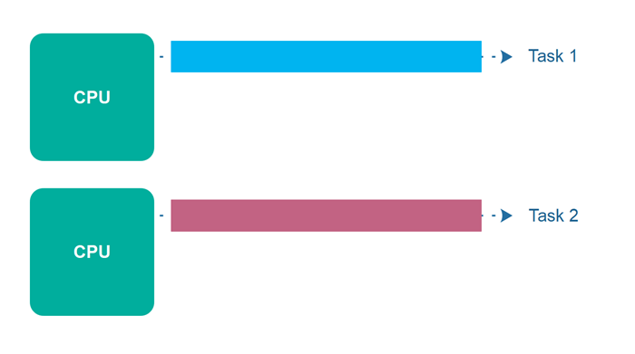
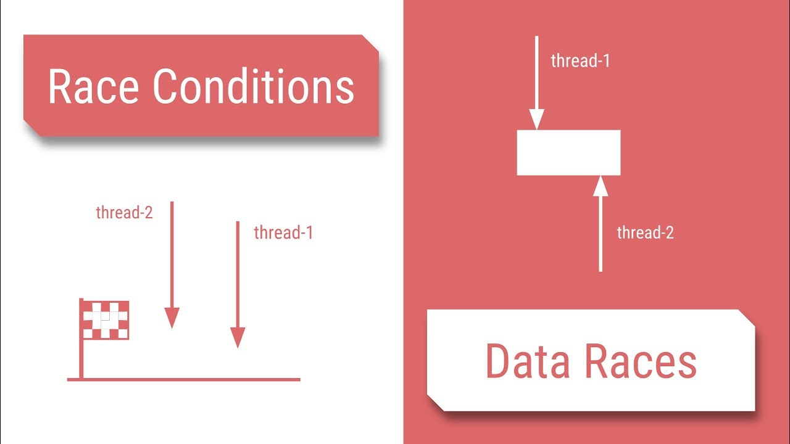
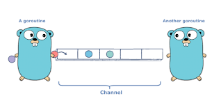

# Goroutine

## 1. Concurrency vs Parallelism

**Concurrency** is when two or more tasks can start, run, and complete in overlapping time periods. It doesn't necessarily mean they'll ever both be running at the same instant.


**Parallelism** is when tasks literally run at the same time, e.g., on a multicore processor.



## 2. Data races and race conditions

**Data races** is a situation, in which at least two threads access a shared variable at the same time. At least one thread tries to modify the variable.

**Race condition** is a situation, in which the result of an operation depends on the interleaving of certain individual operations.



## 3. Deadlocks

### What is a deadlock?

A deadlock occurs when all processes are blocked while waiting for each other and the program cannot proceed further.

### Coffman conditions

There are four conditions, knows as the **Coffman conditions** that must be present simultaneously for a deadlock to occur:

- Mutual exclusion: A concurrent process holds at least one resource at any time making it non-sharable
- Hold and wait: A concurrent process holds a resource and is waiting for an additional resource
- No preemption: A resource held by a concurrent process cannot be taken away by the system. It can only be freed by the process holding it.
- Circle wait: A concurrent process must be waiting on a chain of other concurrent processes such that P1 is waiting on P2, P2 on P3 and so on, and there exists a Pn which is waiting for P1.

In order to prevent deadlocks, we need to make sure that at least one of the conditions stated above should not hold.

## 3. Starvation

Starvation describes a situation where a thread is unable to gain regular access to shared resources and is unable to make progress.
This happens when shared resources are made unavailable for long periods by **greedy** threads.

For example, suppose an object provides a synchronized method that often takes a long time to return.
If one thread invokes this method frequently, other threads that also need frequent synchronized access to the same object will often be blocked.

## 4. Goroutine

A goroutine is a lightweight thread managed by the Go runtime.

You can create a goroutine by using the following syntax

```go
go f(x, y, z)
```

The current goroutine evaluates the input parameters to the function which are executed in the new goroutine.
`main()` function is a goroutine which was invoked by the implicity created goroutine managed by Go runtime.

## 5. Channels

Channel is a pipe between goroutines to synchronize excution and communicate by sending/receiving data



```go
channelName := make(chan datatype)
```

The datatype is the type of data that you will pass on your channel.

Eg:

```go
channelName := make(chan int)
```

### Sending on a channel

```go
channelName<-data
```

### Receiving on a channel

```go
data := <-channelName
```

By default, sends and receives block until the other side is ready. This allows goroutines to synchronize without explicit locks or condition variables.

### Closing a channel

```go
close(channelName)
```

A sender can close a channel to indicate that no more values will be sent. Receivers can test whether a channel has been closed by assigning a second parameter to the receive expression:

```go
v, ok := <-ch
```

`ok` is `false` if there are no more values to receive and the channel is closed.

The loop `for i := range c` receives values from the channel repeatedly until it is closed.

## 6. Buffered channels

Buffered channels are channels with a capacity/buffer. They can created with the following syntax:

```go
channelName := make(chan datatype, capacity)
```

Sends to a buffered channel block only when the buffer is **full**. Receives block when the buffer is **empty**.

## 7. Select

The select statement lets a goroutine wait on multiple communication operations.

A select blocks until one of its cases can run, then it executes that case. It chooses one at random if multiple are ready.

```go
select {
    case mess1 := <-channel1:
      fmt.Println(mess1)
    case mess2 := <-channel2:
      fmt.Println(mess2)
}
```

### Default selection

The `default` case in a `select` is run if no other case is ready.

```go
select {
    case mess := <-channel:
      fmt.Println(mess)
    default:
      time.Sleep(50 * time.Millisecond)
}
```

### Empty select

```go
select {}
```

The empty select will block forever as there is no case statement to execute.
It is similar to an empty `for {}` statement.
On most supported Go architectures, the empty select will yield CPU. An empty for-loop won't, i.e. it will "spin" on 100% CPU.

## 8. WaitGroups

A WaitGroup blocks a program an waits for a set of goroutines to finish before moving to the next steps of excutions.

```go
package main

import (
    "fmt"
    "sync"
)

func main() {
    waitgroup := new(sync.WaitGroup)
    waitgroup.Add(2)

    go func() {
        fmt.Println("Hello world 1")
        waitgroup.Done()
    }()

    go func() {
        fmt.Println("Hello world 2")
        waitgroup.Done()
    }()

    waitgroup.Wait()

    fmt.Println("Finished Execution")
}
```

## 9. Mutex

### Critical section

When a program runs concurrently, the parts of code which modify shared resources should not be accessed by multiple Goroutines at the same time.
This section of code that modifies shared resources is called critical section

### What is mutex

A mutex prevents other processes from entering a critical section of data while a process occupies it.

Go's standard library provides mutual exclusion with sync.Mutex and its two methods:

- `Lock`
- `Unlock`

### RWMutex

A RWMutex is a reader/writer mutual exclusion lock. The lock can be held by an arbitrary number of readers or a single writer.

- `Lock`: locks for writing. If the lock is already locked for reading or writing, Lock blocks until the lock is available.
- `Unlock`: unlocks writing lock.
- `RLock`: locks for reading. It should not be used for recursive read locking; a blocked Lock call excludes new readers from acquiring the lock.
- `RUnlock`: RUnlock undoes a single RLock call; it does not affect other simultaneous readers.
