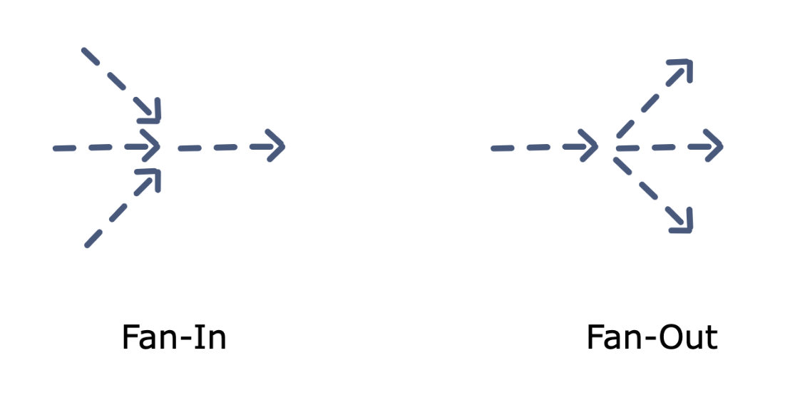

# Goroutine

## 1. Concurrency vs Parallelism

**Concurrency** is when two or more tasks can start, run, and complete in overlapping time periods. It doesn't necessarily mean they'll ever both be running at the same instant.


**Parallelism** is when tasks literally run at the same time, e.g., on a multicore processor.


## 2. Data races and race conditions

**Data races** is a situation, in which at least two threads access a shared variable at the same time. At least one thread tries to modify the variable.

**Race condition** is a situation, in which the result of an operation depends on the interleaving of certain individual operations.


## 3. Deadlocks

### What is a deadlock?

A deadlock occurs when all processes are blocked while waiting for each other and the program cannot proceed further.

### Coffman conditions

There are four conditions, knows as the **Coffman conditions** that must be present simultaneously for a deadlock to occur:

- Mutual exclusion: A concurrent process holds at least one resource at any time making it non-sharable
- Hold and wait: A concurrent process holds a resource and is waiting for an additional resource
- No preemption: A resource held by a concurrent process cannot be taken away by the system. It can only be freed by the process holding it.
- Circle wait: A concurrent process must be waiting on a chain of other concurrent processes such that P1 is waiting on P2, P2 on P3 and so on, and there exists a Pn which is waiting for P1.

In order to prevent deadlocks, we need to make sure that at least one of the conditions stated above should not hold.

## 3. Starvation

Starvation describes a situation where a thread is unable to gain regular access to shared resources and is unable to make progress.
This happens when shared resources are made unavailable for long periods by **greedy** threads.

For example, suppose an object provides a synchronized method that often takes a long time to return.
If one thread invokes this method frequently, other threads that also need frequent synchronized access to the same object will often be blocked.

## 4. Goroutine

A goroutine is a lightweight thread managed by the Go runtime.

You can create a goroutine by using the following syntax

```go
go f(x, y, z)
```

The current goroutine evaluates the input parameters to the function which are executed in the new goroutine.
`main()` function is a goroutine which was invoked by the implicity created goroutine managed by Go runtime.

## 5. Channels

Channel is a pipe between goroutines to synchronize excution and communicate by sending/receiving data


```go
channelName := make(chan datatype)
```

The datatype is the type of data that you will pass on your channel.

Eg:

```go
channelName := make(chan int)
```

### Sending on a channel

```go
channelName<-data
```

### Receiving on a channel

```go
data := <-channelName
```

By default, sends and receives block until the other side is ready. This allows goroutines to synchronize without explicit locks or condition variables.

### Closing a channel

```go
close(channelName)
```

A sender can close a channel to indicate that no more values will be sent. Receivers can test whether a channel has been closed by assigning a second parameter to the receive expression:

```go
v, ok := <-ch
```

`ok` is `false` if there are no more values to receive and the channel is closed.

The loop `for i := range c` receives values from the channel repeatedly until it is closed.

## 6. Buffered channels

Buffered channels are channels with a capacity/buffer. They can created with the following syntax:

```go
channelName := make(chan datatype, capacity)
```

Sends to a buffered channel block only when the buffer is **full**. Receives block when the buffer is **empty**.

## 7. Select

The select statement lets a goroutine wait on multiple communication operations.

A select blocks until one of its cases can run, then it executes that case. It chooses one at random if multiple are ready.

```go
select {
    case mess1 := <-channel1:
      fmt.Println(mess1)
    case mess2 := <-channel2:
      fmt.Println(mess2)
}
```

### Default selection

The `default` case in a `select` is run if no other case is ready.

```go
select {
    case mess := <-channel:
      fmt.Println(mess)
    default:
      time.Sleep(50 * time.Millisecond)
}
```

### Empty select

```go
select {}
```

The empty select will block forever as there is no case statement to execute.
It is similar to an empty `for {}` statement.
On most supported Go architectures, the empty select will yield CPU. An empty for-loop won't, i.e. it will "spin" on 100% CPU.

### Select statement with timeout

Timeout in select can be achieved by using `After()` function of `time` package. Below is the signature of `After()` function.

```go
func After(d Duration) <-chan Time
```

The `After` function waits for `d` duration to finish and then it returns the current time on a channel.

Example:

```go
package main

import (
	"fmt"
	"time"
)

func main() {
	news := make(chan string)
	go newsFeed(news)

	printAllNews(news)
}

func printAllNews(news chan string) {
	for {
		select {
		case n := <-news:
			fmt.Println(n)
		case <-time.After(time.Second * 1):
			fmt.Println("Timeout: News feed finished")
			return
		}
	}
}

func newsFeed(ch chan string) {
	for i := 0; i < 2; i++ {
		time.Sleep(time.Millisecond * 400)
		ch <- fmt.Sprintf("News: %d", i+1)
	}
}
```

## 8. WaitGroups

A WaitGroup blocks a program an waits for a set of goroutines to finish before moving to the next steps of excutions.

```go
package main

import (
    "fmt"
    "sync"
)

func main() {
    waitgroup := new(sync.WaitGroup)
    waitgroup.Add(2)

    go func() {
        fmt.Println("Hello world 1")
        waitgroup.Done()
    }()

    go func() {
        fmt.Println("Hello world 2")
        waitgroup.Done()
    }()

    waitgroup.Wait()

    fmt.Println("Finished Execution")
}
```

## 9. Mutex

### Critical section

When a program runs concurrently, the parts of code which modify shared resources should not be accessed by multiple Goroutines at the same time.
This section of code that modifies shared resources is called critical section

### What is mutex

A mutex prevents other processes from entering a critical section of data while a process occupies it.

Go's standard library provides mutual exclusion with sync.Mutex and its two methods:

- `Lock`
- `Unlock`

### RWMutex

A RWMutex is a reader/writer mutual exclusion lock. The lock can be held by an arbitrary number of readers or a single writer.

- `Lock`: locks for writing. If the lock is already locked for reading or writing, Lock blocks until the lock is available.
- `Unlock`: unlocks writing lock.
- `RLock`: locks for reading. It should not be used for recursive read locking; a blocked Lock call excludes new readers from acquiring the lock.
- `RUnlock`: RUnlock undoes a single RLock call; it does not affect other simultaneous readers.

## 9. Once, Pool, Cond

### Once

Once is an object that performs an action only once.

Implement a singleton pattern in Go:

```go
package main

import (
   "fmt"
   "sync"
)

type DbConnection struct {}

var (
   dbConnOnce sync.Once
   conn *DbConnection
)

func GetConnection() *DbConnection {
   dbConnOnce.Do(func() {
      conn = &DbConnection{}
      fmt.Println("Inside")
   })
   fmt.Println("Outside")
   return conn
}

func main()  {
   for i := 0; i<5; i++ {
      _ = GetConnection()
      /*
         Result is ...
         Inside
         Outside
         Outside
         Outside
         Outside
         Outside
      */
   }
}
```

### Pool

A Pool is a set of temporary objects that may be individually saved and retrieved. Pool's purpose is to cache allocated but unused items for later reuse, relieving pressure on the garbage collector.

The public methods are:

- `Get() interface{}` to retrieve an element
- `Put(interface{})` to add an element

```go
pool := &sync.Pool{
  New: func() interface{} {
    return NewConnection()
  },
}

connection := pool.Get().(*Connection)
```

When shall we use sync.Pool? There are two use-cases:

- The first one is when we have to reuse **shared and long-live objects** like a DB connection for example.
- The second one is to **optimize memory allocation**.

Eg:

```go
func writeFile(pool *sync.Pool, filename string) error {
	// Gets a buffer object
	buf := pool.Get().(*bytes.Buffer)
	// Returns the buffer into the pool
	defer pool.Put(buf)

	// Reset buffer otherwise it will contain "foo" during the first call
	// Then "foofoo" etc.
	buf.Reset()

	buf.WriteString("foo")

	return ioutil.WriteFile(filename, buf.Bytes(), 0644)
}
```

**Note:** Since a pointer can be put into the interface value returned by Get() without any allocation, it is preferable to put pointers than structures in the pool.

### Cond

Cond implements a condition variable, a rendezvous point for goroutines waiting for or announcing the occurrence of an event.

Creating a sync.Cond requires a sync.Locker object (either a sync.Mutex or a sync.RWMutex):

```go
cond := sync.NewCond(&sync.RWMutex{})
```

## 10. Concurrency patterns

### Generator function

Generator Pattern is used to generate a sequence of values which is used to produce some output.
This pattern is widely used to introduce parallelism into loops.
This allows the consumer of the data produced by the generator to run in parallel when the generator function is busy computing the next value.

```go
package main

import "fmt"

// Generator func which produces data which might be computationally expensive.
func fib(n int) chan int {
	c := make(chan int)
	go func() {
		for i, j := 0, 1; i < n; i, j = i+j, i {
			c <- i
		}
		close(c)
	}()
	return c
}

func main() {
	// fib returns the fibonacci numbers lesser than 1000
	for i := range fib(1000) {
		// Consumer which consumes the data produced by the generator, which further does some extra computations
		v := i * i
		fmt.Println(v)
	}
}
```

### Futures

A Future indicates any data that is needed in future but its computation can be started in parallel so that it can be fetched from the background when needed.

Example:

```go
package main

import (
	"fmt"
	"io/ioutil"
	"net/http"
)

type data struct {
	Body  []byte
	Error error
}

func futureData(url string) <-chan data {
	c := make(chan data, 1)

	go func() {
		var body []byte
		var err error

		resp, err := http.Get(url)
		defer resp.Body.Close()

		body, err = ioutil.ReadAll(resp.Body)

		c <- data{Body: body, Error: err}
	}()

	return c
}

func main() {
	future := futureData("http://test.future.com")

	// do many other things

	body := <-future
	fmt.Printf("response: %#v", string(body.Body))
	fmt.Printf("error: %#v", body.Error)
}
```

The actual http request is done asynchronously in a goroutine. The main function can continue doing other things. When the result is needed, we read the result from the channel.

### Fan-in, Fan-out

Fan-in Fan-out is a way of Multiplexing and Demultiplexing in golang.

- Fan-in refers to processing multiple input data and combining into a single entity.
- Fan-out is the exact opposite, dividing the data into multiple smaller chunks, distributing the work amongst a group of workers to parallelize CPU use and I/O.



For example we have a following program:

```go
package main

import (
	"fmt"
	"math/rand"
	"time"
)

func updatePosition(name string) <-chan string {
	positionChannel := make(chan string)

	go func() {
		for i := 0; ; i++ {
			positionChannel <- fmt.Sprintf("%s %d", name, i)
			time.Sleep(time.Duration(rand.Intn(1e3)) * time.Millisecond)
		}
	}()

	return positionChannel
}

func main() {
	positionChannel1 := updatePosition("Huy")
	positionChannel2 := updatePosition("Duong")

	for i := 0; i < 5; i++ {
		fmt.Println(<-positionChannel1)
		fmt.Println(<-positionChannel2)
	}
}
```

What if the data in `positionChannel2` come first? It needs to wait for the data in positionChannel1. What if we want to get position updates as soon as the data is ready?
This is where `fan-in` comes into play. By using this technique, we'll combine the inputs from both channels and send them through a single channel.

```
package main

import (
	"fmt"
	"math/rand"
	"time"
)

func updatePosition(name string) <-chan string {
	positionChannel := make(chan string)

	go func() {
		for i := 0; ; i++ {
			positionChannel <- fmt.Sprintf("%s %d", name, i)
			time.Sleep(time.Duration(rand.Intn(1e3)) * time.Millisecond)
		}
	}()

	return positionChannel
}

func fanIn(chan1, chan2 <-chan string) <-chan string {
	channel := make(chan string)
	go func() {
		for {
			channel <- <-chan1
		}
	}()
	go func() {
		for {
			channel <- <-chan2
		}
	}()

	return channel
}

func main() {
	positionChannel := fanIn(updatePosition("Huy"), updatePosition("Duong"))

	for i := 0; i < 10; i++ {
		fmt.Println(<-positionChannel)
	}
}
```

Another example using `generator`, `fan-in` and `fan-out` pattern

```go
package main

import (
	"fmt"
)

func main() {
	randomNumbers := []int{13, 44, 56, 99, 9, 45, 67, 90, 78, 23}
	// generate the common channel with inputs
	inputChan := generatePipeline(randomNumbers)

	// Fan-out to 2 Go-routine
	c1 := squareNumber(inputChan)
	c2 := squareNumber(inputChan)

	// Fan-in the resulting squared numbers
	c := fanIn(c1, c2)
	sum := 0

	// Do the summation
	for i := 0; i < len(randomNumbers); i++ {
		sum += <-c
	}
	fmt.Printf("Total Sum of Squares: %d", sum)
}

func generatePipeline(numbers []int) <-chan int {
	out := make(chan int)
	go func() {
		for _, n := range numbers {
			out <- n
		}
		close(out)
	}()
	return out
}

func squareNumber(in <-chan int) <-chan int {
	out := make(chan int)
	go func() {
		for n := range in {
			out <- n * n
		}
		close(out)
	}()
	return out
}

func fanIn(input1, input2 <-chan int) <-chan int {
	c := make(chan int)
	go func() {
		for {
			select {
			case s := <-input1:
				c <- s
			case s := <-input2:
				c <- s
			}
		}
	}()
	return c
}
```
