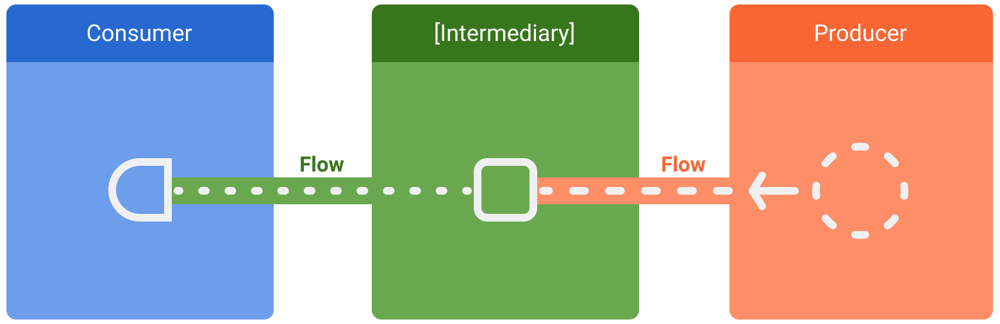

# Flow

In coroutines, a flow is a type that can emit multiple values sequentially, as opposed to suspend functions that return only a single value. For example, you can use a flow to receive live updates from a database.

There are three entities involved in streams of data:

- A **producer** produces data that is added to the stream. Thanks to coroutines, flows can also produce data asynchronously.
- (Optional) **Intermediaries** can modify each value emitted into the stream or the stream itself.
- A **consumer** consumes the values from the stream.



Flows are cold streams similar to sequences — the code inside a flow builder does not run until the flow is collected. 

## Creating a flow

To create flows, use the flow builder APIs. The `flow` builder function creates a new flow where you can manually emit new values into the stream of data using the `emit` function.

```kt
fun simple(): Flow<Int> = flow { // flow builder
    for (i in 1..3) {
        delay(100) // pretend we are doing something useful here
        emit(i) // emit next value
    }
}
```

## Collecting from a flow

```kt
fun main() = runBlocking<Unit> {
    // Collect the flow
    simple().collect { value -> println(value) }
}
```

## Modifying the stream

Intermediaries can use intermediate operators to modify the stream of data without consuming the value.

```kt
suspend fun performRequest(request: Int): String {
    delay(1000) // imitate long-running asynchronous work
    return "response $request"
}

fun main() = runBlocking<Unit> {
    (1..3).asFlow() // a flow of requests
        .filter { it != 2 }
        .map { request -> performRequest(request) }
        .collect { response -> println(response) }
}
```

You can also modify the flow using `transform` builtin function

```kt
(1..3).asFlow() // a flow of requests
    .transform { request ->
        emit("Making request $request") 
        emit(performRequest(request)) 
    }
    .collect { response -> println(response) }
```

## Executing in a different CoroutineContext

By default, the producer of a flow builder executes in the `CoroutineContext` of the coroutine that collects from it and you can not `emit` values from different `CoroutineContext`. This behavior might be undesirable in some cases.

To change the CoroutineContext of a flow, use the intermediate operator `flowOn`. `flowOn` changes the `CoroutineContext` of the upstream flow, meaning the producer and any intermediate operators applied before (or above) `flowOn`. The downstream flow (the intermediate operators after `flowOn` along with the consumer) is not affected and executes on the `CoroutineContext` used to collect from the flow.

```kt
class NewsRepository(
    private val newsRemoteDataSource: NewsRemoteDataSource,
    private val userData: UserData,
    private val defaultDispatcher: CoroutineDispatcher
) {
    val favoriteLatestNews: Flow<List<ArticleHeadline>> =
        newsRemoteDataSource.latestNews
            .map { news -> // Executes on the default dispatcher
                news.filter { userData.isFavoriteTopic(it) }
            }
            .onEach { news -> // Executes on the default dispatcher
                saveInCache(news)
            }
            // flowOn affects the upstream flow ↑
            .flowOn(defaultDispatcher)
            // the downstream flow ↓ is not affected
            .catch { exception -> // Executes in the consumer's context
                emit(lastCachedNews())
            }
}
```

