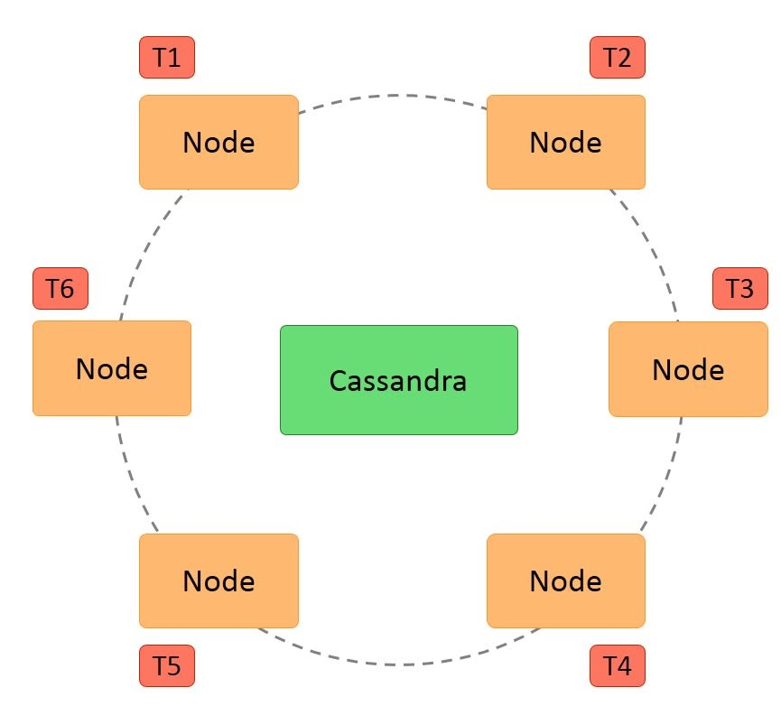
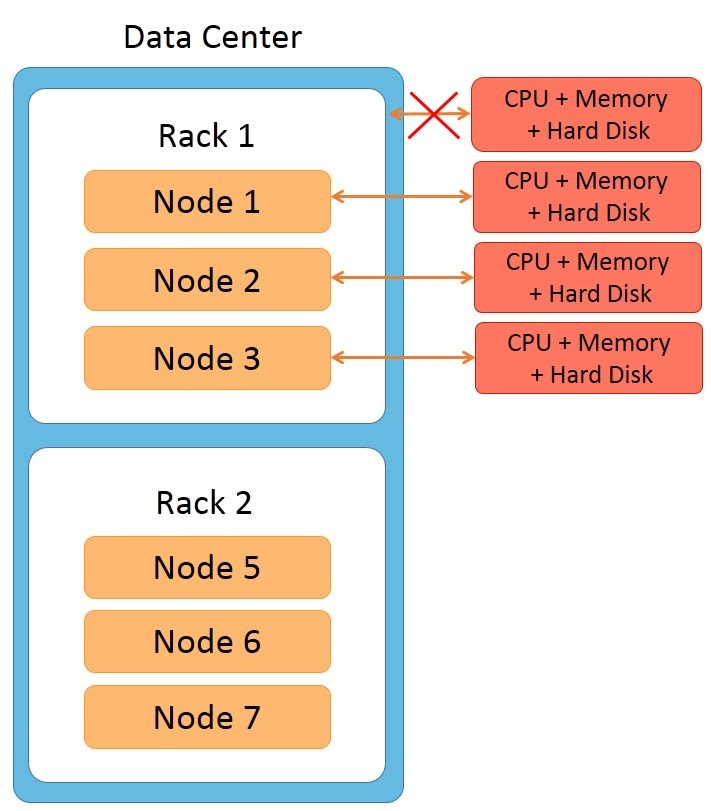
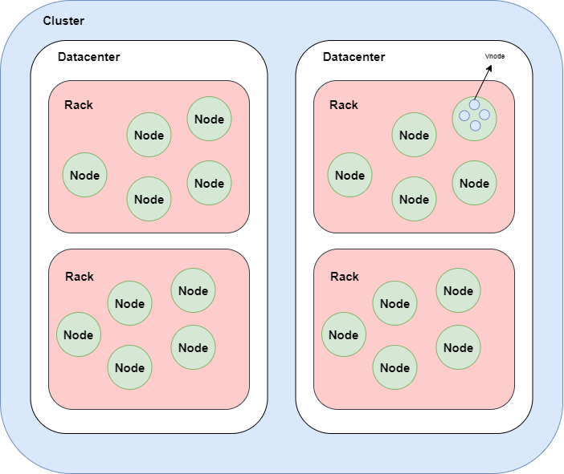
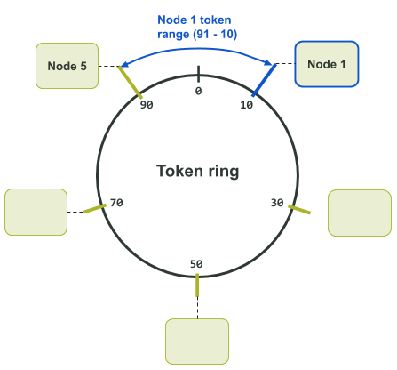
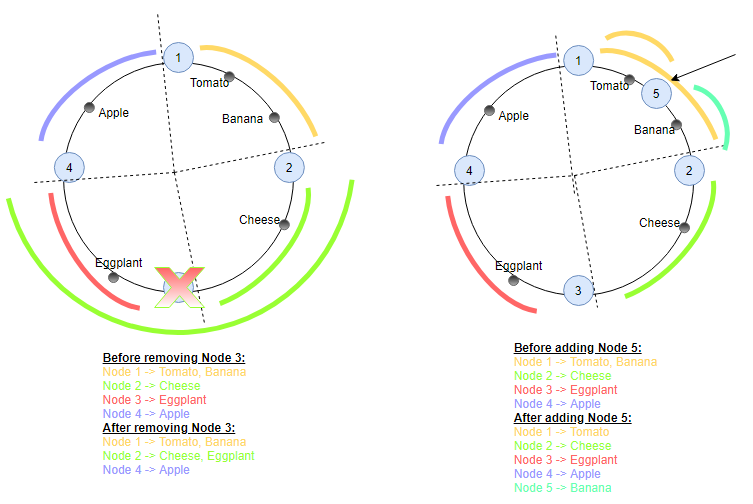
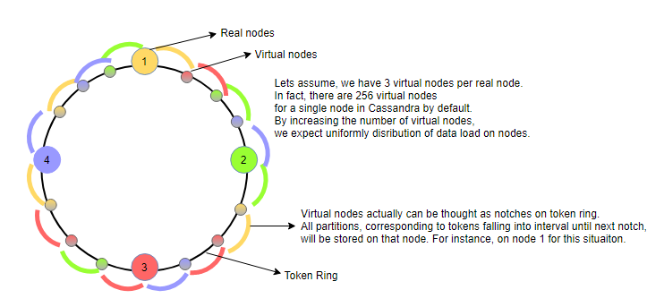
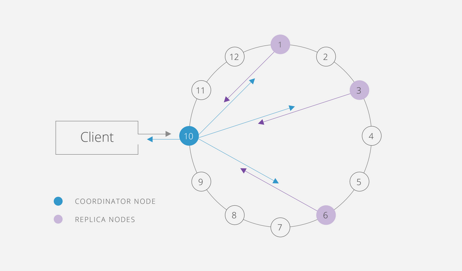
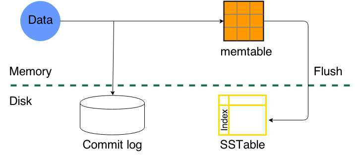
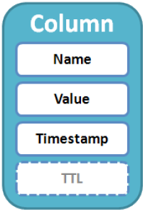
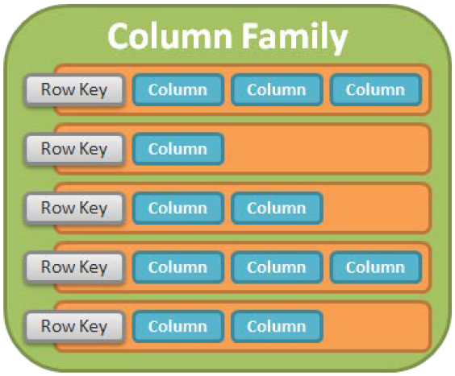

# Cassandra

Cassandra is an open source, column-oriented database designed to handle large amounts of data across many commodity servers.

## 1. Cassandra Architecture

Some of the features of Cassandra architecture are as follows:

- Cassandra is designed such that it has no master or slave nodes.
- It has a ring-type architecture, that is, its nodes are logically distributed like a ring.
- Data is automatically distributed across all the nodes.
- Similar to HDFS, data is replicated across the nodes for redundancy.
- Data is kept in memory and lazily written to the disk.
- Hash values of the keys are used to distribute the data among nodes in the cluster.



Additional features of Cassandra architecture are:

- Cassandra architecture supports multiple data centers.
- Data can be replicated across data centers.

You can keep three copies of data in one data center and the fourth copy in a remote data center for remote backup. Data reads prefer a local data center to a remote data center.


### Node

Node is the place where data is stored. It is the basic component of Cassandra.

### Rack

A rack is a group of machines housed in the same physical box.



- All machines in the rack are connected to the network switch of the rack
- The rack’s network switch is connected to the cluster.
- All machines on the rack have a common power supply. It is important to notice that a rack can fail due to two reasons: a network switch failure or a power supply failure.
- If a rack fails, none of the machines on the rack can be accessed. So it would seem as though all the nodes on the rack are down.

### Datacenter

A datacenter is a logical set of racks/ nodes. A common use case is AWS-EAST vs AWS-WEST...

### Cluster

The cluster is the collection of many data centers.



## 2. Data distribution and replication

### 2.1 Data Partitions

A **partition key** is converted to a **token** by a **partitioner**. The tokens are signed integer values between -2^63 to +2^63-1, and this range is referred to as token range.

If we consider there are only 100 tokens used for a Cassandra cluster with three nodes. Each node is assigned approximately 33 tokens like

```
node1: 0-33
node2: 34-66
node3: 67-99
```

If there are nodes added or removed, the token range distribution should be shuffled to suit the new topology. This process takes a lot of calculation and configuration change for each cluster operation.



If one node is removed, data in removed node is placed on the next neighbor node in clockwise manner.



### 2.2 Virtual nodes/Vnodes

Virtual nodes in a Cassandra cluster are also called vnodes. Vnodes can be defined for each physical node in the cluster. Each node in the ring can hold multiple virtual nodes.

The default number of Vnodes owned by a node in Cassandra is `256`, which is set by `num_tokens` property. When a node is added into a cluster, the token allocation algorithm allocates tokens to the node. The algorithm selects random token values to ensure uniform distribution.

In your case you have 6 nodes, each set with 256 token ranges so you have 6\*256 token ranges and each psychical node contains 256 token ranges.



### 2.3 Replication

The data in each keyspace is replicated with a **replication factor**. There is one primary replica of data that resides with the token owner node as explained in the data partitioning section. The remainder of replicas is placed by Cassandra on specific nodes using the replica placement strategy.

The total number of replicas for a keyspace across a Cassandra cluster is referred to as the keyspace's replication factor. A replication factor of one means that there is only one copy of each row in the Cassandra cluster. A replication factor of two means there are two copies of each row, where each copy is on a different node. All replicas are equally important; there is no primary or master replica.

There are two settings that mainly impact replica placement:

- First is snitch, which determines the data center, and the rack a Cassandra node belongs to, and it is set at the node level
- The second setting is the replication strategy. The replication strategy is set at the keyspace level. There are two strategies: SimpleStrategy and NetworkTopologyStrategy.

SimpleStrategy: does not consider racks and multiple data centers. It places data replicas on nodes sequentially.
NetworkTopologyStrategy: is rack aware and data center aware


### 2.4 Consistency level

The Cassandra consistency level is defined as the minimum number of Cassandra nodes that must acknowledge a read or write operation before the operation can be considered successful. Different consistency levels can be assigned to different Edge keyspaces.

You can find all cassandra's consistency level [here](https://docs.scylladb.com/getting-started/consistency/#consistency-levels-reference)



**Write Consistency**

1. A client sends a write request to the coordinator.
2. The coordinator forwards the write request (INSERT, UPDATE or DELETE) to all replica nodes whatever write CL you have set.
3. The coordinator waits for n number of replica nodes to respond. n is set by the write CL.
4. The coordinator sends the response back to the client.

**Read Consistency**

1. A client sends a read request to the coordinator.
2. The coordinator forwards the read (SELECT) request to n number of replica nodes. n is set by the read CL.
3. The coordinator waits for n number of replica nodes to respond.
4. The coordinator then merges (finds out most recent copy of written data) the n number of responses to a single response and sends response to the client.

## 3. Data storage

Cassandra processes data at several stages on the write path, starting with the immediate logging of a write and ending in with a write of data to disk:

- Logging data in the commit log
- Writing data to the memtable
- Flushing data from the memtable
- Storing data on disk in SSTables



- **Commitlogs** are an append only log of all mutations local to a Cassandra node. Any data written to Cassandra will first be written to a commit log before being written to a memtable. This provides durability in the case of unexpected shutdown. On startup, any mutations in the commit log will be applied to memtables.
- **Memtables** are in-memory structures where Cassandra buffers writes. In general, there is one active memtable per table. Eventually, memtables are flushed onto disk and become immutable SSTables. This can be triggered in several ways:
  - The memory usage of the memtables exceeds the configured threshold (see `memtable_cleanup_threshold`)
  - The `commit-log` approaches its maximum size, and forces memtable flushes in order to allow commitlog segments to be freed
- **SSTables** are the immutable data files that Cassandra uses for persisting data on disk.

## 4. Data Model

The Cassandra data model uses the same terms as Google BigTable, for example, column family, column, row, etc. Some of these terms also exist in the relational data model but have different meanings.

**Column**

A column is the smallest data model element in Cassandra. Although it also exists in a relational database, the column in Cassandra is different. The figure below shows that each column consists of a column name, column value, timestamp, and TTL ( Time-To-Live ).



The timestamp is used for conflict resolution by client applications during write operations. Time-To-Live is an optional expiration value that is used to mark columns that are deleted after expiration.

**Row**

Each row consists of a row key — also known as the primary key — and a set of columns, as shown in the following figure.


Each row may have different column names. That is why Cassandra is row-oriented and column-oriented. There are no timestamps for the row.

**Column Family**



A row key in the column family must be unique and be used to identify rows. Although not the same, the column family can be analogous to a **table** in a relational database. Column families provide greater flexibility by allowing different columns in different rows.

**Keyspace**

A keyspace is analogous to a **schema** or **database** in a relational model. Each Cassandra cluster has a system keyspace to store system-wide metadata. Keyspace contains replication settings that control how data is distributed and replicated in clusters.
