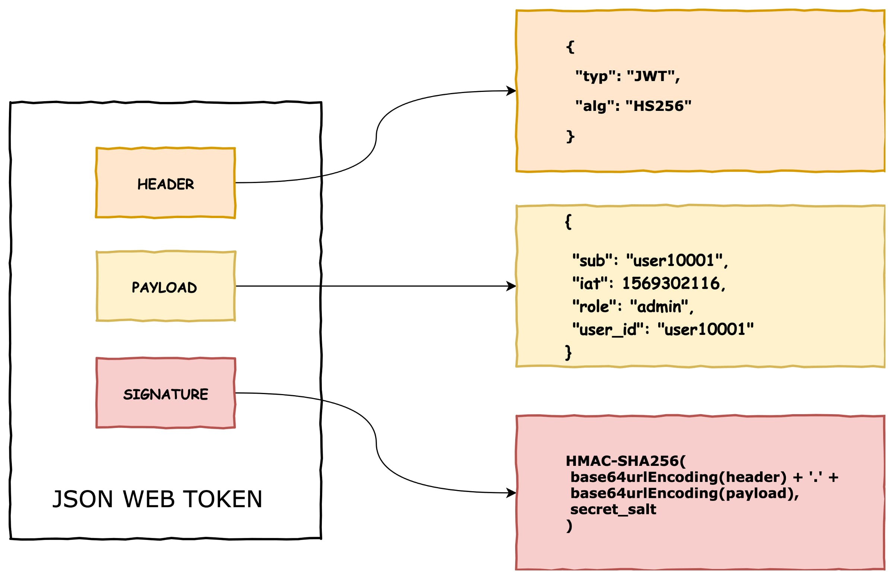
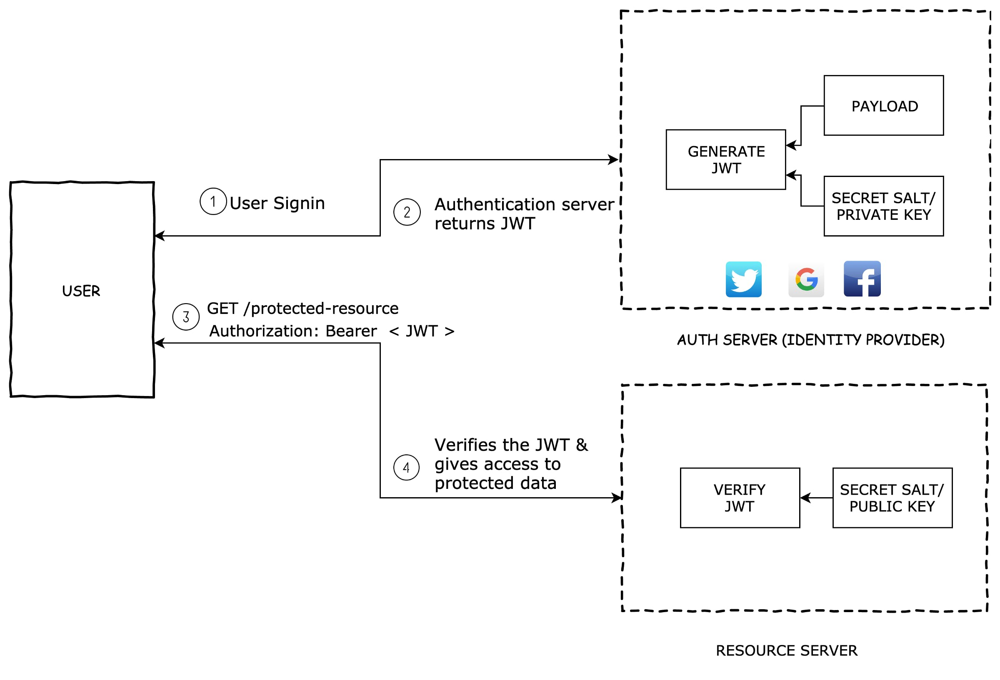

# JWT

## 1. What is JWT?

JWT, or JSON Web Token, is an open standard used to share security information between two parties — a client and a server. Each JWT contains encoded JSON objects, including a set of claims. JWTs are signed using a cryptographic algorithm to ensure that the claims cannot be altered after the token is issued.

## 2. What is the JSON Web Token structure?

A JSON Web Token consists of 3 parts separated by a period.

`header.payload.signature`



### 2.1 Header

JWT header consists of token type and algorithm used for signing and encoding. Algorithms can be HMAC, SHA256, RSA, HS256 or RS256.

Eg:

```json
{
  "typ": "JWT",
  "alg": "HS256"
}
```

Then, this JSON is **Base64Url** encoded to form the first part of the JWT.

### 2.2 Payload

Payload consists of the session data called as claims. Below are some of the the standard claims that we can use,

- Issuer(iss)
- Subject (sub)
- Audience (aud)
- Expiration time (exp)
- Issued at (iat)

Eg:

```json
{
  "sub": "user10001",
  "iat": 1569302116
}
```

Custom claims can also be included in the claim set. When using custom claim sets,

- Do not put large data in claim sets. Claim sets meant to be compact.
- Do not put sensitive informations since, JWT can be decoded easily.

```json
{
  "sub": "user10001",
  "iat": 1569302116,
  "role": "admin",
  "user_id": "user10001"
}
```

The payload is then Base64Url encoded to form the second part of the JSON Web Token.

### 2.3 Signature

To create the signature part you have to take the encoded header, the encoded payload, a secret, the algorithm specified in the header, and sign that.

For example if you want to use the HMAC SHA256 algorithm, the signature will be created in the following way:

```
HMACSHA256(
  base64UrlEncode(header) + "." +
  base64UrlEncode(payload),
  secret)
```

The signature is used to verify the message wasn't changed along the way, and, in the case of tokens signed with a private key, it can also verify that the sender of the JWT is who it says it is.

## 3. How do JSON Web Tokens work?


