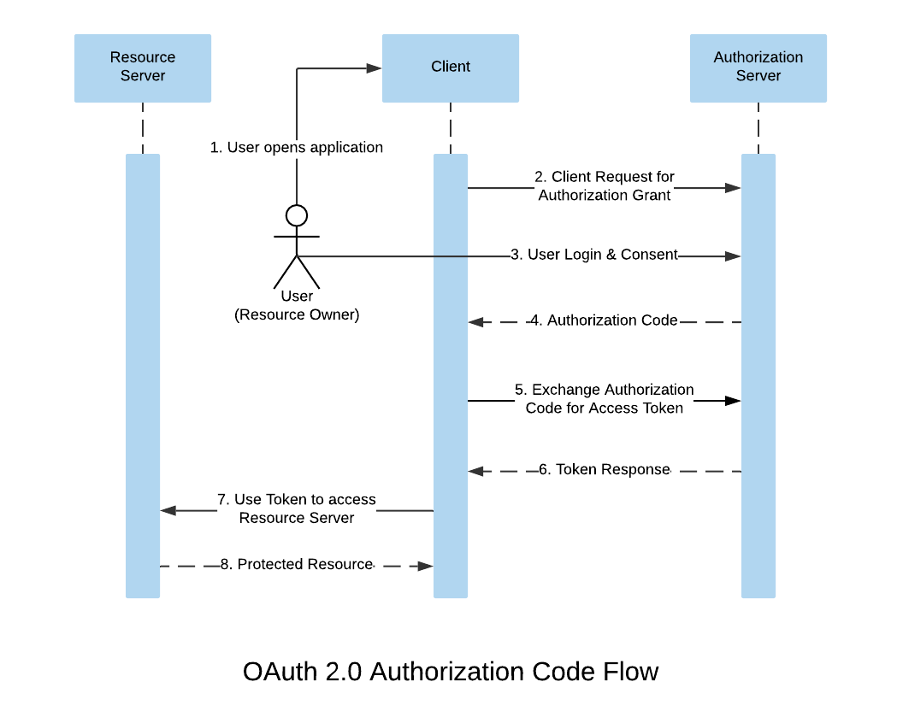
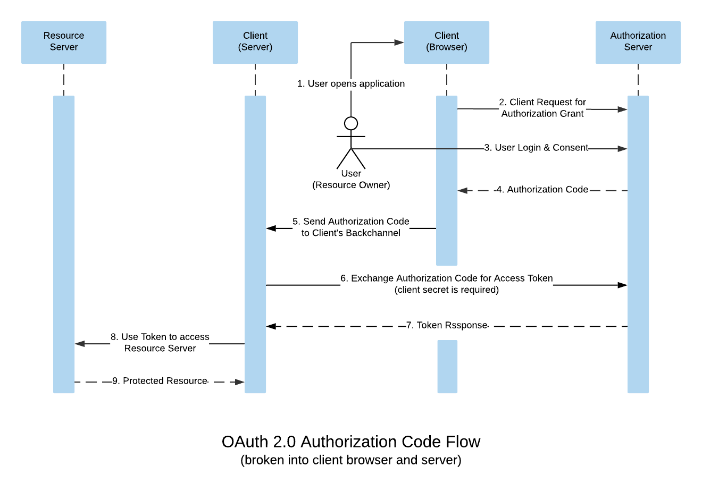
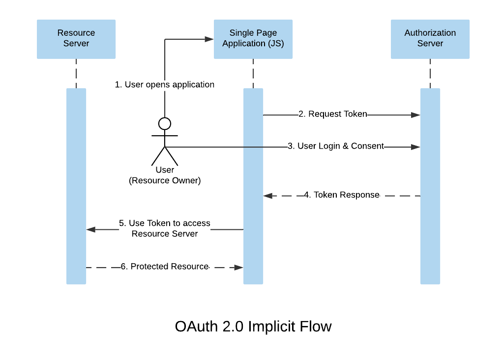

# OAuth2

## 1. Authentication vs Authorization

### Authentication

Authentication is the process of proving your own identity to third party service.

So when we are trying to log in to Facebook or Google, we are required to first enter the email and password to verify our identity. This is what Authentication is.

### Authorization

Authorization is the process of giving someone permission to do something or have something. It is done after successful Authentication.

## 2. OAuth2

OAuth 2.0 is the industry-standard protocol for **authorization** and anyone can implement it.

OAuth 2.0 terminology:

- **Resource Owner**: The user who owns the data that the client application wants to access.
- **Client:** The application that wants access to the user’s data.
- **Authorization Server:** The authorization server authorizes the client to access a user’s data by granting permission from the user.
- **Resource Server:** The system that holds the data that the client wants to access. In some cases, the resource server and authorization server are the same.
- **Access token:** An access token is the only key that the client can use to access the granted data by the user on the resource server.

## 3. OAuth2 flow

### Authorization Code Flow



The client begins the authorization sequence by redirecting the user to the authorization server with `response_type` set to `code` this tells the authorization server to respond with an authorization code.

```
https://accounts.google.com/o/oauth2/v2/auth?
 response_type=code&
 client_id=your_client_id&
 scope=profile%20contacts&
 redirect_uri=https%3A//oauth2.example.com/code
```

The result of this request is an authorization code, which the client can exchange for an access token. The authorization code looks like this:

```
4/W7q7P51a-iMsCeLvIaQc6bYrgtp9
```

** Why exchange code for a token?**

An access token is a secret piece of information that we don’t want someone to access. If the client requests an access token directly and stores it in the browser, it can be stolen because browsers are not fully secure. Anyone can see the page source or potentially use dev tools to acquire the access token.

To avoid exposure of the access token in the browser, the front end channel of the client gets the application code from the authorization server, then it sends the application code to the client’s back end channel.

Now to exchange this application code for an access token, a thing called **client_secret** is needed. The **client_secret** is only known by the client’s back-end channel

The request might look something like this:

```
POST /token HTTP/1.1
Host: oauth2.googleapis.com
Content-Type: application/x-www-form-urlencoded

code=4/W7q7P51a-iMsCeLvIaQc6bYrgtp9&
client_id=your_client_id&
client_secret=your_client_secret_only_known_by_server&
redirect_uri=https%3A//oauth2.example.com/code
```



### Implicit flow

The OAuth 2.0 implicit flow is used when you don’t have a back end channel and your website is a static site that uses only the browser.



The client redirects the browser to the authorization server URI to start the authorization flow with `response_type` set to `token`

Implicit flow is considered less secure because the browser is responsible for managing the access token, so it could potentially be stolen. Still, it’s widely used for single-page applications.

## 4. OpenID Connect

OpenID Connect is an identity layer on top of the OAuth 2.0 protocol. It extends OAuth 2.0 to standardize a way for authentication.
