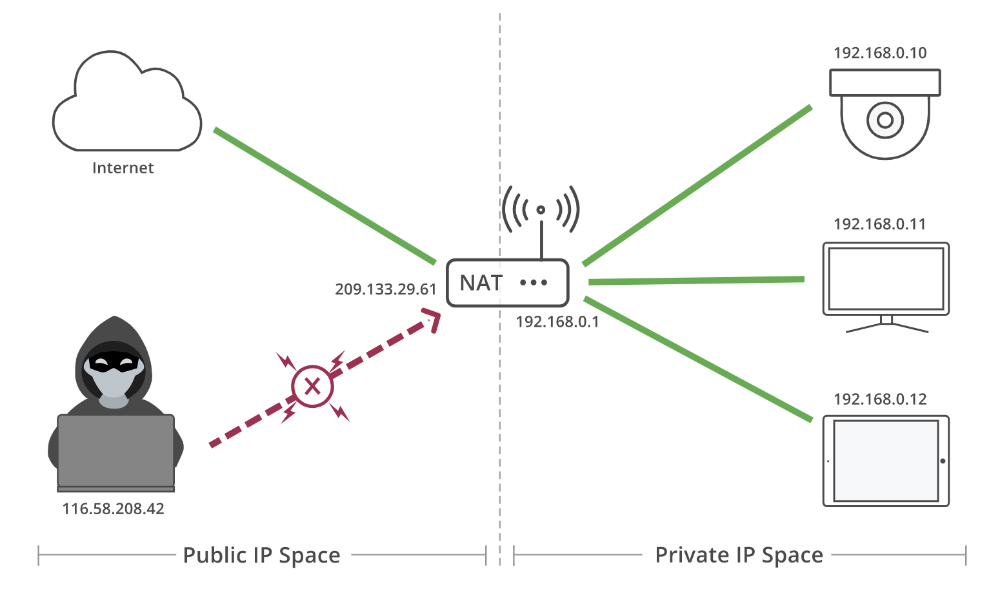
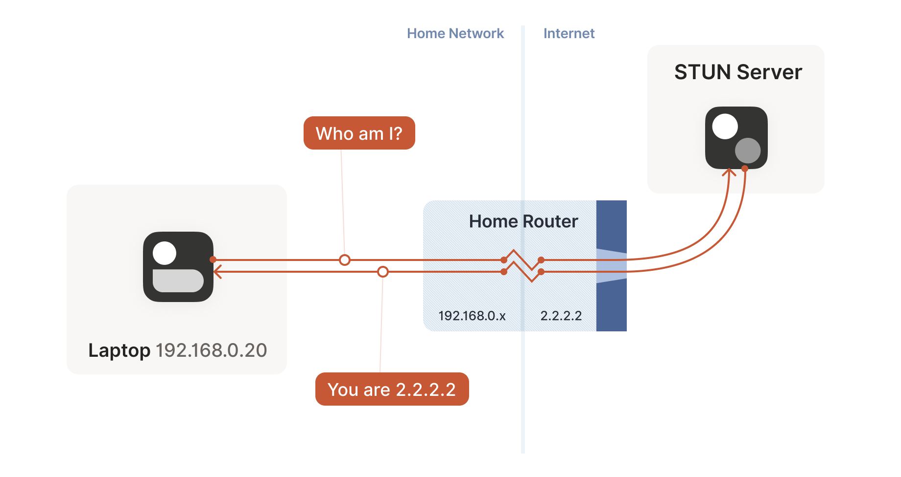
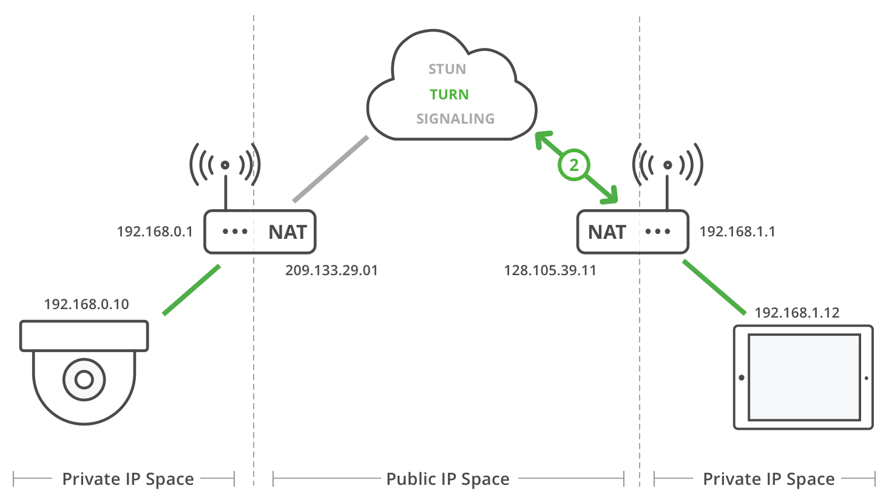

# Connecting

## 1. Peer to peer connection

WebRTC does’t use a client/server model, it establishes peer-to-peer (P2P) connections. 

## 2. How does it work

### 2.1 Networking real-world constraints

Most of the time the other WebRTC Agent will not even be in the same network. A typical call is usually between two WebRTC Agents in different networks with no direct connectivity.

For hosts in the same network it is very easy to connect. However, a host using `Router B` has no way to directly access anything behind `Router A`. How would you tell the different between `191.168.0.1` behind `Router A` and the same IP behind `Router B`? They are private IPs. A host using `Router B` could send traffic directly to `Router A`, but the request would end there. How does `Router A` know which host it should forward the message to?

### 2.2 NAT Mapping

IP version 4 addresses are only 32 bit(4 byte) long, which provides 4.29 billion(2 to the power of 32 = 4,294,967,296) unique IP addresses. 4.29 billion address space not enough for give public IP address for all available hosts.

To solve this issue NAT devices introduced. These devices would be responsible for maintaining a table mapping of local IP(private IP) and port tuples to one or more globally unique IP(public IP) and port tuples. By using this technology firewalls and routers allow multiple devices on a LAN with **private IP addresses to share a single public IP address**

### 2.3 STUN

Session Traversal Utilities for NAT (STUN) protocol enables a device to discover its public IP address.

STUN relies on a simple observation: when you talk to a server on the internet from a NATed client, the server sees the public `ip:port` that your NAT device created for you, not your LAN `ip:port`. So, the server can tell you what `ip:port` it saw. That way, you know what traffic from your LAN `ip:port` looks like on the internet, you can tell your peers about that mapping, and now they know where to send packets.

### 2.4 TURN

TURN (Traversal Using Relays around NAT) is the solution when direct connectivity isn’t possible. It could be because you have two NAT Types that are incompatible, or maybe can’t speak the same protocol or when a symmetric NAT is in use!

TURN Server allows clients to send and receive data through an intermediary server.

Typically A TURN client first sends a message to a TURN server to allocate an IP address and port on the TURN server. Once the allocation has succeeded, the client will use the IP address and port number to communicate with peers.

