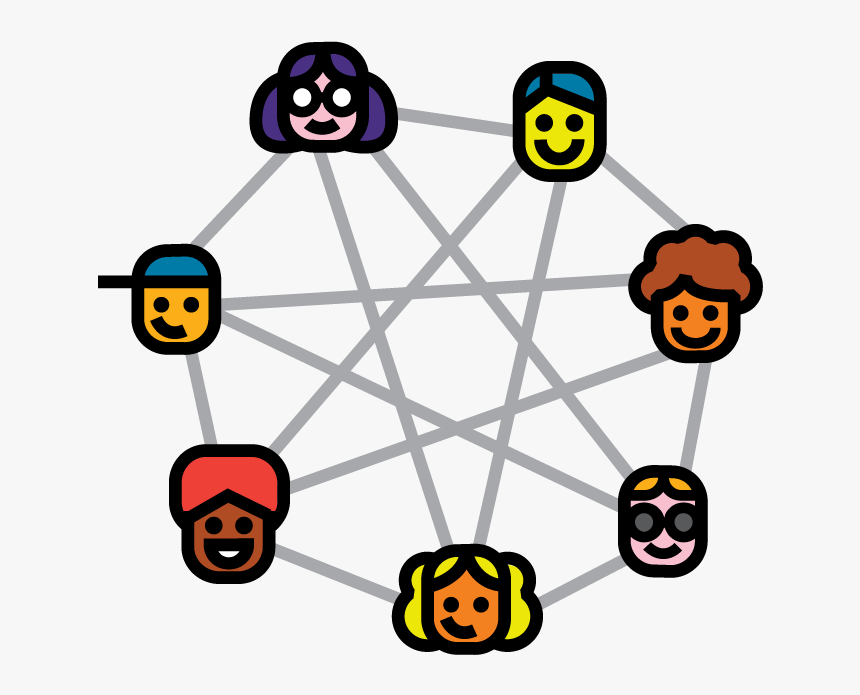
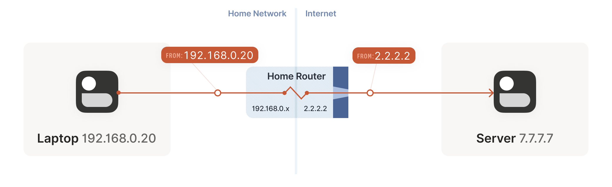

# Connecting

## 1. Peer to peer connection

WebRTC does’t use a client/server model, it establishes peer-to-peer (P2P) connections. 

Establishing peer-to-peer connectivity can be difficult though. Despite these difficulties in setting up a P2P connection, you get advantages over traditional Client/Server technology because of the following attributes that WebRTC offers.

**Reduce bandwidth costs**

Since media communication happens directly between peers you don't have to pay for, or host a separate server to relay media

**Lower latency**

Communication is fast when it is direct

**Secure E2E communication**

Direct communication is more secure. Since users aren’t routing data through your server, they don’t even need to trust you won’t decrypt it.

## 2. How does it work

### 2.1 Networking real-world constraints

**Not in the same network**

Most of the time the other WebRTC Agent will not even be in the same network. A typical call is usually between two WebRTC Agents in different networks with no direct connectivity.

For hosts in the same network it is very easy to connect. However, a host using `Router B` has no way to directly access anything behind `Router A`. How would you tell the different between `191.168.0.1` behind `Router A` and the same IP behind `Router B`? They are private IPs. A host using `Router B` could send traffic directly to `Router A`, but the request would end there. How does `Router A` know which host it should forward the message to?

**Protocol Restrictions**

Some networks don’t allow UDP traffic at all, or maybe they don’t allow TCP. Some networks may have a very low MTU (Maximum Transmission Unit). There are lots of variables that network administrators can change that can make communication difficult.

**Firewall/IDS Rules**

Some network administrators will run software that tries to process every packet. Many times this software doesn’t understand WebRTC, so it blocks it because it doesn’t know what to do, e.g. treating WebRTC packets as suspicious UDP packets on an arbitrary port that is not whitelisted.

### 2.2 NAT Mapping

NAT (Network Address Translation) mapping is the magic that makes the connectivity of WebRTC possible

For example we have `Agent 1` and `Agent 2` and they are in different networks

To make this communication happen you establish a NAT mapping

Agent 1 uses port `7000` to establish a WebRTC connection with Agent 2. This creates a binding of `192.168.0.1:7000` to `5.0.0.1:7000`. This then allows Agent 2 to reach Agent 1 by sending packets to 5.0.0.1:7000.

