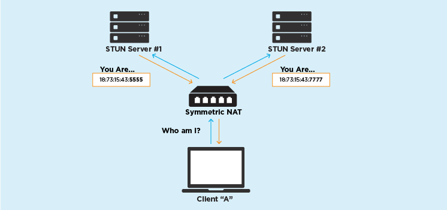

# Connecting

## 1. Peer to peer connection

WebRTC does’t use a client/server model, it establishes peer-to-peer (P2P) connections. 

## 2. How does it work

### 2.1 Networking real-world constraints

Most of the time the other WebRTC Agent will not even be in the same network. A typical call is usually between two WebRTC Agents in different networks with no direct connectivity.

For hosts in the same network it is very easy to connect. However, a host using `Router B` has no way to directly access anything behind `Router A`. How would you tell the different between `191.168.0.1` behind `Router A` and the same IP behind `Router B`? They are private IPs. A host using `Router B` could send traffic directly to `Router A`, but the request would end there. How does `Router A` know which host it should forward the message to?

### 2.2 NAT Mapping

IP version 4 addresses are only 32 bit(4 byte) long, which provides 4.29 billion(2 to the power of 32 = 4,294,967,296) unique IP addresses. 4.29 billion address space not enough for give public IP address for all available hosts.

To solve this issue NAT devices introduced. These devices would be responsible for maintaining a table mapping of local IP(private IP) and port tuples to one or more globally unique IP(public IP) and port tuples. By using this technology firewalls and routers allow multiple devices on a LAN with **private IP addresses to share a single public IP address**

There are different types of NATs, but some of them allocates a public IP address and a port for UDP flows (what we need). When you want to create a P2P connection with a peer, a first challenge is therefore to discover what kind of NATs you are behind, and if they exist, to get an IP address and a port you can give to your contact.

### 2.3 STUN

Session Traversal Utilities for NAT (STUN) protocol enables a device to discover its public IP address.

STUN relies on a simple observation: when you talk to a server on the internet from a NATed client, the server sees the public `ip:port` that your NAT device created for you, not your LAN `ip:port`. So, the server can tell you what `ip:port` it saw. That way, you know what traffic from your LAN `ip:port` looks like on the internet, you can tell your peers about that mapping, and now they know where to send packets.

### 2.4 NAT implementations

NATs are not all implemented the same way and may differ in how they allow packets to go through. Some NAT implementations, like the One-to-one NATs, will allow a P2P connection to be established. Some, like the symmetric ones, don’t.

**One-to-one NAT (or Full Cone NAT)**

In this implementation, once an internal IP address/ port duo is mapped to the external IP adress/ port duo, all packages arriving to the external address/ port, no matter where they are coming from, will be sent through to the original internal one.

**Symmetric NAT**

A symmetric NAT is one where all requests from the same internal IP address and port, to a specific destination IP address and port, are mapped to the same external IP address and port. If the same host sends a packet with the same source address and port, but to a different destination, a different mapping is used. Furthermore, only the external host that receives a packet can send a UDP packet back to the internal host.

### 2.5 TURN

TURN (Traversal Using Relays around NAT) is the solution when direct connectivity isn’t possible. It could be because a symmetric NAT is in use!

WebRTC agent bypass the Symmetric NAT restriction by opening a connection with a TURN server and relaying all information through that server. You would create a connection with a TURN server and tell all peers to send packets to the server which will then be forwarded to you. This obviously comes with some overhead so it is only used if there are no other alternatives.

### 2.6 ICE

ICE (Interactive Connectivity Establishment) is how  WebRTC connects two Agents. ICE is a protocol for establishing connectivity. It determines all the possible routes between the two peers and then ensures you stay connected. 

These routes are known as `Candidate Pairs`, which is a pairing of a local and remote transport address. This is where STUN and TURN come into play with ICE. These addresses can be your `local IP Address plus a port`, `NAT mapping`, or `Relayed Transport Address` (TURN). Each side gathers all the addresses they want to use, exchanges them, and then attempts to connect!

An ICE Agent is either Controlling or Controlled. The Controlling Agent is the one that decides the selected Candidate Pair. Usually, the peer sending the offer is the controlling side.

Each side must have a `user fragment` and a `password`. These two values must be exchanged before connectivity checks can even begin. The `user fragment` is sent in plain text and is useful for demuxing multiple ICE Sessions. The `password` is used to generate a MESSAGE-INTEGRITY attribute. At the end of each STUN packet, there is an attribute that is a hash of the entire packet using the `password` as a key. This is used to authenticate the packet and ensure it hasn’t been tampered with.
