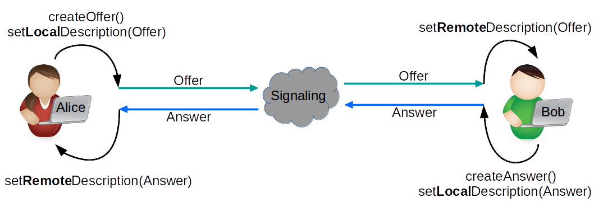

# Signaling

When a WebRTC Agent starts it has no idea who it is going to communicate with and what they are going to communicate about. 
Signaling is used to bootstrap the call so that two WebRTC agents can start communicating.

Signaling messages are just text. The WebRTC agents don’t care how they are transported. They are commonly shared via Websockets, but that is not a requirement.

## 1. How does WebRTC signaling work?

WebRTC uses an existing protocol called the Session Description Protocol. Via this protocol, the two WebRTC Agents will share all the state required to establish a connection.

## 2. What is the Session Description Protocol (SDP)

The SDP is a key/value protocol wiht a newline after each value. A SDP contains zero or more Media Descriptions.

A Media Description usually maps to a single stream of media. So if you wanted to describe a call with three video streams and two audio tracks you would have five Media Descriptions.

### 2.2. How to read the SDP

Every line in a SDP will start with a single character, this is your key. 

The SDP defines all they keys that are valid. You can **ONLY** use letters for keys as defined in the protocol.

Eg:

```
a=my-sdp-value
a=second-value
```

**SDP keys is using in WebRTC:**

- `v` version, should be equal to `0`
- `o` origin, contains a unique ID useful for renegotiations
- `s` session name, should be equal to `-`
- `t` timing, should be equal to `0 0`
- `m` media description (`m=<media> <port> <proto> <fmt> ...`) 
- `a` attribute, a free text field
- `c` connection data, shoudl be equal to `IN IP4 0.0.0.0`

**Media Descriptions in SDP:**

A Media Description definition contains list of formats. These formats map to RTP Payload Types.
The actual codec is then defined by an `Attribute` with the value `rtpmap` in the Media Description.

Eg:

```
v=0
o=- 0 0 IN IP4 127.0.0.1
s=-
c=IN IP4 127.0.0.1
t=0 0
m=audio 4000 RTP/AVP 111
a=rtpmap:111 OPUS/48000/2
m=video 4002 RTP/AVP 96
a=rtpmap:96 VP8/90000
```

In the above example, we have 2 Media Descriptions:

- Audio format in port `4000`, proto `RTP/AVP`, fmt `111`. The attribute maps the Payload Type `111` to `Opus`
- Video format in port `4002`, proto `RTP/AVP`, fmt `96`. The attribute maps the Payload Type `96` to `VP8`

**Note**: In the above example `v`, `o`, `s`, `c`, `t` are defined, but they do not affect the WebRTC session.

## 3. How SDP and WebRTC work together

### 3.1 What are offers and answers

WebRTC uses an offer/answer model. All this means is that one WebRTC Agent makes an “Offer” to start a call, and the other WebRTC Agents “Answers” if it is willing to accept what has been offered.

This gives the answerer a chance to reject unsupported codecs in the Media Descriptions. This is how two peers can understand what formats they are willing to exchange.



### 3.2 Transceivers are for sending and receiving

Transceivers is a WebRTC specific concept that you will see in the API. What it is doing is exposing the “Media Description” to the JavaScript API. Each Media Description becomes a Transceiver. Every time you create a Transceiver a new Media Description is added to the local Session Description.

Each Media Description in WebRTC will have a direction attribute. There are four valid values:

- `send`
- `recv`
- `sendrecv`
- `inactive`

### 3.3 SDP Values used by WebRTC

**group:BUNDLE**

Bundling is an act of running multiple types of traffic over one connection. Some WebRTC implementations use a dedicated connection per media stream. Bundling should be preferred.

**fingerprint:sha-256**

This is a hash of the certificate a peer is using for DTLS. After the DTLS handshake is completed, you compare this to the actual certificate to confirm you are communicating with whom you expect.

**setup:**

This controls the DTLS Agent behavior. This determines if it runs as a client or server after ICE has connected. The possible values are:

- `setup:active` - Run as DTLS Client
- `setup:passive` - Run as DTLS Server
- `setup:actpass` - Ask the other WebRTC Agent to choose

**ice-ufrag**

This is the user fragment value for the ICE Agent. Used for the authentication of ICE Traffic.

**ice-pwd**

This is the password for the ICE Agent. Used for authentication of ICE Traffic.

**rtpmap**

This value is used to map a specific codec to an RTP Payload Type.

**fmtp**

Defines additional values for one Payload Type. This is useful to communicate a specific video profile or encoder setting.

**candidate**

This is an ICE Candidate that comes from the ICE Agent. This is one possible address that the WebRTC Agent is available on

**ssrc**

A Synchronization Source (SSRC) defines a single media stream track.

`label` is the ID for this individual stream. `mslabel` is the ID for a container that can have multiple streams inside it.

### 3.4 Example of a WebRTC Session Description

```
v=0
o=- 3546004397921447048 1596742744 IN IP4 0.0.0.0
s=-
t=0 0
a=fingerprint:sha-256 0F:74:31:25:CB:A2:13:EC:28:6F:6D:2C:61:FF:5D:C2:BC:B9:DB:3D:98:14:8D:1A:BB:EA:33:0C:A4:60:A8:8E
a=group:BUNDLE 0 1
m=audio 9 UDP/TLS/RTP/SAVPF 111
c=IN IP4 0.0.0.0
a=setup:active
a=mid:0
a=ice-ufrag:CsxzEWmoKpJyscFj
a=ice-pwd:mktpbhgREmjEwUFSIJyPINPUhgDqJlSd
a=rtcp-mux
a=rtcp-rsize
a=rtpmap:111 opus/48000/2
a=fmtp:111 minptime=10;useinbandfec=1
a=ssrc:350842737 cname:yvKPspsHcYcwGFTw
a=ssrc:350842737 msid:yvKPspsHcYcwGFTw DfQnKjQQuwceLFdV
a=ssrc:350842737 mslabel:yvKPspsHcYcwGFTw
a=ssrc:350842737 label:DfQnKjQQuwceLFdV
a=msid:yvKPspsHcYcwGFTw DfQnKjQQuwceLFdV
a=sendrecv
a=candidate:foundation 1 udp 2130706431 192.168.1.1 53165 typ host generation 0
a=candidate:foundation 2 udp 2130706431 192.168.1.1 53165 typ host generation 0
a=candidate:foundation 1 udp 1694498815 1.2.3.4 57336 typ srflx raddr 0.0.0.0 rport 57336 generation 0
a=candidate:foundation 2 udp 1694498815 1.2.3.4 57336 typ srflx raddr 0.0.0.0 rport 57336 generation 0
a=end-of-candidates
m=video 9 UDP/TLS/RTP/SAVPF 96
c=IN IP4 0.0.0.0
a=setup:active
a=mid:1
a=ice-ufrag:CsxzEWmoKpJyscFj
a=ice-pwd:mktpbhgREmjEwUFSIJyPINPUhgDqJlSd
a=rtcp-mux
a=rtcp-rsize
a=rtpmap:96 VP8/90000
a=ssrc:2180035812 cname:XHbOTNRFnLtesHwJ
a=ssrc:2180035812 msid:XHbOTNRFnLtesHwJ JgtwEhBWNEiOnhuW
a=ssrc:2180035812 mslabel:XHbOTNRFnLtesHwJ
a=ssrc:2180035812 label:JgtwEhBWNEiOnhuW
a=msid:XHbOTNRFnLtesHwJ JgtwEhBWNEiOnhuW
a=sendrecv
```

This is what we know from the above message:

- We have two media sections, one audio and one video.
- Both of them are sendrecv transceivers. We are getting two streams, and we can send two back.
- We have ICE Candidates and Authentication details, so we can attempt to connect.
- We have a certificate fingerprint, so we can have a secure call.

