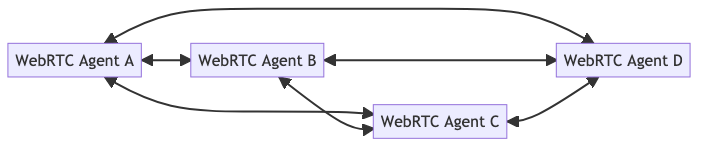
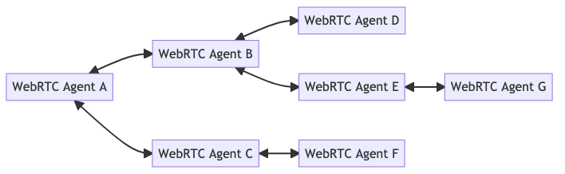
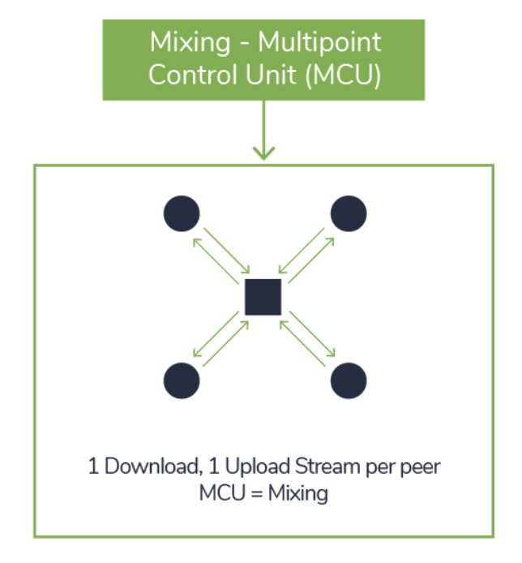
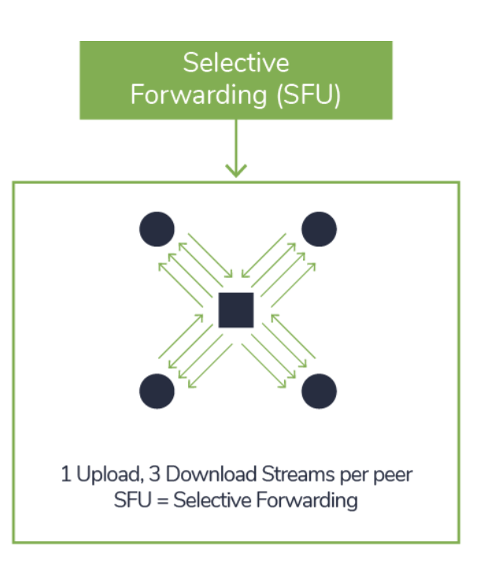

# WebRTC

In WebRTC we have 4 steps:

- Signaling
- Connecting
- Securing
- Communicating

These four steps happen sequentially. The prior step must be 100% successful for the subsequent one to even begin.

## WebRTC Topologies

### One-To-One

One-to-One is the first connection type you will use with WebRTC. You connect two WebRTC Agents directly and they can send bi-directional media and data.

### Full Mesh

Full mesh is the answer if you want to build a conference call or a multiplayer game. In this topology each user establishes a connection with every other user directly

In a Full Mesh topology each user is connected directly. That means you have to encode and upload video independently for each member of the call. The network conditions between each connection will be different, so you can’t reuse the same video.

### Hybrid Mesh

Hybrid Mesh is an alternative to Full Mesh that can alleviate some of the Full Mesh’s issues. In a Hybrid Mesh connections aren’t established between every user. Instead, media is relayed through peers in the network. This means that the creator of the media doesn’t have to use as much bandwidth to distribute media.

This does have some downsides. In this set up, the original creator of the media has no idea who its video is being sent too, and if it arrived successfully. You also will have an increase in latency with every hop in your Hybrid Mesh network.

### MCU

The MCU architecture assumes that each conference participant sends his or her stream to the MCU. The MCU decodes each received stream, rescales it, composes a new stream from all received streams, encodes it, and sends a single to all other participants.

The main disadvantage of MCU is its cost, as It decodes and re-encodes streams to compose the final stream, hence requires significant computing power by the MCU.

### Selective Forwarding Unit 

Selective Forwarding Units (SFUs) are the most popular modern approach. In the SFU architecture, every participant sends his or her media stream to a centralized server (SFU) and receives streams from all other participants via the same central server. The architecture allows the call participant to send multiple media streams to the SFU, where the SFU may decide which of the media streams should be forwarded to the other call participants.

Unlike in the MCU architecture, the SFU does not need to decode and re-encode received streams, but simply acts as a forwarder of streams between call participants. The device endpoints need to be more intelligent and have more computing power than in the MCU architecture.

