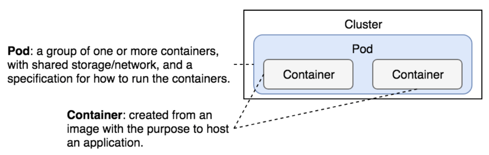

# Workloads

A workload is an application running on Kubernetes. Whether your workload is a single component or several that work together, on Kubernetes you run it inside a set of pods
In Kubernetes, a Pod represents a set of running containers on your cluster.

Kubernetes provides several built-in workload resources:

- Deployment and ReplicaSet
- StatefulSet
- DaemonSet
- Job and CronJob

## 1. Pods

### What is a pod?

Pods are the smallest deployable units of computing that you can create and manage in Kubernetes.

A Pod is a group of one or more containers, with shared storage and network resources, and a specification for how to run the containers.

The shared context of a Pod is a set of Linux namespaces, cgroups, and potentially other facets of isolation - the same things that isolate a Docker container.

In terms of Docker concepts, a Pod is similar to a group of Docker containers with shared namespaces and shared filesystem volumes.

### Pod networking

Each Pod is assigned a unique IP address for each address family. Every container in a Pod shares the network namespace, including the IP address and network ports. Inside a Pod (and only then), the containers that belong to the Pod can communicate with one another using `localhost`.
When containers in a Pod communicate with entities outside the Pod, they must coordinate how they use the shared network resources (such as ports).
The containers in a Pod can also communicate with each other using standard inter-process communications
Containers in different Pods have distinct IP addresses and can not communicate by IPC without special configuration. Containers that want to interact with a container running in a different Pod can use IP networking to communicate.

### Pod lifetime

Pods are created, assigned a unique ID (UID), and scheduled to nodes where they remain until termination (according to restart policy) or deletion. If a Node dies, the Pods scheduled to that node are scheduled for deletion after a timeout period.

Pods do not, by themselves, self-heal. If a Pod is scheduled to a node that then fails, the Pod is deleted; likewise, a Pod won't survive an eviction due to a lack of resources or Node maintenance. Kubernetes uses a higher-level abstraction, called a controller, that handles the work of managing the relatively disposable Pod instances.
