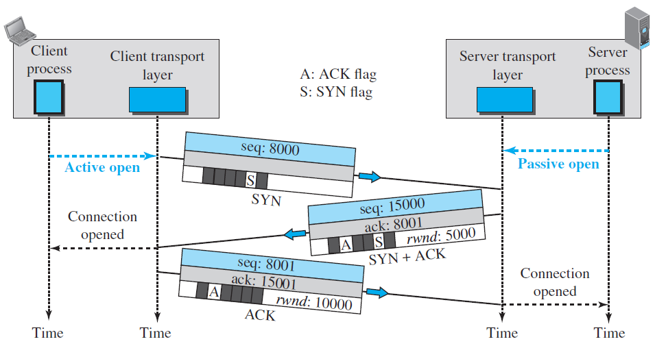

# TCP

## 1. TCP 3-way handshake

Step 1: The client sends a message with the SYN flag = 1 + random sequence number (SEQ = x) to the server.

Step 2: After receiving the client's synchronization request, the server sends a message with the SYN flag = 1, ACK flag = 1, Ack number = Client's sequence number + 1 (x + 1) and server random sequence number (SEQ = y).

Step 3: After receiving the SYN from the server, the client sends a message to server with ACK flag = 1, Ack number = Server sequence number + 1 (y + 1), SEQ = x + 1

- The first two handshakes SYN packets cannot carry data. They are using to establish the sequence number for both client and server.
- The third handshake to make sure that the client already received the SYN-ACK message from the server and it can carry data.

## 2. TCP waving 4 times

Step 1: The client sends to the server a segment with the FIN flag = 1.

Step 2: After receiving the client's FIN segment, the server immediately send ACK message to the client.

Step 3: The server sends a segment with the FIN flag = 1 to the client.

Step 4: After receiving the server's FIN segment, the client immediately send ACK message to the server and enters **TIME_WAIT** state. After the wait, the connection formally closes and all resources on the client side (including port numbers and buffer data) are released.

- TCP connection is full-duplex. There are two channels (read and write), and we must close these channels separately.
- After the step 2 the server can still send data to the client (connection is in haft-open state).
- The **TIME_WAIT** state lets the client resend the final acknowledgment in case the ACK is lost.
