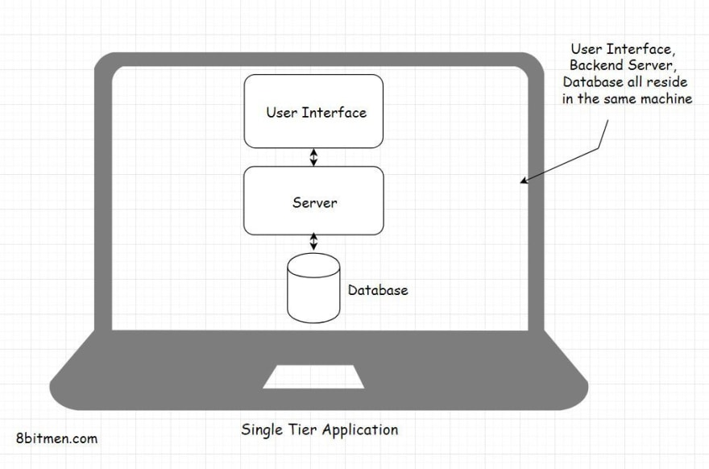
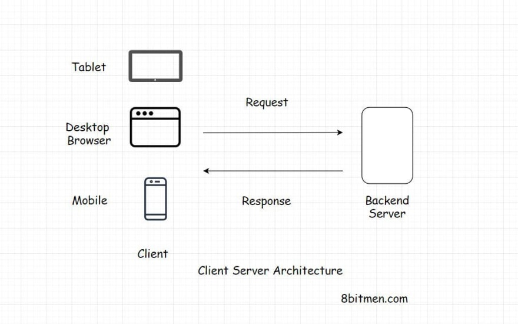
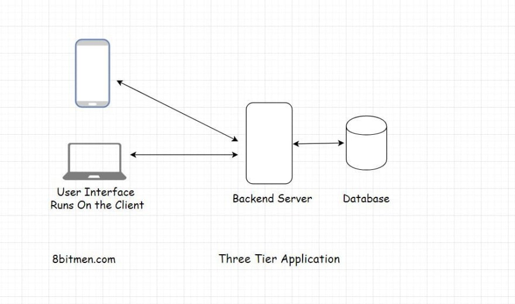

# Basic

## Tier

### Single tier application

A single-tier application is an application where the user interface, backend business logic and database all reside in the same machine.

An example of an application with single-tier are applications such as MS Office, GIMP..

### Two tier application

A two-tier application involves a client and a server. The client would contain the user interface and business logic in one machine and the server would be the database running on a different machine.

### Three tier application

In three-tier application the user interface, application logic and the database all lie on different machine and thus have different tiers. They are physically separated.

### N tier application

An N-tier application is an application which has more than three components involved.

These components can be:

- Cache
- Message queues
- Load balancers
- Search server
- ...
