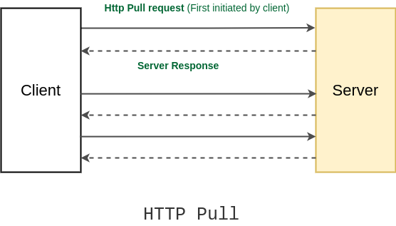
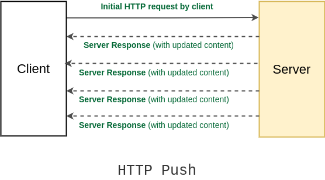

# HTTP

## 1) An overview of HTTP

Hypertext Transfer Protocol (HTTP) is an application-layer protocol for transmitting hypermedia documents, such as HTML. It was designed for communication between web browsers and web servers, but it can also be used for other purposes.

Basic aspects of HTTP:

- HTTP is media independent: It means, any type of data can be sent by HTTP as long as both the client and the server know how to handle the data content
- HTTP is stateless: The server and client are aware of each other only during a current request. Afterwards, both of them forget about each other.

### 1.1) Htpp flow

When a client wants to communicate with a server, either the final server or an intermediate proxy, it performs the following steps:

1. Open a TCP connection
2. Send an HTTP message (HTTP/1 is human-readable but HTTP/2 is not)

Eg:

```
GET / HTTP/1.1
Host: developer.mozilla.org
Accept-Language: fr
```

3. Read the response sent by the server, such as:

```
HTTP/1.1 200 OK
Date: Sat, 09 Oct 2010 14:28:02 GMT
Server: Apache
Last-Modified: Tue, 01 Dec 2009 20:18:22 GMT
ETag: "51142bc1-7449-479b075b2891b"
Accept-Ranges: bytes
Content-Length: 29769
Content-Type: text/html

<!DOCTYPE html... (here comes the 29769 bytes of the requested web page)
```

4. Close or reuse the connection for further requests.

### 1.2) HTTP messsage

HTTP messages, as defined in HTTP/1.1 and earlier, are human-readable. In HTTP/2, these messages are embedded into a binary structure, a frame, allowing optimizations like compression of headers and multiplexing.

#### 1.2.1) HTTP Request


Requests consists of the following elements:

- An HTTP method (GET, POST, PUT, OPTIONS, HEAD...)
- A path of resource to fetch
- The version of HTTP protocol
- HTTP request headers that convey additional information for the servers
- Optionally, a body, for some methods like **POST**, which contain the resource sent

#### 1.2.2) HTTP Response


Responses consist of the following elements:

- The version of the HTTP protocol
- A status code
- A status message, a non-authoritative short description of the status code
- HTTP response headers
- Optionally, a body containing the fetched resource.

#### 1.2.3) HTTP headers

HTTP headers allow the client and the server to pass additional information with the request or the response

An HTTP header consists of its case-insensitive name followed by a colon (:), then by its value. Whitespace before the value is ignored.

Headers can be grouped according to their contexts:

- **General headers** applying to both requests and responses but with no relation to the data eventually transmitted in the body
- **Request headers** contain more information about the resource to be fetched, or about the client requesting the resource
- **Response headers** hold additional information about the response, like its location or about the server providing it
- **Representation headers** contain information about the body of the resource, like its MIME type, or encoding/compression applied

Example:

- Cookie: Contains stored HTTP cookies previously sent by the server with the Set-Cookie header.
- Set-Cookie: Send cookies from the server to the user-agent.
- Origin: Indicates where a request originates from
- Authorization: Contains the credentials to authenticate a user-agent with a server
- Access-Control-Allow-Origin: Indicates whether the response can be shared
- ...

#### 1.2.4) HTTP status code

HTTP status code are like short notes from server to client. They are messsages from the server letting clients konw how things went when it received requests.

HTTP status codes are grouped in five classed:

1. Information responses (100- 199)
2. Successful responses (200, 299)
3. Redirect (300-399)
4. Client errors (400-499)
5. Server errors (500-599)

## 2) HTTP pull

In the HTTP pull method, the client sends a request to the server and the server responds to that request (and the connection is closed). The client pulls the data from the server whenever it requires (by creating a new connection). And it keeps doing it over and over to fetch the updated data.

This is the default HTTP communication method and is extensively on the Internet for fetching HTTP pages from websites.

The disadvantage of the HTTP pull method is that if clients keep on periodically makes the pull request for updated data, but there are no updates at the server hence, every time the client will get the same result, bandwidth will be wasted and the server will be busy too.
Also, excessive pulls by the clients have the potential to bring down the server.



## 3) HTTP push

To overcome the problem with HTTP pull, an HTTP push was introduced. In the HTTP push method, the client opens a connection to the server by requesting a server only the first time and after that server keeps on pushing back updated content to the client, whenever there’s any.

There are multiple technologies involved in the HTTP push based mechanism such as:

- Ajax Long polling
- Web Sockets
- HTML5 Event Source
- Message Queues
- Streaming over HTTP


